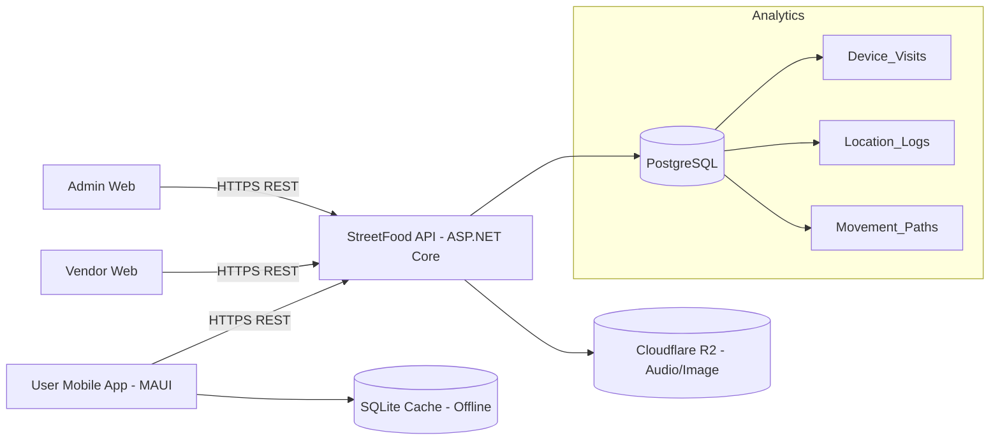
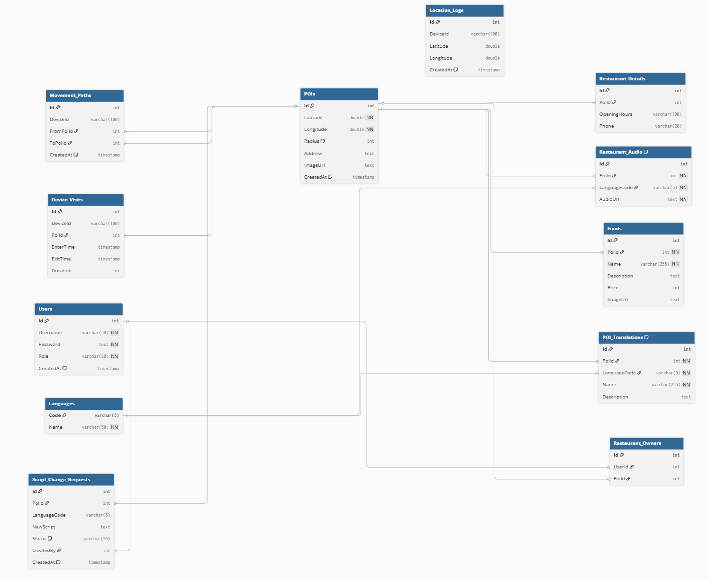
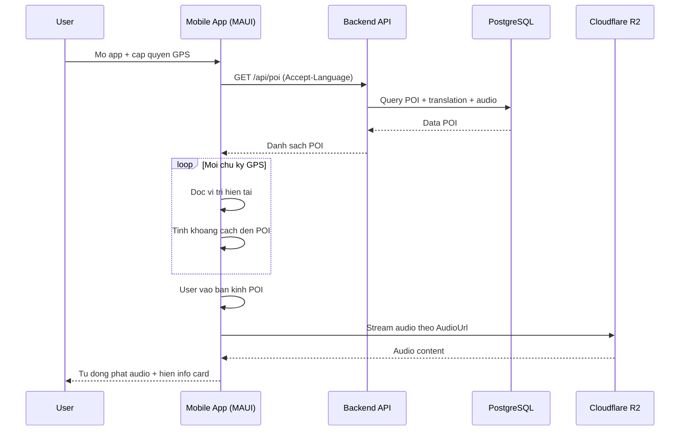
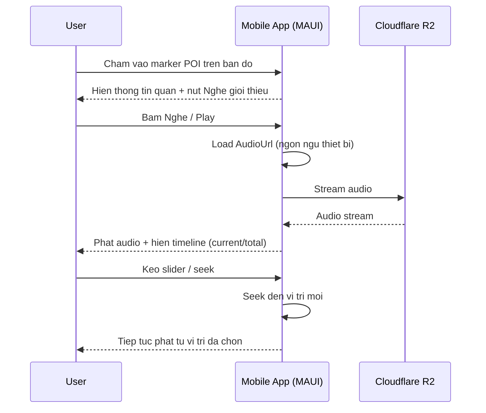
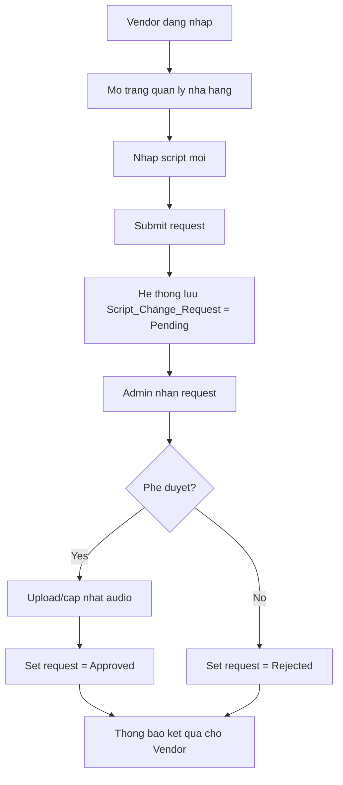
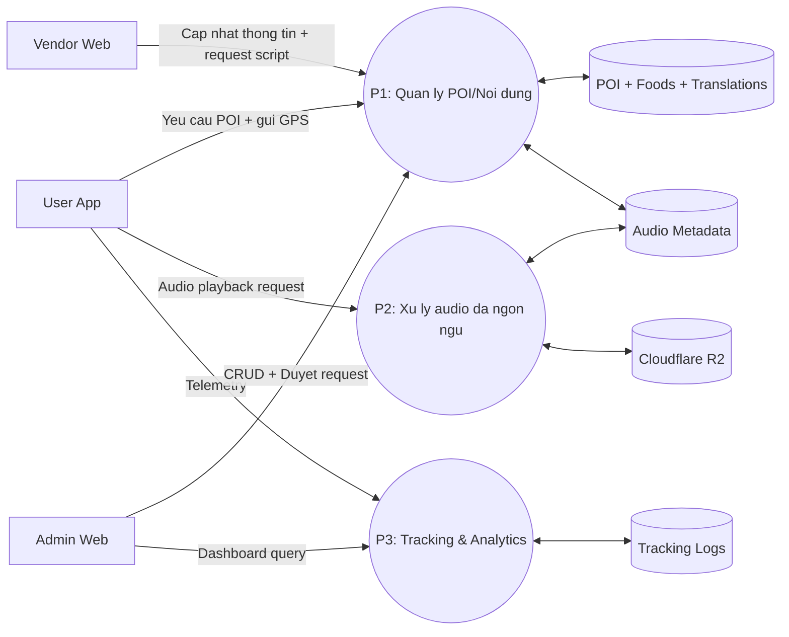

# PRD (Product Requirements Document) - StreetFood

## 1. Giới thiệu
### 1.1 Mục tiêu tài liệu
Tài liệu này mô tả đầy đủ yêu cầu sản phẩm cho dự án **StreetFood** theo hướng MVP có thể triển khai thực tế cho đồ án đại học hoặc startup giai đoạn đầu.  
PRD tập trung vào nghiệp vụ cốt lõi: phát audio giới thiệu nhà hàng theo vị trí GPS, đa ngôn ngữ, và khả năng quản trị nội dung qua web.

### 1.2 Tổng quan dự án
StreetFood là hệ thống **mobile + backend + admin/vendor web**:
- Người dùng quét QR để cài app.
- App dùng GPS phát hiện nhà hàng lân cận (POI).
- Khi người dùng đi vào bán kính POI, app tự động phát audio theo ngôn ngữ thiết bị.
- Người dùng có thể **chọn bất kỳ POI trên bản đồ** (kể cả đang ở xa) để mở thông tin và **phát audio giới thiệu chủ động**, kèm **thanh tiến trình / tua** (seek) theo thời gian thực.
- Backend cung cấp API dữ liệu POI, món ăn, audio đa ngôn ngữ.
- Admin quản trị dữ liệu và theo dõi analytics.
- Vendor cập nhật thông tin nhà hàng và gửi yêu cầu đổi audio script chờ admin duyệt.

### 1.3 Phạm vi phiên bản
- **In scope (MVP):** định vị, hiển thị POI, auto play audio, **chọn POI trên map để nghe on-demand**, **player có thanh mốc thời gian + tua được**, đa ngôn ngữ, quản trị cơ bản POI/foods/audio, analytics cơ bản.
- **Out of scope:** thanh toán, đặt bàn, loyalty, AI recommendation nâng cao thời gian thực.

---

## 2. Mục tiêu sản phẩm
### 2.1 Mục tiêu kinh doanh
- Tăng khả năng thu hút khách vãng lai cho nhà hàng.
- Tạo khác biệt bằng trải nghiệm audio theo vị trí.
- Xây nền tảng dữ liệu hành vi di chuyển để phục vụ quyết định vận hành.

### 2.2 Mục tiêu người dùng
- Tiếp cận nhanh thông tin nhà hàng gần nhất mà không cần tìm kiếm thủ công.
- Nghe nội dung giới thiệu bằng ngôn ngữ quen thuộc.
- Trải nghiệm mượt ngay cả khi mạng yếu (có cache offline).
- Nghe trước giới thiệu quán khi còn ở xa (ví dụ du khách lên kế hoạch) và điều chỉnh vị trí nghe trong file audio.

### 2.3 KPI đề xuất
- Tỷ lệ bật quyền vị trí: >= 80%.
- Tỷ lệ auto-trigger audio thành công trong vùng POI: >= 95%.
- P95 response time API đọc dữ liệu: < 300ms.
- Tỷ lệ fallback ngôn ngữ thành công: >= 99%.
- Thời lượng phiên dùng app trung bình: >= 3 phút.

---

## 3. Personas và nhu cầu
### 3.1 User (Khách/du khách)
- Cần biết chỗ ăn gần mình.
- Muốn thông tin nhanh, rảnh tay, đa ngôn ngữ.
- Không muốn thao tác nhiều khi đang di chuyển.

### 3.2 Vendor (Chủ nhà hàng)
- Muốn cập nhật thông tin nhà hàng, menu, hình ảnh.
- Muốn thay đổi nội dung audio nhưng qua quy trình kiểm duyệt.

### 3.3 Admin
- Quản lý hệ thống nội dung tập trung.
- Duyệt yêu cầu thay đổi script từ vendor.
- Theo dõi số liệu truy cập, heatmap, tuyến đường phổ biến.

---

## 4. Tính năng và yêu cầu chức năng
## 4.1 Mobile App (.NET MAUI)
### FR-M01: Cài đặt qua QR
- Người dùng quét QR để mở landing/install flow.
- Hỗ trợ deep link tới trang cài app tương ứng nền tảng.

### FR-M02: Định vị GPS
- Xin quyền vị trí khi mở app lần đầu.
- Theo dõi vị trí định kỳ khi app foreground.

### FR-M03: Hiển thị POI trên bản đồ
- Hiển thị marker cho nhà hàng lân cận (và/hoặc toàn bộ POI trong vùng tải dữ liệu).
- **Bấm marker / chạm POI** mở thẻ thông tin (bottom sheet hoặc card) **không phụ thuộc khoảng cách** — du khách có thể xem quán và quyết định nghe dù đang ở xa.

### FR-M04: Auto trigger audio theo bán kính POI
- Khi user vào bán kính POI, tự động hiển thị info card và phát audio.
- Có cooldown để tránh phát lặp quá dày.
- Khi ra khỏi vùng POI, dừng/ẩn trạng thái phát tự động.
- **Tương tác với chế độ chủ động (FR-M08):** Khi user đang phát audio do **chọn POI thủ công**, hệ thống **không tự đổi bài** sang POI khác chỉ vì geofence (tránh cắt ngang trải nghiệm). Auto-play geofence chỉ kích hoạt khi không có phiên phát on-demand đang active, hoặc sau khi user dừng/hoàn tất bài đang nghe — chi tiết ưu tiên do UX quyết định trong spec kỹ thuật.

### FR-M05: Đa ngôn ngữ
- Hỗ trợ `vi`, `en`, `zh`, `ja`, `ko`.
- Gửi `Accept-Language` theo ngôn ngữ thiết bị.
- Fallback về `en` nếu thiếu dữ liệu ngôn ngữ yêu cầu.

### FR-M06: Offline support (SQLite cache)
- Cache POI + translations + metadata gần nhất.
- Nếu offline: dùng dữ liệu cache để hiển thị bản đồ và thông tin cơ bản.
- Audio offline là tùy chọn nâng cao (phase sau); MVP ưu tiên stream.

### FR-M07: Tìm kiếm và lọc
- Tìm theo tên nhà hàng.
- Lọc theo loại món/khung giờ mở cửa/khoảng cách.

### FR-M08: Chọn POI trên bản đồ để nghe on-demand (không cần vào bán kính)
- Từ bản đồ hoặc kết quả tìm kiếm, user chọn một POI → hiển thị thông tin quán (tên, địa chỉ, giờ mở cửa, ảnh, khoảng cách nếu có GPS).
- Nút **“Nghe giới thiệu”** (hoặc tương đương) phát `AudioUrl` đúng ngôn ngữ thiết bị (fallback như FR-M05).
- Cho phép đóng thẻ / chuyển POI khác; khi chuyển POI có thể dừng bài cũ hoặc hỏi xác nhận (tùy MVP, mặc định: dừng và load bài mới).

### FR-M09: Trình phát audio với thanh mốc thời gian (timeline) và tua (seek)
- Luôn hiển thị khi đang có audio: **thời gian đã phát / tổng thời lượng** (ví dụ `0:42 / 2:15`).
- **Thanh trượt (slider/scrubber)** đồng bộ với tiến độ phát; user **kéo để tua** tới vị trí mong muốn.
- Giữ **Play / Pause**; khi tạm dừng, thanh thời gian giữ nguyên vị trí.
- Xử lý trạng thái tải/buffering: hiển thị loading hoặc khóa slider tạm thời cho đến khi stream sẵn sàng (theo khả năng nền tảng MAUI / MediaElement).
- Áp dụng chung cho cả **phát tự động theo geofence** và **phát on-demand** (cùng một component player).
- **Ghi chú triển khai:** Để seek ổn định, file audio trên R2/CDN nên phục vụ qua **HTTP Range requests** (hoặc định dạng phù hợp với control phát của MAUI); team kỹ thuật xác nhận trong spike trước khi khóa UI.

## 4.2 Backend API (.NET)
### FR-B01: Quản lý POI
- CRUD POI: tọa độ, bán kính, địa chỉ, ảnh.
- API đọc danh sách POI theo vùng địa lý hoặc gần user.

### FR-B02: Quản lý foods và images
- CRUD món ăn theo nhà hàng.
- Lưu URL ảnh món ăn.

### FR-B03: Quản lý audio đa ngôn ngữ
- Lưu metadata audio theo `PoiId + LanguageCode`.
- File audio lưu Cloudflare R2, DB lưu `AudioUrl`.

### FR-B04: Quản lý nội dung đa ngôn ngữ
- CRUD `POI_Translations`.
- Trả dữ liệu theo ngôn ngữ client.

### FR-B05: API cho mobile
- API đọc POI + translation + detail + audio.
- API tìm kiếm/lọc.
- API gửi telemetry visit/location/path.

## 4.3 Admin Web
### FR-A01: Quản lý nhà hàng
- CRUD POI, translations, foods, details.

### FR-A02: Quản lý audio
- Upload/replace audio lên R2.
- Gắn audio theo từng ngôn ngữ.

### FR-A03: Dashboard analytics
- Most visited restaurants.
- Heatmap vị trí người dùng.
- Most popular routes giữa POIs.
- Average visit duration.

### FR-A04: Duyệt yêu cầu từ vendor
- Danh sách request đổi script.
- Approve/Reject + lưu lịch sử.

## 4.4 Vendor Web
### FR-V01: Chỉnh sửa thông tin nhà hàng
- Cập nhật profile nhà hàng và menu trong phạm vi được cấp quyền.

### FR-V02: Request thay đổi audio script
- Gửi text script mới theo ngôn ngữ.
- Không được tự thay audio trực tiếp.
- Theo dõi trạng thái: pending/approved/rejected.

---

## 5. User stories
### 5.1 User
- Là người dùng, tôi muốn thấy nhà hàng gần tôi trên bản đồ để quyết định ghé nhanh.
- Là người dùng, tôi muốn khi đi vào vùng POI thì audio tự phát để không cần thao tác.
- Là người dùng, tôi muốn nghe đúng ngôn ngữ máy của tôi.
- Là người dùng, tôi muốn app vẫn dùng được khi mạng yếu nhờ cache.
- Là người dùng, tôi muốn tìm và lọc nhà hàng theo nhu cầu.
- Là người dùng, tôi muốn **chạm vào POI trên bản đồ** để xem quán và **nghe giới thiệu ngay cả khi tôi chưa tới gần**.
- Là người dùng, tôi muốn **thấy thanh thời gian** của bài audio và **kéo tua** tới đoạn tôi muốn nghe lại hoặc bỏ qua phần đầu.

### 5.2 Vendor
- Là vendor, tôi muốn chỉnh thông tin nhà hàng của mình để thông tin luôn chính xác.
- Là vendor, tôi muốn gửi yêu cầu đổi script audio và chờ admin duyệt.

### 5.3 Admin
- Là admin, tôi muốn quản lý toàn bộ nhà hàng/món/audio trên một dashboard.
- Là admin, tôi muốn xem analytics để tối ưu vận hành.
- Là admin, tôi muốn duyệt yêu cầu vendor theo quy trình rõ ràng.

---

## 6. Luồng người dùng chính
### 6.1 User flow
**Luồng theo vị trí (geofence):**  
`Scan QR -> Install App -> Open App -> Grant GPS -> View Map/POIs -> Enter POI Radius -> Auto Play Audio (+ timeline / seek)`

**Luồng chủ động (du khách / nghe từ xa):**  
`Open App -> View Map/POIs -> Tap POI -> Xem thông tin -> Nghe giới thiệu (Play) -> Tùy chỉnh bằng thanh thời gian (tua) / Pause`

### 6.2 Vendor flow
`Login -> Edit Restaurant Info -> Submit Audio Script Request -> Wait Approval`

### 6.3 Admin flow
`Login -> Manage Data -> Review Vendor Requests -> Approve/Reject -> View Analytics`

---

## 7. Kiến trúc hệ thống (System Architecture Overview)


---

## 8. Tổng quan cơ sở dữ liệu (Database Overview)
## 8.1 Danh sách bảng chính
- `POIs`
- `POI_Translations`
- `Restaurant_Audio`
- `Restaurant_Details`
- `Foods`
- `Users`
- `Restaurant_Owners`
- `Script_Change_Requests`
- `Device_Visits`
- `Location_Logs`
- `Movement_Paths`
- `Languages`

## 8.2 ERD (Mermaid)


---

## 9. Thiết kế analytics
### 9.1 Số liệu cần thu thập
- **Visit count theo POI:** từ `Device_Visits`.
- **Visit duration:** `ExitTime - EnterTime`.
- **Heatmap:** tổng hợp `Location_Logs` theo lưới tọa độ.
- **Popular routes:** chuỗi chuyển dịch `FromPoiId -> ToPoiId` từ `Movement_Paths`.

### 9.2 Metrics/dashboard
- Top N POI theo lượt ghé.
- Thời lượng ghé trung bình theo POI.
- Bản đồ nhiệt theo khung giờ.
- Top tuyến di chuyển (cặp POI) theo tần suất.

### 9.3 Chu kỳ cập nhật
- Near real-time (1-5 phút) cho dashboard vận hành.
- Daily aggregation cho báo cáo xu hướng.

---

## 10. Yêu cầu phi chức năng (NFR)
- **Hiệu năng:** API đọc dữ liệu P95 < 300ms.
- **Khả năng mở rộng:** hỗ trợ tăng số lượng POI và người dùng đồng thời.
- **Bảo mật:** JWT authentication, RBAC (admin/vendor), mã hóa kết nối HTTPS.
- **Độ tin cậy:** hệ thống hoạt động ổn định khi mạng chập chờn.
- **Offline:** mobile có SQLite cache cho dữ liệu đọc.
- **Khả dụng:** UX đơn giản, ít thao tác, phản hồi rõ khi lỗi mạng/quyền vị trí.

---

## 11. Sơ đồ Use Case

```mermaid
flowchart TB
    User((User))
    Vendor((Vendor))
    Admin((Admin))

    UC1[Scan QR va cai app]
    UC2[Xem POI gan day]
    UC3[Nghe audio tu dong]
    UC4[Tim kiem va loc]
    UC4b[Chon POI tren map nghe on-demand]
    UC4c[Dieu khien timeline va tua audio]

    UC5[Dang nhap Vendor]
    UC6[Chinh sua thong tin nha hang]
    UC7[Gui yeu cau doi audio script]

    UC8[Dang nhap Admin]
    UC9[CRUD nha hang/foods/audio]
    UC10[Duyet yeu cau vendor]
    UC11[Xem analytics dashboard]

    User --> UC1
    User --> UC2
    User --> UC3
    User --> UC4
    User --> UC4b
    User --> UC4c

    Vendor --> UC5
    Vendor --> UC6
    Vendor --> UC7

    Admin --> UC8
    Admin --> UC9
    Admin --> UC10
    Admin --> UC11
```


---

## 12. Sequence diagram (User vao POI va phat audio)


## 12.1 Sequence diagram (User chọn POI trên map — on-demand + timeline)


---

## 13. Activity diagram (Vendor request doi script)


---

## 14. Data Flow Diagram (DFD Level 1)


---

## 15. UI wireframe (MVP)
## 15.1 Mobile - Home map
```text
+--------------------------------------------------+
| StreetFood                                       |
| [Search.................] [Filter]               |
|                                                  |
|                (MAP VIEW)                        |
|          o User                                  |
|      [POI1]   [POI2]   [POI3]                    |
|                                                  |
|----------------------------------------------    |
| [Restaurant Card]  (mo khi: gan POI HOAC cham POI) |
| Name: Highlands Coffee                           |
| Address: 98 Nguyen Tri Phuong                    |
| Open: 07:00 - 22:00   | ~1.2 km (neu co GPS)     |
| [Nghe gioi thieu]  [Play] [Pause]                |
| |------o-----------------------|  0:42 / 2:15     |
|  ^-------- slider timeline (tua duoc) ----------- |
+--------------------------------------------------+
```
*Ghi chú:* Dòng timeline hiển thị khi có audio; user kéo “o” để tua. Có thể gom “Nghe giới thiệu” với Play nếu UI tối giản.

## 15.2 Admin - Dashboard
```text
+---------------------------------------------------------------+
| Admin Dashboard                                               |
| [POIs] [Foods] [Audio] [Requests] [Analytics]                |
|---------------------------------------------------------------|
| KPI: Visits Today | Avg Duration | Active POIs               |
|---------------------------------------------------------------|
| Heatmap Panel                 | Popular Routes                |
|                               | POI A -> POI B (120)         |
|                               | POI B -> POI C (95)          |
|---------------------------------------------------------------|
| Most Visited Restaurants Table                                |
+---------------------------------------------------------------+
```

## 15.3 Vendor - Request audio script
```text
+--------------------------------------------------+
| Vendor Portal                                    |
| [Restaurant Info] [Menu] [Audio Requests]        |
|--------------------------------------------------|
| Restaurant: Co Chi Thi Nen                       |
| Language: [vi v]                                 |
| New Script:                                      |
| [............................................]   |
| [............................................]   |
| Status: Pending                                  |
| [Submit Request]                                 |
+--------------------------------------------------+
```

---

## 16. API overview đề xuất
### 16.1 Mobile APIs
- `GET /api/poi?lat=&lng=&radius=&lang=`
- `GET /api/poi/{id}`
- `GET /api/poi/search?q=&filters=`
- `POST /api/telemetry/visit`
- `POST /api/telemetry/location`
- `POST /api/telemetry/path`

### 16.2 Admin/Vendor APIs
- `POST /api/auth/login`
- `GET/POST/PUT/DELETE /api/admin/pois`
- `GET/POST/PUT/DELETE /api/admin/foods`
- `POST /api/admin/audio/upload`
- `GET /api/admin/analytics/*`
- `POST /api/vendor/script-requests`
- `GET /api/vendor/script-requests`
- `POST /api/admin/script-requests/{id}/approve`
- `POST /api/admin/script-requests/{id}/reject`

---

## 17. Bảo mật và phân quyền
- JWT cho xác thực.
- RBAC:
  - `admin`: toàn quyền quản trị.
  - `vendor`: chỉnh sửa trong phạm vi POI được gán.
  - `user`: chỉ đọc dữ liệu công khai.
- Audit log cho thao tác nhạy cảm (upload audio, approve request).
- Giới hạn tần suất API (rate limit) chống lạm dụng.

---

## 18. Kế hoạch triển khai (Roadmap)
### Phase 1 - MVP core (4-6 tuần)
- Mobile: GPS, map, POI, auto audio, **tap POI phát on-demand**, **player timeline + seek**, đa ngôn ngữ.
- API: POI/translation/audio read APIs.
- DB: schema + seed data.

### Phase 2 - Operations (3-4 tuần)
- Admin CRUD đầy đủ.
- Vendor portal + request workflow.
- Upload audio lên R2.

### Phase 3 - Analytics (3-4 tuần)
- Tracking pipeline.
- Dashboard heatmap/routes/visit duration.
- Tối ưu hiệu năng truy vấn thống kê.

### Phase 4 - Optimization
- Offline nâng cao (audio prefetch tùy chọn).
- Geofencing thông minh giảm hao pin.
- Đề xuất POI cá nhân hóa.

---

## 19. Tiêu chí nghiệm thu MVP
- User cài app qua QR và mở thành công.
- App hiển thị đúng POI gần vị trí hiện tại.
- Vào bán kính POI thì audio tự phát đúng ngôn ngữ.
- User **chạm POI trên bản đồ** khi **ngoài bán kính** vẫn mở được thông tin và **phát được audio** sau khi bấm nghe.
- Khi đang phát audio, UI có **thời gian đã phát / tổng thời lượng** và **thanh tua**; kéo seek cập nhật đúng vị trí phát (trong giới hạn hỗ trợ của nguồn stream).
- Quy tắc **không cắt ngang** bài on-demand bởi auto geofence được áp dụng như mô tả FR-M04.
- Admin quản lý được POI, foods, audio.
- Vendor gửi được request script, admin duyệt được.
- Dashboard hiển thị được 4 chỉ số analytics chính.

---

## 20. Future improvements
- AI voice generation/TTS cho audio đa ngôn ngữ.
- Recommendation engine theo hành vi di chuyển.
- A/B test nội dung audio để tối ưu chuyển đổi ghé quán.
- Tích hợp chiến dịch theo khung giờ và sự kiện địa phương.
- Mở rộng đa thành phố/đa cụm nhà hàng với kiến trúc multi-tenant.
