# PRD (Product Requirements Document) - StreetFood


| Thuộc tính             | Giá trị                                                                                                                     |
| ---------------------- | --------------------------------------------------------------------------------------------------------------------------- |
| **Phiên bản tài liệu** | **2.8**                                                                                                                     |
| **Ngày cập nhật**      | **2026-04-28**                                                                                                              |
| **Trạng thái**         | Đồng bộ với mã nguồn trong repo (MVP vận hành được; đối chiếu `App/`, `StreetFoodAPI/`, `Web Admin/`, `Web Vendor/`)         |
| **Mục đích**           | Mô tả yêu cầu sản phẩm; ghi nhận **tiến độ thực tế**, **phiên bản công nghệ**, **tham chiếu file** để nộp đồ án / bàn giao. |


### Mục lục nhanh

1. [Giới thiệu](#1-giới-thiệu)
2. [Mục tiêu sản phẩm](#2-mục-tiêu-sản-phẩm)
3. [Personas](#3-personas-và-nhu-cầu)
4. [Tính năng chi tiết](#4-tính-năng-và-yêu-cầu-chức-năng)
5. [User stories](#5-user-stories)
6. [Luồng người dùng chính](#6-luồng-người-dùng-chính)
7. [Kiến trúc hệ thống](#7-kiến-trúc-hệ-thống-system-architecture-overview)
8. [CSDL](#8-tổng-quan-cơ-sở-dữ-liệu-database-overview)
9. [Thiết kế analytics](#9-thiết-kế-analytics)
10. [Yêu cầu phi chức năng (NFR)](#10-yêu-cầu-phi-chức-năng-nfr)
11. [Sơ đồ Use Case](#11-sơ-đồ-use-case)
12. [Sequence diagram](#12-sequence-diagram)
13. [Activity diagram](#13-activity-diagram)
14. [Data Flow Diagram (DFD Level 1)](#14-data-flow-diagram-dfd-level-1)
15. [UI wireframe (MVP)](#15-ui-wireframe-mvp)
16. [API thực tế](#16-api-overview-đã-triển-khai-trong-repo)
17. [Bảo mật](#17-bảo-mật-và-phân-quyền)
18. [Roadmap](#18-kế-hoạch-triển-khai-roadmap-và-trạng-thái)
19. [Nghiệm thu](#19-tiêu-chí-nghiệm-thu-mvp)
20. [Future](#20-future-improvements)
21. **[Danh mục tài liệu & mã tham chiếu](#21-danh-mục-tài-liệu-và-tham-chiếu-mã-nguồn)**
22. **[Lịch sử phiên bản PRD](#22-lịch-sử-phiên-bản-prd)**

---

## 1. Giới thiệu

### 1.1 Mục tiêu tài liệu

Tài liệu này mô tả đầy đủ yêu cầu sản phẩm cho dự án **StreetFood** theo hướng MVP có thể triển khai thực tế cho đồ án đại học hoặc startup giai đoạn đầu.  
PRD tập trung vào nghiệp vụ cốt lõi: phát audio giới thiệu nhà hàng theo vị trí GPS, đa ngôn ngữ, và khả năng quản trị nội dung qua web.

### 1.2 Tổng quan dự án

StreetFood là hệ thống **mobile + backend + admin/vendor web**:

- Người dùng kích hoạt app bằng QR/mã hợp lệ trước khi dùng.
- App dùng GPS phát hiện nhà hàng lân cận (POI).
- Khi người dùng đi vào bán kính POI, app tự động phát audio theo ngôn ngữ thiết bị.
- Người dùng có thể **chọn bất kỳ POI trên bản đồ** (kể cả đang ở xa) để mở thông tin và **phát audio giới thiệu chủ động**, kèm **thanh tiến trình / tua** (seek) theo thời gian thực.
- Backend cung cấp API dữ liệu POI, món ăn, audio đa ngôn ngữ.
- Admin quản trị dữ liệu và theo dõi analytics.
- Vendor cập nhật thông tin nhà hàng và gửi yêu cầu đổi audio script chờ admin duyệt.

### 1.3 Phạm vi phiên bản

- **In scope (MVP):** định vị, hiển thị POI, auto play audio, **chọn POI trên map để nghe on-demand**, **player có thanh mốc thời gian + tua được**, đa ngôn ngữ, quản trị cơ bản POI/foods/audio, analytics cơ bản.
- **Out of scope (user app):** thanh toán/đặt bàn/loyalty trong app khách, AI recommendation nâng cao thời gian thực. **Thanh toán MoMo gói Premium** thuộc **Web Vendor** (đã triển khai; xem `VendorShopController`, `upgradePage.html`).

### 1.4 Sản phẩm con & phiên bản công nghệ (repo hiện tại)


| Thành phần          | Vị trí trong repo                                | Công nghệ / phiên bản (tham chiếu `.csproj`)                                                                                                                               |
| ------------------- | ------------------------------------------------ | -------------------------------------------------------------------------------------------------------------------------------------------------------------------------- |
| **Mobile**          | `App/`                                           | .NET **MAUI** `net10.0` (Android, iOS, Mac Catalyst, Windows); `Microsoft.Maui.Controls` **10.0.50**; Maps, MediaElement, ZXing (QR), SQLite (`sqlite-net-pcl`).           |
| **API**             | `StreetFoodAPI/`                                 | ASP.NET Core **net10.0**; **PostgreSQL** qua **Dapper** + `Npgsql`; Azure **Speech** (TTS) & **Translator** (dịch script); tùy chọn `Admin:ApiKey` + header `X-Admin-Key`. |
| **Admin Web**       | `Web Admin/wwwroot/`                             | ASP.NET Core static host **net10.0**; HTML/CSS/JS (`admin-api.js`, `config.js`).                                                                                           |
| **Vendor Web**      | `Web Vendor/wwwroot/`                            | Cùng kiểu static host **net10.0**.                                                                                                                                         |
| **Tầng dùng chung** | `StreetFood.Domain`, `StreetFood.Infrastructure` | Hỗ trợ API & migration SQL (`StreetFood.Infrastructure/Migrations`).                                                                                                       |


### 1.5 Cổng dịch vụ phát triển (launchSettings — tham chiếu)


| Dịch vụ           | HTTPS (mặc định dev)     | HTTP                                                          | Ghi chú                                                                                                          |
| ----------------- | ------------------------ | ------------------------------------------------------------- | ---------------------------------------------------------------------------------------------------------------- |
| **StreetFoodAPI** | `https://localhost:7236` | `http://localhost:5191` (profile `http` có thể bind `*:5191`) | Client admin/vendor: biến `STREETFOOD_API` trong `Web Admin/wwwroot/config.js` / `Web Vendor/wwwroot/config.js`. |
| **Web Admin**     | `https://localhost:7238` | `http://localhost:5238`                                       | Trang quản trị: `/html/loginPage.html`, dashboard, heatmap, v.v.                                                 |
| **Web Vendor**    | `https://localhost:7240`     | `http://localhost:5240`                                       | Cổng chủ quán.                                                                                                   |


**Lưu ý triển khai:** Cần chạy **API** và web cùng lúc; HTTPS tránh lỗi mixed content khi admin gọi API HTTPS.

---

## 2. Mục tiêu sản phẩm

### 2.1 Mục tiêu kinh doanh

- Tăng khả năng thu hút khách vãng lai cho nhà hàng.
- Tạo khác biệt bằng trải nghiệm audio theo vị trí.
- Xây nền tảng dữ liệu hành vi di chuyển để phục vụ quyết định vận hành.

### 2.2 Mục tiêu người dùng

- Tiếp cận nhanh thông tin nhà hàng gần nhất mà không cần tìm kiếm thủ công.
- Nghe nội dung giới thiệu bằng ngôn ngữ quen thuộc.
- Trải nghiệm mượt ngay cả khi mạng yếu (có cache offline).
- Nghe trước giới thiệu quán khi còn ở xa (ví dụ du khách lên kế hoạch) và điều chỉnh vị trí nghe trong file audio.

### 2.3 KPI đề xuất

- Tỷ lệ bật quyền vị trí: >= 80%.
- Tỷ lệ auto-trigger audio thành công trong vùng POI: >= 95%.
- P95 response time API đọc dữ liệu: < 300ms.
- Tỷ lệ fallback ngôn ngữ thành công: >= 99%.
- Thời lượng phiên dùng app trung bình: >= 3 phút.

---

## 3. Personas và nhu cầu

### 3.1 User (Khách/du khách)

- Cần biết chỗ ăn gần mình.
- Muốn thông tin nhanh, rảnh tay, đa ngôn ngữ.
- Không muốn thao tác nhiều khi đang di chuyển.

### 3.2 Vendor (Chủ nhà hàng)

- Muốn cập nhật thông tin nhà hàng, menu, hình ảnh.
- Muốn thay đổi nội dung audio nhưng qua quy trình kiểm duyệt.

### 3.3 Admin

- Quản lý hệ thống nội dung tập trung.
- Duyệt yêu cầu thay đổi script từ vendor.
- Theo dõi số liệu truy cập, heatmap, tuyến đường phổ biến.

### 3.4 Tiến độ triển khai (snapshot — đối chiếu mã nguồn)

Trạng thái gợi ý: **Đã có** = có UI/API rõ trong repo; **Một phần** = có nền tảng nhưng chưa đầy đủ so PRD gốc; **Tùy cấu hình** = cần khóa API/môi trường.

#### App MAUI (`App/Views/`)


| Mã     | Yêu cầu                                                   | Trạng thái   | Ghi chú                                                                           |
| ------ | --------------------------------------------------------- | ------------ | --------------------------------------------------------------------------------- |
| FR-M01 | Kích hoạt app bằng QR / mã thủ công                      | **Đã có**      | `QrGatePage.xaml` + `QrAccess.cs` + `ActivationService` (modal khi chưa kích hoạt; JWT HS256 *hoặc* mã dạng `StreetFood` / `30_days_activation` — lưu hạn dùng cục bộ) |
| FR-M02 | GPS                                                       | **Đã có**    | `HomePage` + quyền vị trí                                                         |
| FR-M03 | POI trên bản đồ, chạm xem thông tin                       | **Đã có**    | Maps + card POI                                                                   |
| FR-M04 | Auto audio theo bán kính + queue lộ trình + skip bằng vuốt trái | **Đã có** | Geofence + ưu tiên Premium/heat/khoảng cách; queue POI trong vùng; vuốt trái bỏ qua POI hiện tại để phát POI kế tiếp; có lock/gate chống race |
| FR-M05 | Đa ngôn ngữ `vi/en/cn/ja/ko`                              | **Đã có**    | API `Accept-Language`; fallback                                                   |
| FR-M06 | SQLite cache                                              | **Một phần** | Thư viện `sqlite-net-pcl` có trong project; độ phủ cache POI/audio tùy triển khai |
| FR-M07 | Gợi ý theo lượt ghé + khoảng cách; tìm theo từ khóa     | **Đã có**    | `SuggestPage` gọi `GET /api/Poi/top` + sắp `VisitCount`/khoảng cách; **Bản đồ** lọc client theo tên/địa chỉ/mô tả (`SearchEntry` trên `HomePage`) |
| FR-M08 | On-demand nghe ngoài bán kính                             | **Đã có**    | Chọn POI → `PoiDetailPage`                                                        |
| FR-M09 | Timeline + seek                                           | **Đã có**    | `CommunityToolkit.Maui.MediaElement`                                              |
| —      | Gửi thống kê thời lượng nghe                              | **Đã có**    | `POST /api/analytics/poi-audio-listen` (`ListenAnalyticsController`)              |


#### Backend API (`StreetFoodAPI/Controllers/`)


| Mã         | Yêu cầu           | Trạng thái | Ghi chú                                                                  |
| ---------- | ----------------- | ---------- | ------------------------------------------------------------------------ |
| FR-B01–B02 | POI, foods        | **Đã có**  | `PoiController`; bảng `POIs`, `Foods`, …                                 |
| FR-B03     | Audio đa ngôn ngữ | **Đã có**  | `Restaurant_Audio`; URL tới CDN/R2 tùy cấu hình                          |
| FR-B04     | Translation       | **Đã có**  | `POI_Translations`                                                       |
| FR-B05     | Telemetry         | **Đã có**  | Visit/path/listen events (admin analytics + `ListenAnalyticsController`) |
| —          | Auth web          | **Đã có**  | `POST /api/auth/login` (admin/vendor)                                    |       |


#### Admin Web (`Web Admin/wwwroot/html/`)


| Mã PRD                       | Trạng thái       | Ghi chú                                                                                                                                                                                           |
| ---------------------------- | ---------------- | ------------------------------------------------------------------------------------------------------------------------------------------------------------------------------------------------- |
| FR-A01 Quản lý dữ liệu & tài khoản | **Một phần** | **Tạo** POI+owner `createPoiOwnerPage.html`; trang `managePOIPage.html` / `manageShopsPage.html` (theo tên); CRUD món/ảnh/audio chi tiết qua **vendor** + `poi-with-owner` / phê duyệt. |
| FR-A02 Upload audio          | **Tùy cấu hình** | TTS/regenerate qua API (`regenerate-audio`); vendor có thể gửi **gói 5 URL** (`submit-audio-bundle`).                                                                                             |
| FR-A03 Dashboard / analytics | **Đã có**        | `dashboardPage.html`, `routeHeatmapPage.html`, `poiListenStatsPage.html`; online-now có polling thông minh (pause khi tab ẩn, chống chồng request, backoff khi lỗi/chậm). |
| FR-A04 Duyệt script          | **Đã có**        | `pendingScriptsPage.html`; phê duyệt + TTS/dịch theo `AdminController`.                                                                                                                           |


#### Vendor Web (`Web Vendor/wwwroot/html/`)


| Mã                            | Trạng thái | Ghi chú                                                          |
| ----------------------------- | ---------- | ---------------------------------------------------------------- |
| FR-V01 Sửa shop / menu        | **Đã có**  | `VendorShopController` (foods CRUD, update details)              |
| FR-V02 Request script / audio | **Đã có**  | `VendorScriptController`: `submit-script`, `submit-audio-bundle` |
| FR-V03 Nâng cấp Premium       | **Đã có**  | MoMo payment + IPN kích hoạt premium cho POI vendor.             |


---

## 4. Tính năng và yêu cầu chức năng

## 4.1 Mobile App (.NET MAUI)

### FR-M01: Kích hoạt qua QR (bắt buộc trước khi dùng)

- `AppShell` đẩy modal `QrGatePage` khi chưa kích hoạt (`ActivationService.IsCurrentlyActivated()`).
- Nội dung mã: **JWT HS256** (issuer `StreetFood`, `typ=activation`, ký bằng shared secret trong `QrAccess`) **hoặc** mã in ấn dạng `StreetFood` / `30_days_activation:…` (tùy chọn kèm `|WEEK` / `|MONTH` / tương đương) — xem `QrAccess.TryParseActivation`.
- Có thể **nhập tay** cùng payload khi không bật camera; lưu hạn dùng trên **Preferences** (7/30 ngày tùy plan), không cần gọi API.

### FR-M02: Định vị GPS

- Xin quyền vị trí khi mở app lần đầu.
- Theo dõi vị trí định kỳ khi app foreground.

### FR-M03: Hiển thị POI trên bản đồ

- Hiển thị marker cho nhà hàng lân cận (và/hoặc toàn bộ POI trong vùng tải dữ liệu).
- **Bấm marker / chạm POI** mở thẻ thông tin (bottom sheet hoặc card) **không phụ thuộc khoảng cách** — du khách có thể xem quán và quyết định nghe dù đang ở xa.

### FR-M04: Tự phát audio theo bán kính POI (geofence) + hàng đợi POI

- **Chọn POI active:** `FindPoiContainingUser` và `GetNearbyPoiCandidates` sắp theo **Premium** → **heat** → **khoảng cách gần hơn**.
- **Queue POI theo lộ trình:** app duy trì `_audioPoiQueue` (kèm tập `_queuedPoiIds`, `_skippedPoiIds`) để lưu các POI đang trong vùng theo thứ tự ưu tiên.
- **Vuốt trái để bỏ qua:** trên info card có `SwipeGestureRecognizer Direction="Left"`; khi vuốt trái POI hiện tại sẽ bị skip tạm thời và app thử phát POI kế tiếp trong queue.
- **Độ tin cậy GPS:** nếu `Accuracy > 120m` thì bỏ qua auto geofence để tránh kích hoạt sai.
- **Cooldown:** `CanPlay` 300 giây/POI chống phát lặp.
- **Pinned mode:** khi user chạm map/pin và ghim card, auto-play chỉ theo POI đã ghim; ra khỏi bán kính thì dừng.
- **Thread-safe trong app:** cập nhật queue dùng `lock (_queueSync)`; chuyển bài dùng `SemaphoreSlim _playSwitchGate` để tránh race giữa GPS loop, swipe và play thủ công.
- **Thiết bị đứng giữa 2 POI:** nếu ngoài toàn bộ bán kính thì `activePoi` rỗng; nếu giao nhiều vùng thì vẫn chọn 1 POI thắng theo thứ tự ưu tiên nêu trên.

### FR-M05: Đa ngôn ngữ

- Hỗ trợ `vi`, `en`, `zh`, `ja`, `ko`.
- Gửi `Accept-Language` theo ngôn ngữ thiết bị.
- Fallback về `en` nếu thiếu dữ liệu ngôn ngữ yêu cầu.

### FR-M06: Offline support (SQLite cache)

- Cache POI + translations + metadata gần nhất.
- Nếu offline: dùng dữ liệu cache để hiển thị bản đồ và thông tin cơ bản.
- Audio offline là tùy chọn nâng cao (phase sau); MVP ưu tiên stream.

### FR-M07: Gợi ý (tab **Đề xuất**) và tìm trên bản đồ

- **Suggest:** tải top POI qua `GET /api/Poi/top`, kết hợp vị trí user để tính khoảng cách, sắp theo `VisitCount` rồi theo gần (`SuggestPage`).
- **Home map:** thanh tìm **lọc client-side** theo tên, địa chỉ, mô tả trên `poiList` đã tải (không gọi API tìm kiếm riêng).

### FR-M08: Chọn POI trên bản đồ để nghe on-demand (không cần vào bán kính)

- Từ bản đồ hoặc kết quả tìm kiếm, user chọn một POI → hiển thị thông tin quán (tên, địa chỉ, giờ mở cửa, ảnh, khoảng cách nếu có GPS).
- Nút **“Nghe giới thiệu”** (hoặc tương đương) phát `AudioUrl` đúng ngôn ngữ thiết bị (fallback như FR-M05).
- Cho phép đóng thẻ / chuyển POI khác; khi chuyển POI có thể dừng bài cũ hoặc hỏi xác nhận (tùy MVP, mặc định: dừng và load bài mới).

### FR-M09: Trình phát audio với thanh mốc thời gian (timeline) và tua (seek)

- Luôn hiển thị khi đang có audio: **thời gian đã phát / tổng thời lượng** (ví dụ `0:42 / 2:15`).
- **Thanh trượt (slider/scrubber)** đồng bộ với tiến độ phát; user **kéo để tua** tới vị trí mong muốn.
- Giữ **Play / Pause**; khi tạm dừng, thanh thời gian giữ nguyên vị trí.
- Xử lý trạng thái tải/buffering: hiển thị loading hoặc khóa slider tạm thời cho đến khi stream sẵn sàng (theo khả năng nền tảng MAUI / MediaElement).
- Áp dụng chung cho cả **phát tự động theo geofence** và **phát on-demand** (cùng một component player).
- **Ghi chú triển khai:** Để seek ổn định, file audio trên R2/CDN nên phục vụ qua **HTTP Range requests** (hoặc định dạng phù hợp với control phát của MAUI); team kỹ thuật xác nhận trong spike trước khi khóa UI.

## 4.2 Backend API (.NET)

### FR-B01: Quản lý POI

- CRUD POI: tọa độ, bán kính, địa chỉ, ảnh.
- API đọc danh sách POI theo vùng địa lý hoặc gần user.

### FR-B02: Quản lý foods và images

- CRUD món ăn theo nhà hàng.
- Lưu URL ảnh món ăn.

### FR-B03: Quản lý audio đa ngôn ngữ

- Lưu metadata audio theo `PoiId + LanguageCode`.
- File audio lưu Cloudflare R2, DB lưu `AudioUrl`.

### FR-B04: Quản lý nội dung đa ngôn ngữ

- CRUD `POI_Translations`.
- Trả dữ liệu theo ngôn ngữ client.

### FR-B05: API cho mobile

- API đọc POI + translation + detail + audio.
- API tìm kiếm/lọc.
- API gửi telemetry visit/location/path.

## 4.3 Admin Web

### FR-A01: Quản lý nhà hàng

- CRUD POI, translations, foods, details.

### FR-A02: Quản lý audio

- Upload/replace audio lên R2.
- Gắn audio theo từng ngôn ngữ.

### FR-A03: Dashboard analytics

- Most visited restaurants.
- Số người dùng đang hoạt động (online now, cập nhật theo cửa sổ thời gian ngắn).
- Heatmap vị trí người dùng.
- Most popular routes giữa POIs.
- Average visit duration.

### FR-A04: Duyệt yêu cầu từ vendor

- Danh sách request đổi script.
- Approve/Reject + lưu lịch sử.

**Triển khai UI (tham chiếu):** `Web Admin/wwwroot/html/` — `loginPage.html`, `dashboardPage.html` (KPI + online-now + biểu đồ theo `device_visits`), `analyticsPage.html` (giờ / online-now), `routeHeatmapPage.html` (heatmap + paths + phổ biến), `poiListenStatsPage.html` (thời lượng nghe theo POI), `createPoiOwnerPage.html` (tạo POI + owner), `pendingScriptsPage.html`, `restaurantOwnersPage.html` (hide/unhide), `managePOIPage.html`, `manageShopsPage.html`. Sidebar: inject DOM trong `admin-api.js`.

## 4.4 Vendor Web

### FR-V01: Chỉnh sửa thông tin nhà hàng

- Cập nhật profile nhà hàng và menu trong phạm vi được cấp quyền.

### FR-V02: Request thay đổi audio script

- Gửi text script mới theo ngôn ngữ.
- Không được tự thay audio trực tiếp.
- Theo dõi trạng thái: pending/approved/rejected.

### FR-V03: Nâng cấp Premium

- Vendor xem trạng thái gói premium của POI đang quản lý.
- Tạo phiên thanh toán MoMo để nâng cấp premium.
- Sau khi thanh toán thành công (IPN/return), hệ thống cập nhật trạng thái premium và bật quyền tính năng tương ứng.

---

## 5. User stories

### 5.1 User

- Là người dùng, tôi muốn thấy nhà hàng gần tôi trên bản đồ để quyết định ghé nhanh.
- Là người dùng, tôi muốn khi đi vào vùng POI thì audio tự phát để không cần thao tác.
- Là người dùng, tôi muốn nghe đúng ngôn ngữ máy của tôi.
- Là người dùng, tôi muốn app vẫn dùng được khi mạng yếu nhờ cache.
- Là người dùng, tôi muốn tìm và lọc nhà hàng theo nhu cầu.
- Là người dùng, tôi muốn **chạm vào POI trên bản đồ** để xem quán và **nghe giới thiệu ngay cả khi tôi chưa tới gần**.
- Là người dùng, tôi muốn **thấy thanh thời gian** của bài audio và **kéo tua** tới đoạn tôi muốn nghe lại hoặc bỏ qua phần đầu.

### 5.2 Vendor

- Là vendor, tôi muốn chỉnh thông tin nhà hàng của mình để thông tin luôn chính xác.
- Là vendor, tôi muốn gửi yêu cầu đổi script audio và chờ admin duyệt.
- Là vendor, tôi muốn nâng cấp gói Premium để mở quyền tính năng nâng cao cho nhà hàng của tôi.

### 5.3 Admin

- Là admin, tôi muốn quản lý POI và tài khoản chủ quán để kiểm soát dữ liệu hệ thống.
- Là admin, tôi muốn xem analytics và số người dùng đang hoạt động theo thời gian thực để tối ưu vận hành.
- Là admin, tôi muốn duyệt yêu cầu vendor theo quy trình rõ ràng.

---

## 6. Luồng người dùng chính

### 6.1 User flow

**Luồng kích hoạt (lần đầu / hết hạn):**  
`Mở app -> Modal quét/nhập mã -> TryParseActivation -> Lưu hạn dùng local -> Vào tab Bản đồ/Đề xuất`

**Luồng theo vị trí (geofence + queue POI):**  
`Kích hoạt -> Cấp GPS -> Poll vị trí -> Xác định activePoi (Premium > heat > khoảng cách) -> Enqueue POI trong vùng -> Auto-play qua gate -> Có thể SwipeLeft để skip POI hiện tại và phát POI kế`

**Luồng chủ động (chạm POI / chi tiết):**  
`Bản đồ: chạm pin -> Ghim thẻ (có thể ngoài bán kính) -> Mở chi tiết -> Play/Pause/Seek timeline -> Gửi listen analytics`

**Luồng telemetry nền:**  
`GPS loop -> POST /api/Poi/log -> visit start/end -> movement -> POST /api/analytics/poi-audio-listen`

### 6.2 Vendor flow

`Login -> Lấy POI của vendor -> Cập nhật shop/menu/media -> Submit script hoặc audio bundle -> Theo dõi trạng thái pending/approved -> (tùy chọn) nâng cấp Premium qua MoMo`

### 6.3 Admin flow

`Login + X-Admin-Key (nếu bật) -> Quản lý owner/POI -> Duyệt script request -> Theo dõi dashboard + heatmap + tuyến đi + listen stats + online-now`

---

## 7. Kiến trúc hệ thống (System Architecture Overview)

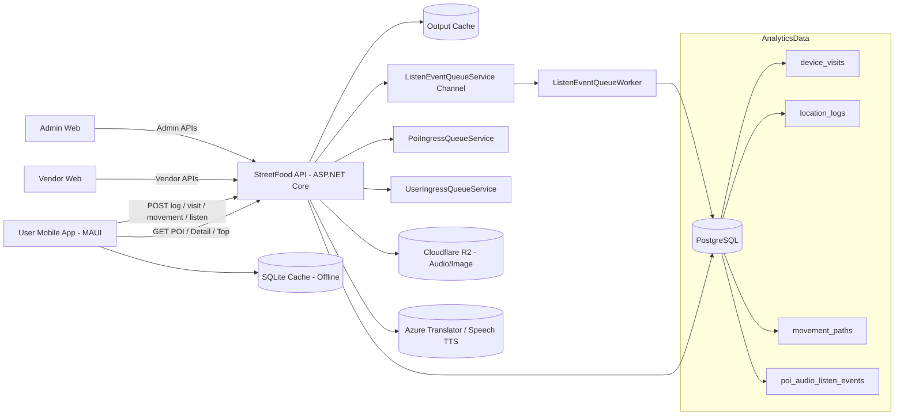
```mermaid
flowchart LR
    U[User Mobile App - MAUI] -->|GET POI / Detail / Top| API[StreetFood API - ASP.NET Core]
    U -->|POST log / visit / movement / listen| API
    V[Vendor Web] -->|Vendor APIs| API
    A[Admin Web] -->|Admin APIs| API

    API --> OC[(Output Cache)]
    API --> LQ[ListenEventQueueService Channel]
    API --> PIQ[PoiIngressQueueService]
    API --> UIQ[UserIngressQueueService]
    LQ --> LW[ListenEventQueueWorker]

    API --> DB[(PostgreSQL)]
    LW --> DB
    API --> R2[(Cloudflare R2 - Audio/Image)]
    API --> AZ[(Azure Translator / Speech TTS)]
    U --> SQ[(SQLite Cache - Offline)]

    subgraph AnalyticsData
      DB --> D1[device_visits]
      DB --> D2[location_logs]
      DB --> D3[movement_paths]
      DB --> D4[poi_audio_listen_events]
    end
```

### 7.1 Vai trò các lớp hiệu năng/đồng thời

- **Output Cache (API đọc):** cache ngắn hạn cho `GET /api/Poi`, `GET /api/Poi/{id}`, `GET /api/Poi/top`, `GET /api/Poi/heat-priority`; có `VaryBy Accept-Language` và query.
- **Response Compression:** bật Brotli/Gzip để giảm payload JSON khi trả danh sách POI/analytics.
- **PoiIngressQueueService:** khóa theo `poiId` để tránh race-condition ở luồng visit/session khi nhiều request đồng thời vào cùng POI.
- **UserIngressQueueService:** khóa theo `username/installId` cho `register-app`, `activate-app`, `activate-device` để tránh ghi đè cạnh tranh.
- **ListenEventQueueService + Worker:** queue ghi `poi_audio_listen_events` theo batch; khi flush lỗi sẽ giữ buffer để retry, giảm nguy cơ mất dữ liệu.
- **DB Index tuning:** migration hiệu năng `V4`, `V5`, `V6` tối ưu truy vấn nóng cho telemetry + analytics + đọc POI.


---

## 8. Tổng quan cơ sở dữ liệu (Database Overview)

## 8.1 Danh sách bảng chính

- `POIs`
- `POI_Translations`
- `Restaurant_Audio`
- `Restaurant_Details`
- `Foods`
- `Users`
- `Restaurant_Owners`
- `Script_Change_Requests`
- `Device_Visits`
- `Location_Logs`
- `Movement_Paths`
- `Languages`
- `poi_audio_listen_events` (thống kê thời lượng nghe từ app — xem `ListenAnalyticsController`)
- `schema_migrations` (lịch sử file SQL đã chạy — do `DbInitializer` tạo)

## 8.2 Sơ đồ ERD


```mermaid
erDiagram
    LANGUAGES {
        varchar code PK
        varchar name
    }

    USERS {
        int id PK
        varchar username UK
        text password
        varchar role
        timestamp createdat
        boolean ishidden
        varchar email
    }

    POIS {
        int id PK
        double latitude
        double longitude
        int radius
        text address
        text imageurl
        timestamp createdat
        varchar scriptsubmissionstate
    }

    POI_TRANSLATIONS {
        int id PK
        int poiid FK
        varchar languagecode FK
        varchar name
        text description
    }

    RESTAURANT_DETAILS {
        int id PK
        int poiid FK
        varchar openinghours
        varchar phone
    }

    RESTAURANT_OWNERS {
        int id PK
        int userid FK
        int poiid FK
    }

    FOODS {
        int id PK
        int poiid FK
        varchar name
        text description
        int price
        text imageurl
        boolean ishidden
    }

    RESTAURANT_AUDIO {
        int id PK
        int poiid FK
        varchar languagecode FK
        text audiourl
    }

    SCRIPT_CHANGE_REQUESTS {
        int id PK
        int poiid FK
        varchar languagecode
        text newscript
        varchar status
        int createdby FK
        timestamp createdat
    }

    DEVICE_VISITS {
        int id PK
        varchar deviceid
        int poiid FK
        timestamp entertime
        timestamp exittime
        int duration
    }

    LOCATION_LOGS {
        int id PK
        varchar deviceid
        double latitude
        double longitude
        timestamp createdat
    }

    MOVEMENT_PATHS {
        int id PK
        varchar deviceid
        int frompoiid
        int topoiid
        timestamp createdat
    }

    POI_AUDIO_LISTEN_EVENTS {
        bigint id PK
        int poi_id FK
        int duration_seconds
        varchar device_id
        timestamp created_at
    }

    POIS ||--o{ POI_TRANSLATIONS : "poiid"
    LANGUAGES ||--o{ POI_TRANSLATIONS : "languagecode"

    POIS ||--o| RESTAURANT_DETAILS : "poiid (UNIQUE)"
    POIS ||--o{ FOODS : "poiid"
    POIS ||--o{ RESTAURANT_AUDIO : "poiid"
    LANGUAGES ||--o{ RESTAURANT_AUDIO : "languagecode"

    USERS ||--o{ RESTAURANT_OWNERS : "userid"
    POIS ||--o{ RESTAURANT_OWNERS : "poiid"

    USERS ||--o{ SCRIPT_CHANGE_REQUESTS : "createdby"
    POIS ||--o{ SCRIPT_CHANGE_REQUESTS : "poiid"

    POIS ||--o{ DEVICE_VISITS : "poiid"
    POIS ||--o{ POI_AUDIO_LISTEN_EVENTS : "poi_id"

    POIS ||--o{ MOVEMENT_PATHS : "frompoiid (nghiệp vụ)"
    POIS ||--o{ MOVEMENT_PATHS : "topoiid (nghiệp vụ)"
```

---

## 9. Thiết kế analytics

### 9.1 Số liệu cần thu thập

- **Visit count theo POI:** từ `Device_Visits`.
- **Visit duration:** `ExitTime - EnterTime`.
- **Heatmap:** tổng hợp `Location_Logs` theo lưới tọa độ.
- **Popular routes:** chuỗi chuyển dịch `FromPoiId -> ToPoiId` từ `Movement_Paths`.

### 9.2 Metrics/dashboard

- Top N POI theo lượt ghé.
- Thời lượng ghé trung bình theo POI.
- Bản đồ nhiệt theo khung giờ.
- Top tuyến di chuyển (cặp POI) theo tần suất.

### 9.3 Chu kỳ cập nhật

- **App → `location_logs` (phục vụ online-now & heatmap):** vòng lặp ~**4 giây** lấy GPS; `SendLocationLog` **tối đa 1 POST thực tế / 12 giây / thiết bị** (`ApiService` cooldown) tới `POST /api/Poi/log` (khi có mạng).
- **Web admin dashboard — online-now:** polling nền 5 giây khi ổn định, có **pause khi tab ẩn**, **anti-overlap** và **backoff đến 30 giây** khi lỗi/chậm; API cache 5 giây theo tham số.
- Báo cáo xu hướng: tổng hợp theo ngày / `days` trên các endpoint analytics.

---

## 10. Yêu cầu phi chức năng (NFR)

- **Hiệu năng:** API đọc dữ liệu P95 < 300ms.
- **Khả năng mở rộng:** hỗ trợ tăng số lượng POI và người dùng đồng thời.
- **Bảo mật:** JWT authentication, RBAC (admin/vendor), mã hóa kết nối HTTPS.
- **Độ tin cậy:** hệ thống hoạt động ổn định khi mạng chập chờn.
- **Offline:** mobile có SQLite cache cho dữ liệu đọc.
- **Khả dụng:** UX đơn giản, ít thao tác, phản hồi rõ khi lỗi mạng/quyền vị trí.

### 10.1 Automation test (nhiều thiết bị)

- **Mục tiêu:** đảm bảo tính đúng đắn khi nhiều thiết bị cùng hoạt động trên một cụm POI.
- **Nhóm test bắt buộc:**
  - **API contract test:** `auth`, `poi`, `analytics`, `vendor`, `admin` (status code, schema response, auth header).
  - **Concurrency test:** nhiều request song song cho `visit/start`, `visit/end`, `poi/log`, `poi/movement`, `analytics/poi-audio-listen`.
  - **E2E smoke:** login admin/vendor, tải dashboard, tải heatmap/paths, vendor gửi request script/audio. (Gợi ý k6: `tests/nfr/streetfood-smoke.js` — CI build API: workflow `.github/workflows/nfr-smoke.yml`.) 
- **Kịch bản nhiều thiết bị mẫu (MVP):**
  - 20-50 thiết bị giả lập gửi `POST /api/poi/log` theo chu kỳ 3-5 giây.
  - 10-20 thiết bị đồng thời chuyển POI liên tiếp để tạo `movement_paths`.
  - 10-20 thiết bị đồng thời gửi `visit/start` và `visit/end` để kiểm tra duration/session.
- **Ngưỡng pass đề xuất:** lỗi 5xx < 1%, timeout < 2%, P95 endpoint đọc analytics < 800ms trong test tải trung bình.

### 10.2 Xử lý trùng và đồng thời (MVP)

- **Idempotency/anti-duplicate:** server chống ghi trùng cho event lặp nhanh từ cùng thiết bị.
  - `listen-event`: đã áp dụng cửa sổ 15s theo `deviceId` + `poiId` + `durationSeconds`.
  - `movement`: giữ cooldown hiện có để tránh ghi trùng cùng cặp A->B trong cửa sổ ngắn.
  - `visit/start`: chỉ cho 1 session mở tại 1 POI cho mỗi `deviceId`; gọi lặp trả `accepted=false`.
  - `visit/end`: nếu không có session mở thì trả `accepted=false`, không tạo bản ghi mới.
- **Đồng thời tại 1 POI (API):**
  - `PoiIngressQueueService` dùng `SemaphoreSlim` theo `poiId` cho `visit`, `visit/start`, `visit/end` để giữ nhất quán session.
  - response có `queueDelayMs` để đo thời gian chờ queue.
  - `ListenEventQueueService` + `ListenEventQueueWorker` xử lý listen-event dạng queue/batch (single reader) và flush DB theo lô.
- **Đồng thời trong app (multi-thread safety):**
  - queue POI dùng lock `_queueSync` cho enqueue/dequeue/skip.
  - chuyển bài audio qua `SemaphoreSlim _playSwitchGate` để tránh gọi chồng `PlayPoiAudioAsync`.
- **Mục tiêu UX:** khi đông người vẫn ưu tiên ổn định dữ liệu trước; độ trễ có thể tăng khi dồn tải cùng 1 POI (đây là trade-off đã biết).

### 10.3 Monitoring & vận hành

- **Logging chuẩn hóa:** mỗi request gắn `requestId`, `deviceId` (nếu có), endpoint, status code, latency ms.
- **Metric tối thiểu:**
  - Throughput theo endpoint (RPS) — bộ thu thập HTTP Prometheus: `GET /api/metrics` (OpenMetrics).
  - Tỷ lệ lỗi `4xx/5xx`.
  - P50/P95/P99 latency.
  - DB connection pool usage + query timeout.
  - Tỷ lệ thành công job Translate/TTS.
- **Logging:** middleware `X-Request-Id` (phản hồi cùng header) + mỗi kết thúc request ghi log đạt `status`, thời gian ms, `X-Device-Id` nếu có.
- **Dashboard vận hành đề xuất:**
  - API health (`/api/health`) + uptime theo môi trường.
  - Top endpoint lỗi theo 15m/1h.
  - Heatmap ingest rate (`location_logs`/phút), movement ingest rate (`movement_paths`/phút).
  - Queue depth và tuổi job lớn nhất cho pipeline audio.
  - Ingress contention/queue delay theo POI: theo dõi từ `GET /api/Admin/ops/ingress-queue` + `queueDelayMs` ở response visit endpoints.
- **Web Admin polling online-now:**
  - pause khi tab ẩn (`document.hidden`),
  - chống request chồng (`onlineInFlight`),
  - backoff tăng dần tới 30s khi lỗi/chậm, reset về 5s khi thành công.
- **Alert tối thiểu:**
  - 5xx > 5% trong 5 phút.
  - P95 > 1.5s trong 10 phút.
  - DB timeout tăng đột biến.
  - Queue backlog vượt ngưỡng (ví dụ > 500 jobs pending > 10 phút).

---

## 11. Sơ đồ Use Case

Phần này được chuẩn hóa lại theo phạm vi hiện tại bạn yêu cầu: **App**, **Web Vendor**, **Web Admin**.

### 11.1 Danh mục Use Case chuẩn

| ID | Tác nhân | Use case | Mô tả ngắn |
| --- | --- | --- | --- |
| UC-M01 | User | Kích hoạt app bằng QR / mã | Quét hoặc nhập payload hợp lệ (JWT HS256 *hoặc* mã `StreetFood` / `30_days_activation`…), lưu hạn dùng local (`Preferences`). |
| UC-M02 | User | Xem gợi ý gần bạn | Tab **Đề xuất:** `GET /api/Poi/top` + sắp theo lượt ghé và khoảng cách. Bản đồ tab **Bản đồ** tải `GET /api/Poi`. |
| UC-M03 | User | Tìm / lọc trên bản đồ | Lọc chuỗi trên danh sách POI đã tải (client-side). |
| UC-M04 | User | Chọn POI để nghe | Chọn marker/POI để phát audio chủ động. |
| UC-M05 | System / App | Theo dõi vùng POI | Tính `activePoi` (Premium > heat > khoảng cách), visit/movement, `location_log` (server). |
| UC-M06 | System / App | Nghe audio tự động + queue | Auto-play theo geofence; khi đi qua nhiều quán sẽ xếp queue POI, cho phép vuốt trái bỏ qua POI hiện tại để nghe POI kế tiếp. |
| UC-M07 | System | Log analytics | Ghi location, visit start/end, movement, listen duration. |
| UC-V01 | Vendor | Đăng nhập | Xác thực role vendor. |
| UC-V02 | Vendor | Cập nhật thông tin cửa hàng | Cập nhật profile quán, logo, giờ mở cửa, điện thoại. |
| UC-V03 | Vendor | Quản lý món ăn | Thêm/sửa/ẩn/hiện món ăn. |
| UC-V04 | Vendor | Gửi yêu cầu audio | Gửi script text hoặc audio bundle chờ duyệt. |
| UC-V05 | Vendor | Nâng cấp Premium | Tạo thanh toán MoMo, nhận callback/IPN và cập nhật trạng thái premium. |
| UC-A01 | Admin | Đăng nhập | Xác thực role admin. |
| UC-A02 | Admin | Quản lý tài khoản vendor | Xem danh sách và hide/unhide vendor. |
| UC-A03 | Admin | Phân tích người dùng | Theo dõi người dùng theo khung giờ và chỉ số online-now (đang hoạt động) từ analytics. |
| UC-A04 | Admin | Phân tích heatmap | Xem mật độ vị trí người dùng trên bản đồ. |
| UC-A05 | Admin | Phân tích tuyến đi | Xem movement paths/popular paths/route chains. |
| UC-A06 | Admin | Phân tích thời lượng nghe | Theo dõi thống kê nghe audio theo POI. |
| UC-A07 | Admin | Tạo tài khoản vendor | Tạo vendor + POI ban đầu từ cổng admin. |
| UC-A08 | Admin | Phê duyệt yêu cầu vendor | Duyệt/reject yêu cầu script/audio và cập nhật dữ liệu. |

### 11.2 Use Case Diagram - Mobile App

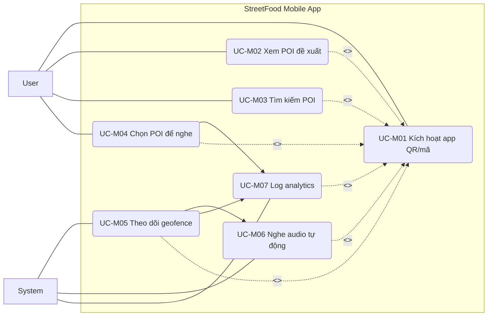
```mermaid
flowchart LR
    U[User]
    S[System]
    subgraph APP[StreetFood Mobile App]
      M1(UC-M01 Kích hoạt app QR/mã)
      M2(UC-M02 Xem POI đề xuất)
      M3(UC-M03 Tìm kiếm POI)
      M4(UC-M04 Chọn POI để nghe)
      M5(UC-M05 Theo dõi geofence)
      M6(UC-M06 Nghe audio tự động)
      M7(UC-M07 Log analytics)
    end
    U --- M1
    U --- M2
    U --- M3
    U --- M4
    S --- M5
    S --- M6
    S --- M7
    M5 --> M6
    M5 --> M7
    M4 --> M7
    M2 -. "<<include>>" .-> M1
    M3 -. "<<include>>" .-> M1
    M4 -. "<<include>>" .-> M1
    M5 -. "<<include>>" .-> M1
    M6 -. "<<include>>" .-> M1
    M7 -. "<<include>>" .-> M1
```

### 11.2.1 Quy tắc include cho kích hoạt (Mobile)

- `UC-M01` là điều kiện bắt buộc: shell chỉ mở nội dung chính sau khi kích hoạt cục bộ còn hạn.
- `UC-M02` … `UC-M07` vẫn đặt quan hệ `<<include>> UC-M01` ở sơ đồ 11.2 theo tài liệu; **kỹ thuật** triển khai hỗ trợ cả **JWT** và **mã văn bản** tĩnh (xem `QrAccess`).

### 11.3 Use Case Diagram - Web Vendor

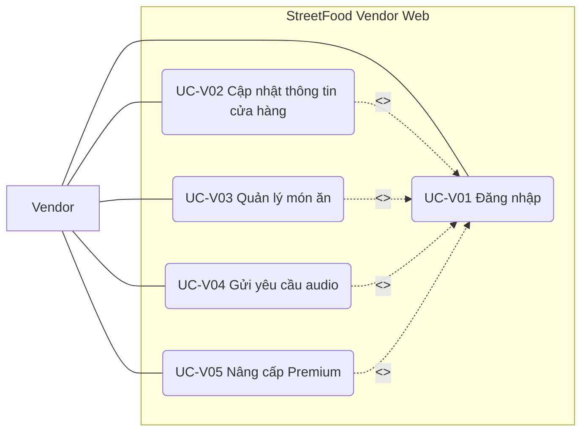
```mermaid
flowchart LR
    V[Vendor]
    subgraph VW[StreetFood Vendor Web]
      V1(UC-V01 Đăng nhập)
      V2(UC-V02 Cập nhật thông tin cửa hàng)
      V3(UC-V03 Quản lý món ăn)
      V4(UC-V04 Gửi yêu cầu audio)
      V5(UC-V05 Nâng cấp Premium)
    end
    V --- V1
    V --- V2
    V --- V3
    V --- V4
    V --- V5
    V2 -. "<<include>>" .-> V1
    V3 -. "<<include>>" .-> V1
    V4 -. "<<include>>" .-> V1
    V5 -. "<<include>>" .-> V1
```

### 11.4 Use Case Diagram - Web Admin

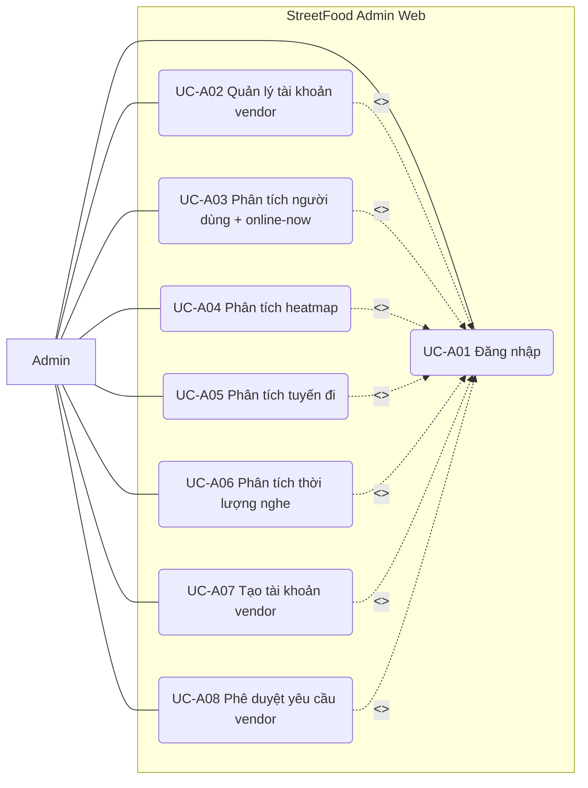
```mermaid
flowchart LR
    A[Admin]
    subgraph AW[StreetFood Admin Web]
      A1(UC-A01 Đăng nhập)
      A2(UC-A02 Quản lý tài khoản vendor)
      A3(UC-A03 Phân tích người dùng + online-now)
      A4(UC-A04 Phân tích heatmap)
      A5(UC-A05 Phân tích tuyến đi)
      A6(UC-A06 Phân tích thời lượng nghe)
      A7(UC-A07 Tạo tài khoản vendor)
      A8(UC-A08 Phê duyệt yêu cầu vendor)
    end
    A --- A1
    A --- A2
    A --- A3
    A --- A4
    A --- A5
    A --- A6
    A --- A7
    A --- A8
    A2 -. "<<include>>" .-> A1
    A3 -. "<<include>>" .-> A1
    A4 -. "<<include>>" .-> A1
    A5 -. "<<include>>" .-> A1
    A6 -. "<<include>>" .-> A1
    A7 -. "<<include>>" .-> A1
    A8 -. "<<include>>" .-> A1
```

### 11.4.1 Quy tắc include cho đăng nhập

- Với **Vendor Web**: `UC-V02`, `UC-V03`, `UC-V04`, `UC-V05` đều `<<include>> UC-V01 Đăng nhập`.
- Với **Admin Web**: `UC-A02` đến `UC-A08` đều `<<include>> UC-A01 Đăng nhập`.
- Ý nghĩa: người dùng web phải qua bước xác thực trước khi thực thi bất kỳ chức năng nghiệp vụ nào.

### 11.5 Mapping Use Case -> Sequence -> Activity

| Use case | Sequence | Activity |
| --- | --- | --- |
| UC-M01 Quét QR JWT để vào app | 12.1 | 13.1 |
| UC-M02 Xem POI đề xuất | 12.2 | 13.2 |
| UC-M03 Tìm kiếm | 12.3 | 13.3 |
| UC-M04 Chọn POI để nghe | 12.4 | 13.4 |
| UC-M05 Theo dõi geofence | 12.5 | 13.5 |
| UC-M06 Nghe audio tự động | 12.6a–e, 12.6f–h | 13.6, 13.6a–c |
| UC-M07 Log analytics | 12.7 | 13.7 |
| UC-V01 Đăng nhập vendor | 12.8 | 13.8 |
| UC-V02 Cập nhật thông tin cửa hàng | 12.9 | 13.9 |
| UC-V03 Quản lý món ăn | 12.10 | 13.10 |
| UC-V04 Gửi yêu cầu audio | 12.11 | 13.11 |
| UC-V05 Nâng cấp Premium | 12.12 | 13.12 |
| UC-A01 Đăng nhập admin | 12.13 | 13.13 |
| UC-A02 Quản lý tài khoản vendor | 12.14 | 13.14 |
| UC-A03 Phân tích người dùng + online-now | 12.15 | 13.15 |
| UC-A04 Phân tích heatmap | 12.16 | 13.16 |
| UC-A05 Phân tích tuyến đi | 12.17 | 13.17 |
| UC-A06 Phân tích thời lượng nghe | 12.18 | 13.18 |
| UC-A07 Tạo tài khoản vendor | 12.19 | 13.19 |
| UC-A08 Phê duyệt yêu cầu vendor | 12.20 | 13.20 |

### 11.6 Use Case chi tiết bổ sung (đồng bộ 2026-04-28)

| ID | Tác nhân | Use case | Tiền điều kiện | Kết quả |
| --- | --- | --- | --- | --- |
| UC-S01 | System/API | Chống race ghi visit theo POI | Request `visit/start/end` hợp lệ | Mỗi POI xử lý tuần tự qua ingress lease, trả `queueDelayMs`. |
| UC-S02 | System/API | Chống race kích hoạt user/device | Request `register-app`/`activate-app`/`activate-device` hợp lệ | Ghi dữ liệu tuần tự theo `user:*` hoặc `install:*`, tránh ghi đè đồng thời. |
| UC-S03 | System/API | Ghi listen event bất đồng bộ | App gửi `/api/analytics/poi-audio-listen` | Event vào `Channel`, worker batch flush DB, dedupe cửa sổ 15s theo thiết bị. |
| UC-S04 | System/API | Retry khi flush listen lỗi | DB/network lỗi tạm thời | Không mất buffer; worker backoff ngắn và flush lại vòng sau. |
| UC-S05 | System/API | Tăng tốc API đọc bằng cache+nén | Request GET POI/top/heat/detail | Trả dữ liệu qua output cache + response compression, giảm tải DB và băng thông. |

---

## 12. Sequence diagram

### 12.1 Sequence - UC-M01 Kích hoạt app (QR / mã thủ công)

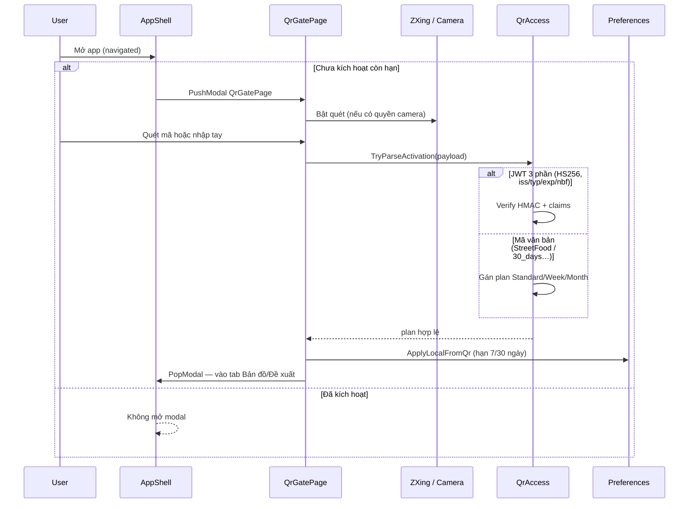
```mermaid
sequenceDiagram
    participant U as User
    participant Shell as AppShell
    participant Q as QrGatePage
    participant Z as ZXing / Camera
    participant QA as QrAccess
    participant P as Preferences

    U->>Shell: Mở app (navigated)
    alt Chưa kích hoạt còn hạn
        Shell->>Q: PushModal QrGatePage
        Q->>Z: Bật quét (nếu có quyền camera)
        U->>Q: Quét mã hoặc nhập tay
        Q->>QA: TryParseActivation(payload)
        alt JWT 3 phần (HS256, iss/typ/exp/nbf)
            QA->>QA: Verify HMAC + claims
        else Mã văn bản (StreetFood / 30_days…)
            QA->>QA: Gán plan Standard/Week/Month
        end
        QA-->>Q: plan hợp lệ
        Q->>P: ApplyLocalFromQr (hạn 7/30 ngày)
        Q->>Shell: PopModal — vào tab Bản đồ/Đề xuất
    else Đã kích hoạt
        Shell-->>Shell: Không mở modal
    end
```

### 12.2 Sequence - UC-M02 Gợi ý (tab Đề xuất) và bản đồ (tab Bản đồ)

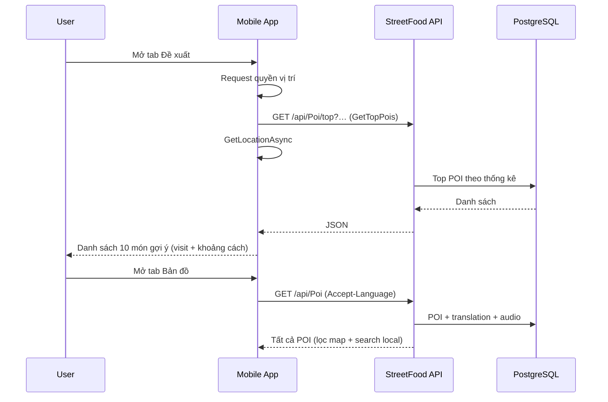
```mermaid
sequenceDiagram
    participant U as User
    participant M as Mobile App
    participant API as StreetFood API
    participant DB as PostgreSQL

    U->>M: Mở tab Đề xuất
    M->>M: Request quyền vị trí
    M->>API: GET /api/Poi/top?… (GetTopPois)
    M->>M: GetLocationAsync
    API->>DB: Top POI theo thống kê
    DB-->>API: Danh sách
    API-->>M: JSON
    M-->>U: Danh sách 10 món gợi ý (visit + khoảng cách)

    U->>M: Mở tab Bản đồ
    M->>API: GET /api/Poi (Accept-Language)
    API->>DB: POI + translation + audio
    API-->>M: Tất cả POI (lọc map + search local)
```

### 12.3 Sequence - UC-M03 Lọc chuỗi trên bản đồ (client)

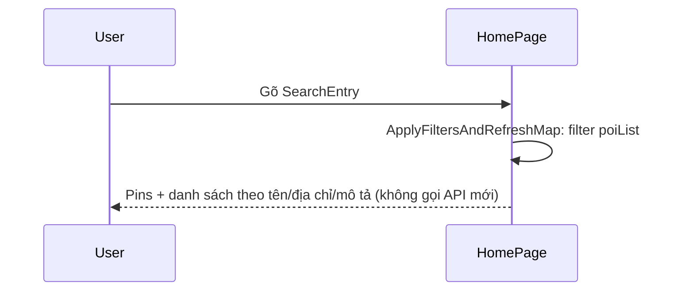
```mermaid
sequenceDiagram
    participant U as User
    participant M as HomePage
    U->>M: Gõ SearchEntry
    M->>M: ApplyFiltersAndRefreshMap: filter poiList
    M-->>U: Pins + danh sách theo tên/địa chỉ/mô tả (không gọi API mới)
```

### 12.4 Sequence - UC-M04 Chọn POI để nghe

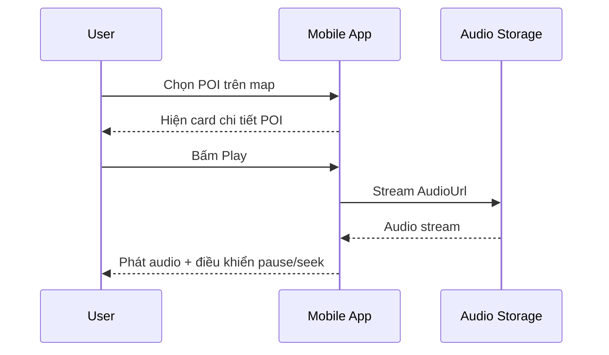
```mermaid
sequenceDiagram
    participant U as User
    participant M as Mobile App
    participant R2 as Audio Storage
    U->>M: Chọn POI trên map
    M-->>U: Hiện card chi tiết POI
    U->>M: Bấm Play
    M->>R2: Stream AudioUrl
    R2-->>M: Audio stream
    M-->>U: Phát audio + điều khiển pause/seek
```

### 12.5 Sequence - UC-M05 Vị trí, vùng POI, thăm quán, movement

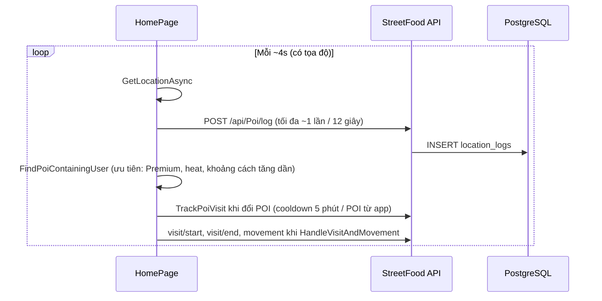
```mermaid
sequenceDiagram
    participant M as HomePage
    participant API as StreetFood API
    participant DB as PostgreSQL

    loop Mỗi ~4s (có tọa độ)
        M->>M: GetLocationAsync
        M->>API: POST /api/Poi/log (tối đa ~1 lần / 12 giây)
        API->>DB: INSERT location_logs
        M->>M: FindPoiContainingUser (ưu tiên: Premium, heat, khoảng cách tăng dần)
        M->>API: TrackPoiVisit khi đổi POI (cooldown 5 phút / POI từ app)
        M->>API: visit/start, visit/end, movement khi HandleVisitAndMovement
    end
```

### 12.6 Sequence - UC-M06 Nghe audio tự động

**Ghi chú tích hợp:** Tự phát nằm trong `CheckNearby` (sau `HandleVisitAndMovement`), có queue POI và xử lý thread-safe (`_queueSync`, `_playSwitchGate`).

#### 12.6a Cổng vào + cập nhật queue POI (mỗi lần có tọa độ)

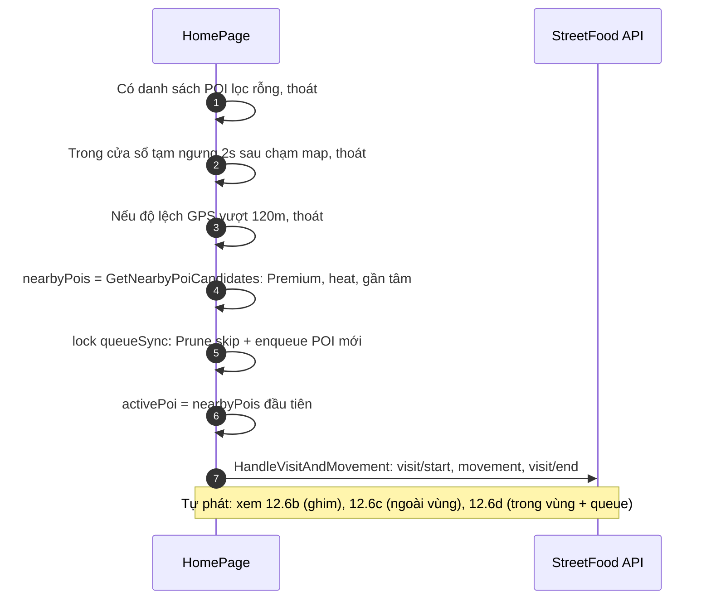
```mermaid
sequenceDiagram
    autonumber
    participant M as HomePage
    participant API as StreetFood API
    M->>M: Có danh sách POI lọc rỗng, thoát
    M->>M: Trong cửa sổ tạm ngưng 2s sau chạm map, thoát
    M->>M: Nếu độ lệch GPS vượt 120m, thoát
    M->>M: nearbyPois = GetNearbyPoiCandidates: Premium, heat, gần tâm
    M->>M: lock queueSync: Prune skip + enqueue POI mới
    M->>M: activePoi = nearbyPois đầu tiên
    M->>API: HandleVisitAndMovement: visit/start, movement, visit/end
    Note over M,API: Tự phát: xem 12.6b (ghim), 12.6c (ngoài vùng), 12.6d (trong vùng + queue)
```

#### 12.6b Đã chạm map để ghim thẻ (_cardPinnedByMapTap)

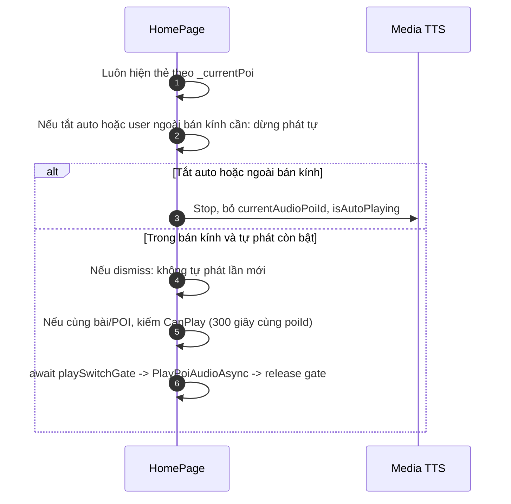
```mermaid
sequenceDiagram
    autonumber
    participant M as HomePage
    participant R as Media TTS
    M->>M: Luôn hiện thẻ theo _currentPoi
    M->>M: Nếu tắt auto hoặc user ngoài bán kính cần: dừng phát tự
    alt Tắt auto hoặc ngoài bán kính
        M->>R: Stop, bỏ currentAudioPoiId, isAutoPlaying
    else Trong bán kính và tự phát còn bật
        M->>M: Nếu dismiss: không tự phát lần mới
        M->>M: Nếu cùng bài/POI, kiểm CanPlay (300 giây cùng poiId)
        M->>M: await playSwitchGate -> PlayPoiAudioAsync -> release gate
    end
```

#### 12.6c Chưa ghim: ngoài mọi bán kính (kể cả "khe" giữa 2 vòng tròn)

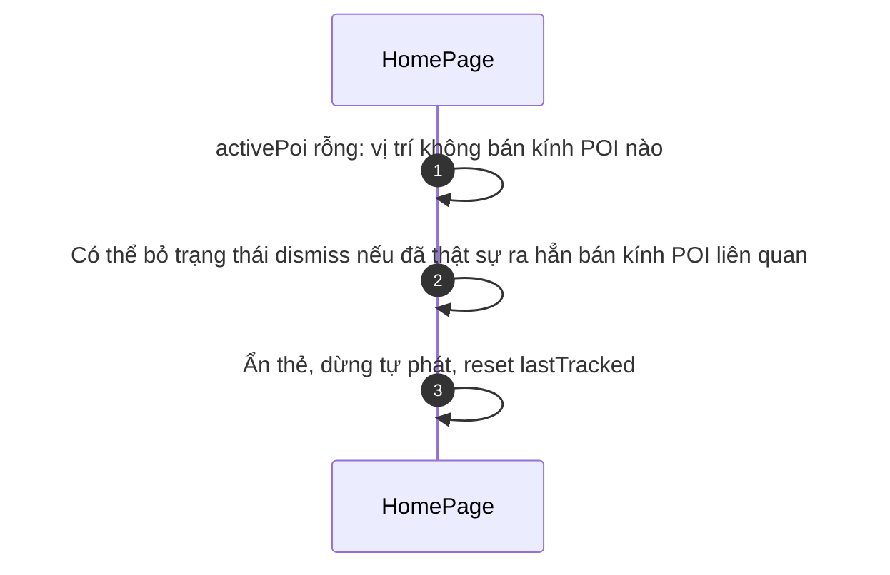
```mermaid
sequenceDiagram
    autonumber
    participant M as HomePage
    M->>M: activePoi rỗng: vị trí không bán kính POI nào
    M->>M: Có thể bỏ trạng thái dismiss nếu đã thật sự ra hẳn bán kính POI liên quan
    M->>M: Ẩn thẻ, dừng tự phát, reset lastTracked
```

#### 12.6d Chưa ghim: trong bán kính + queue chạy kế tiếp

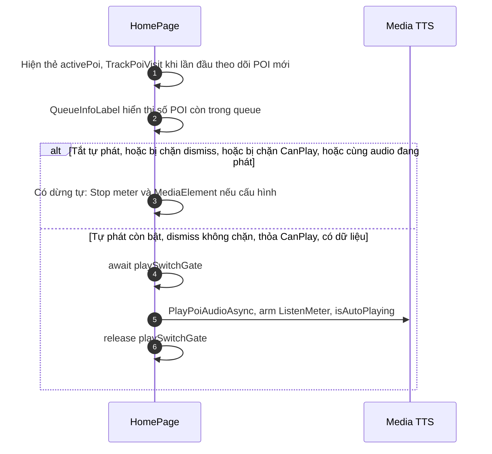
```mermaid
sequenceDiagram
    autonumber
    participant M as HomePage
    participant R as Media TTS
    M->>M: Hiện thẻ activePoi, TrackPoiVisit khi lần đầu theo dõi POI mới
    M->>M: QueueInfoLabel hiển thị số POI còn trong queue
    alt Tắt tự phát, hoặc bị chặn dismiss, hoặc bị chặn CanPlay, hoặc cùng audio đang phát
        M->>M: Có dừng tự: Stop meter và MediaElement nếu cấu hình
    else Tự phát còn bật, dismiss không chặn, thỏa CanPlay, có dữ liệu
        M->>M: await playSwitchGate
        M->>R: PlayPoiAudioAsync, arm ListenMeter, isAutoPlaying
        M->>M: release playSwitchGate
    end
```

#### 12.6e Vuốt trái để bỏ qua POI hiện tại

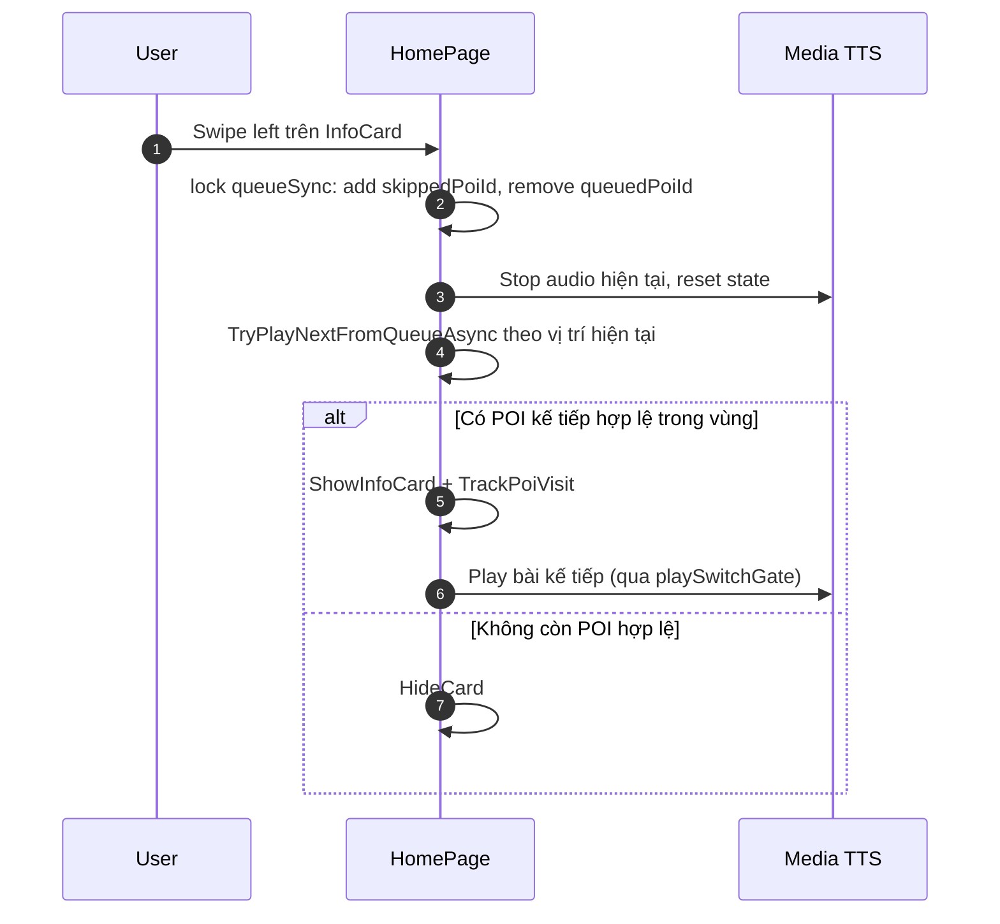
```mermaid
sequenceDiagram
    autonumber
    participant U as User
    participant M as HomePage
    participant R as Media TTS
    U->>M: Swipe left trên InfoCard
    M->>M: lock queueSync: add skippedPoiId, remove queuedPoiId
    M->>R: Stop audio hiện tại, reset state
    M->>M: TryPlayNextFromQueueAsync theo vị trí hiện tại
    alt Có POI kế tiếp hợp lệ trong vùng
        M->>M: ShowInfoCard + TrackPoiVisit
        M->>R: Play bài kế tiếp (qua playSwitchGate)
    else Không còn POI hợp lệ
        M->>M: HideCard
    end
```

#### 12.6f Nhiều người nghe đồng thời (backend queue listen-event)

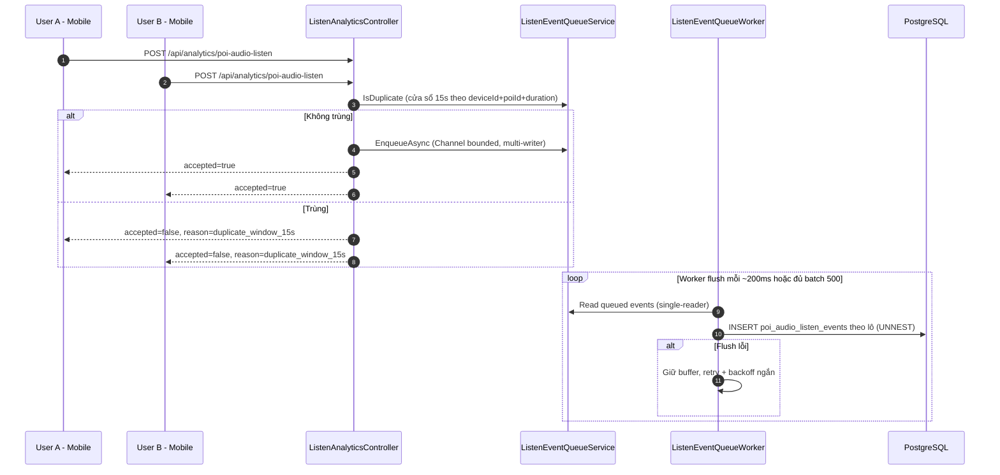
```mermaid
sequenceDiagram
    autonumber
    participant U1 as User A - Mobile
    participant U2 as User B - Mobile
    participant API as ListenAnalyticsController
    participant Q as ListenEventQueueService
    participant W as ListenEventQueueWorker
    participant DB as PostgreSQL
    U1->>API: POST /api/analytics/poi-audio-listen
    U2->>API: POST /api/analytics/poi-audio-listen
    API->>Q: IsDuplicate (cửa sổ 15s theo deviceId+poiId+duration)
    alt Không trùng
        API->>Q: EnqueueAsync (Channel bounded, multi-writer)
        API-->>U1: accepted=true
        API-->>U2: accepted=true
    else Trùng
        API-->>U1: accepted=false, reason=duplicate_window_15s
        API-->>U2: accepted=false, reason=duplicate_window_15s
    end
    loop Worker flush mỗi ~200ms hoặc đủ batch 500
        W->>Q: Read queued events (single-reader)
        W->>DB: INSERT poi_audio_listen_events theo lô (UNNEST)
        alt Flush lỗi
            W->>W: Giữ buffer, retry + backoff ngắn
        end
    end
```

#### 12.6g Một người nghe nhiều POI liên tiếp (queue + cooldown)

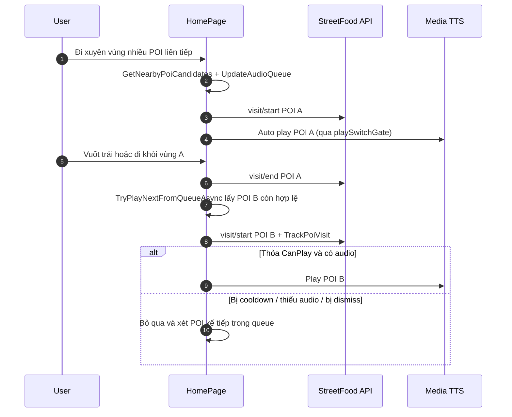
```mermaid
sequenceDiagram
    autonumber
    participant U as User
    participant M as HomePage
    participant API as StreetFood API
    participant R as Media TTS
    U->>M: Đi xuyên vùng nhiều POI liên tiếp
    M->>M: GetNearbyPoiCandidates + UpdateAudioQueue
    M->>API: visit/start POI A
    M->>R: Auto play POI A (qua playSwitchGate)
    U->>M: Vuốt trái hoặc đi khỏi vùng A
    M->>API: visit/end POI A
    M->>M: TryPlayNextFromQueueAsync lấy POI B còn hợp lệ
    M->>API: visit/start POI B + TrackPoiVisit
    alt Thỏa CanPlay và có audio
        M->>R: Play POI B
    else Bị cooldown / thiếu audio / bị dismiss
        M->>M: Bỏ qua và xét POI kế tiếp trong queue
    end
```

#### 12.6h Nhiều user cùng một POI — tải/stream `AudioUrl` song song (client)

Luồng này **không** đi qua `ListenAnalyticsController` hay worker listen-event; mỗi thiết bị mở kết nối HTTP/stream (hoặc Range) tới **cùng một URL** audio của POI. **Web Admin → Kiểm thử tải & GPS** có nút *12.6h — GET Range song song* tới `AudioUrl` của POI #1 để minh họa (khi URL cho phép CORS từ origin admin).

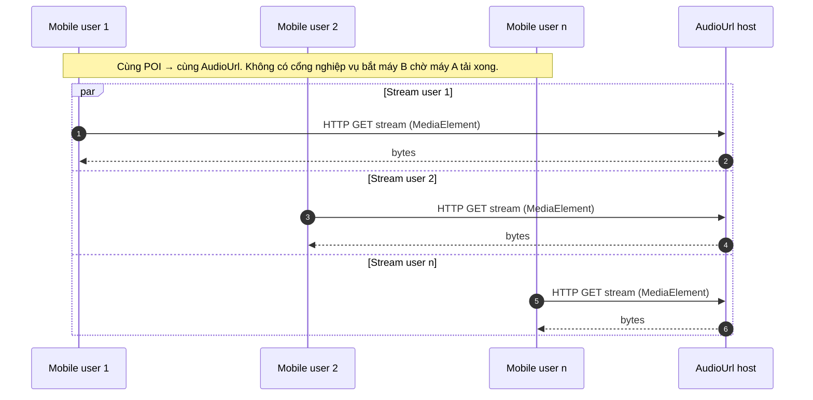
```mermaid
sequenceDiagram
    autonumber
    participant M1 as Mobile user 1
    participant M2 as Mobile user 2
    participant Mn as Mobile user n
    participant R as AudioUrl host
    Note over M1,Mn: Cùng POI → cùng AudioUrl. Không có cổng nghiệp vụ bắt máy B chờ máy A tải xong.
    par Stream user 1
        M1->>R: HTTP GET stream (MediaElement)
        R-->>M1: bytes
    and Stream user 2
        M2->>R: HTTP GET stream (MediaElement)
        R-->>M2: bytes
    and Stream user n
        Mn->>R: HTTP GET stream (MediaElement)
        R-->>Mn: bytes
    end
```

**Mapping nhanh cho các tình huống thường gặp:**
- **Nhiều user gửi analytics listen (`poi-audio-listen`) cùng lúc — backend queue:** xem `12.6f`.
- **Nhiều user cùng một POI, tải/stream `AudioUrl` song song (mỗi máy một MediaElement):** xem `12.6h` và nút chứng minh trên **Web Admin → Kiểm thử tải & GPS**.
- **Một người nghe nhiều cái (nhiều POI liên tiếp):** xem `12.6d`, `12.6e`, `12.6g`.
- **Người dùng đứng giữa 2 POI:** xem `12.6c` (ngoài mọi bán kính) và `12.6a` (nếu giao vùng thì chọn active theo Premium > heat > gần tâm).

### 12.7 Sequence - UC-M07 Log analytics (tổng hợp)

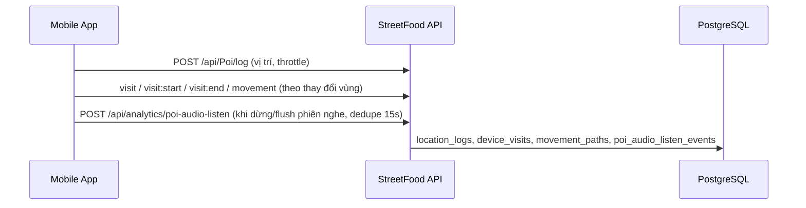
```mermaid
sequenceDiagram
    participant M as Mobile App
    participant API as StreetFood API
    participant DB as PostgreSQL

    M->>API: POST /api/Poi/log (vị trí, throttle)
    M->>API: visit / visit:start / visit:end / movement (theo thay đổi vùng)
    M->>API: POST /api/analytics/poi-audio-listen (khi dừng/flush phiên nghe, dedupe 15s)
    API->>DB: location_logs, device_visits, movement_paths, poi_audio_listen_events
```

### 12.8 Sequence - UC-V01 Đăng nhập vendor

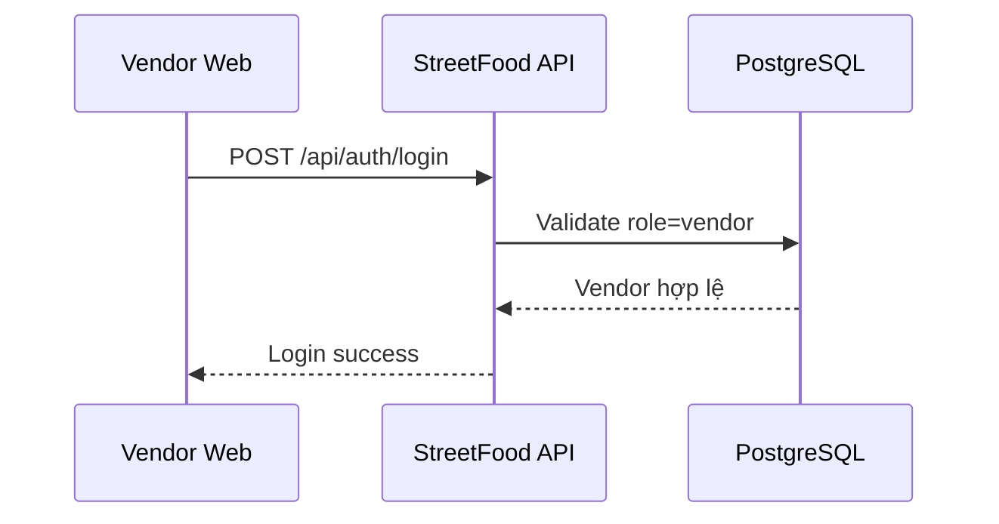
```mermaid
sequenceDiagram
    participant V as Vendor Web
    participant API as StreetFood API
    participant DB as PostgreSQL

    V->>API: POST /api/auth/login
    API->>DB: Validate role=vendor
    DB-->>API: Vendor hợp lệ
    API-->>V: Login success
```

### 12.9 Sequence - UC-V02 Cập nhật thông tin cửa hàng

```mermaid
sequenceDiagram
    participant V as Vendor Web
    participant API as StreetFood API
    participant R2 as Cloudflare R2
    participant DB as PostgreSQL

    V->>API: POST /api/vendor/shop/update-details
    opt Có upload ảnh/logo
        API->>R2: Lưu media
        R2-->>API: URL
    end
    API->>DB: UPDATE restaurant_details
    API-->>V: Cập nhật thành công
```

### 12.10 Sequence - UC-V03 Quản lý món ăn

```mermaid
sequenceDiagram
    participant V as Vendor Web
    participant API as StreetFood API
    participant DB as PostgreSQL

    V->>API: POST /api/vendor/foods/create|update|delete|restore
    API->>DB: INSERT/UPDATE foods
    API-->>V: Thành công
```

### 12.11 Sequence - UC-V04 Gửi yêu cầu audio

```mermaid
sequenceDiagram
    participant V as Vendor Web
    participant API as StreetFood API
    participant DB as PostgreSQL
    alt Gửi script text
      V->>API: POST /api/vendor/submit-script
    else Gửi audio bundle
      V->>API: POST /api/vendor/submit-audio-bundle
    end
    API->>DB: INSERT script_change_requests(status=pending)
    API-->>V: Pending
```

### 12.12 Sequence - UC-V05 Nâng cấp Premium vendor (MoMo)

```mermaid
sequenceDiagram
    participant V as Vendor Web
    participant API as StreetFood API
    participant M as MoMo
    participant DB as PostgreSQL

    V->>API: POST /api/vendor/premium/create-payment
    API->>DB: Validate vendor owns POI + check premium status
    API->>M: Create payment (redirectUrl, ipnUrl)
    M-->>API: payUrl
    API-->>V: payUrl
    V->>M: Open payUrl và thanh toán
    M->>API: POST /api/vendor/premium/momo-ipn
    API->>DB: Mark paid + activate premium subscription
    M->>API: Redirect returnUrl (/payment/return hoặc fallback /?query)
    API-->>V: Redirect về dashboard vendor
```

### 12.13 Sequence - UC-A01 Đăng nhập admin

```mermaid
sequenceDiagram
    participant A as Admin Web
    participant API as StreetFood API
    participant DB as PostgreSQL

    A->>API: POST /api/auth/login
    API->>DB: Validate role=admin
    API-->>A: Login success
```

### 12.14 Sequence - UC-A02 Quản lý tài khoản vendor

```mermaid
sequenceDiagram
    participant A as Admin Web
    participant API as StreetFood API
    participant DB as PostgreSQL

    A->>API: GET /api/admin/owners
    API->>DB: Query users (role=vendor)
    DB-->>API: Danh sách vendor
    API-->>A: Danh sách vendor
    A->>API: POST /api/admin/owners/{id}/hide|unhide
    API->>DB: UPDATE users.ishidden
    API-->>A: Thành công
```

### 12.15 Sequence - UC-A03 Phân tích người dùng

```mermaid
sequenceDiagram
    participant A as Admin Web
    participant API as StreetFood API
    participant DB as PostgreSQL

    A->>API: GET /api/admin/analytics/user-analysis/hourly-visits
    API->>DB: Aggregate device_visits theo giờ
    DB-->>API: Hourly users
    API-->>A: Dữ liệu phân tích người dùng theo giờ
    A->>API: GET /api/admin/analytics/online-now?seconds=5
    API->>DB: Đếm thiết bị có hoạt động trong cửa sổ 5 giây
    DB-->>API: Online now
    API-->>A: Dữ liệu người dùng đang hoạt động
```

### 12.16 Sequence - UC-A04 Phân tích heatmap

```mermaid
sequenceDiagram
    participant A as Admin Web
    participant API as StreetFood API
    participant DB as PostgreSQL

    A->>API: GET /api/admin/analytics/heatmap
    API->>DB: Aggregate location_logs
    DB-->>API: Heat points
    API-->>A: Dữ liệu heatmap
```

### 12.17 Sequence - UC-A05 Phân tích tuyến đi

```mermaid
sequenceDiagram
    participant A as Admin Web
    participant API as StreetFood API
    participant DB as PostgreSQL

    A->>API: GET /api/admin/analytics/paths
    A->>API: GET /api/admin/analytics/popular-paths
    A->>API: GET /api/admin/analytics/popular-route-chains
    API->>DB: Query movement_paths
    DB-->>API: Route analytics
    API-->>A: Dữ liệu tuyến đi
```

### 12.18 Sequence - UC-A06 Phân tích thời lượng nghe

```mermaid
sequenceDiagram
    participant A as Admin Web
    participant API as StreetFood API
    participant DB as PostgreSQL

    A->>API: GET /api/admin/analytics/poi-audio-listen?days=30
    API->>DB: Aggregate poi_audio_listen_events
    DB-->>API: Avg listen duration
    API-->>A: Dữ liệu thời lượng nghe
```

### 12.19 Sequence - UC-A07 Tạo tài khoản vendor

```mermaid
sequenceDiagram
    participant A as Admin Web
    participant API as StreetFood API
    participant DB as PostgreSQL

    A->>API: POST /api/admin/poi-with-owner
    API->>DB: Tạo user vendor + POI + owner mapping
    DB-->>API: Created
    API-->>A: Kết quả tạo mới
```

### 12.20 Sequence - UC-A08 Phê duyệt yêu cầu vendor

```mermaid
sequenceDiagram
    participant A as Admin Web
    participant API as StreetFood API
    participant DB as PostgreSQL
    participant TTS as Azure Services

    A->>API: GET /api/admin/script-requests/pending
    A->>API: POST /api/admin/script-requests/{id}/approve
    alt Request kiểu script text
      API->>TTS: Translate + TTS
      API->>DB: Update translations/audio/status
    else Request kiểu audio bundle
      API->>DB: Update audio/status
    end
    API-->>A: Approved
```

### 12.21 Sequence - UC-S01 Ingress queue theo POI (visit/session)

```mermaid
sequenceDiagram
    participant App as Mobile App
    participant API as PoiController
    participant IQ as PoiIngressQueueService
    participant DB as PostgreSQL

    App->>API: POST /api/Poi/visit/start (poiId, deviceId)
    API->>IQ: EnterAsync(poiId)
    IQ-->>API: Lease(waitedMs, wasQueued)
    API->>DB: Check open session + cooldown
    alt hợp lệ
        API->>DB: INSERT device_visits
        API-->>App: {accepted: true, queueDelayMs}
    else không hợp lệ
        API-->>App: {accepted: false, reason, queueDelayMs}
    end
    API->>IQ: Dispose lease (release)
```

### 12.22 Sequence - UC-S02 Ingress queue theo user/install

```mermaid
sequenceDiagram
    participant C as Client
    participant API as AuthController
    participant UQ as UserIngressQueueService
    participant DB as PostgreSQL

    C->>API: POST /api/Auth/activate-app
    API->>UQ: EnterAsync(user:username)
    UQ-->>API: Lease acquired
    API->>DB: SELECT current activation
    API->>DB: UPDATE expires_at
    API-->>C: activationExpiresAt mới
    API->>UQ: Dispose lease
```

### 12.23 Sequence - UC-S03 Listen event queue batch + retry

```mermaid
sequenceDiagram
    participant App as Mobile App
    participant API as ListenAnalyticsController
    participant Q as ListenEventQueueService
    participant W as ListenEventQueueWorker
    participant DB as PostgreSQL

    App->>API: POST /api/analytics/poi-audio-listen
    API->>Q: IsDuplicate? + EnqueueAsync
    API-->>App: accepted / duplicate_window_15s
    loop Worker tick
        W->>Q: Read batch (max 500 / 200ms)
        W->>DB: INSERT UNNEST batch
        alt flush thành công
            W->>W: Clear buffer + cleanup dedupe cache
        else flush lỗi
            W->>W: Giữ buffer + backoff 500ms + retry vòng sau
        end
    end
```

### 12.24 Sequence - UC-S05 API đọc nhanh (OutputCache + Compression)

```mermaid
sequenceDiagram
    participant Client as App/Web
    participant API as ASP.NET Core Pipeline
    participant Cache as OutputCache
    participant DB as PostgreSQL

    Client->>API: GET /api/Poi (Accept-Language: vi)
    API->>Cache: Lookup key (route + query + header vary)
    alt Cache hit
        Cache-->>API: Cached payload
    else Cache miss
        API->>DB: Query POI + joins
        DB-->>API: Result set
        API->>Cache: Store with short TTL
    end
    API-->>Client: Compressed JSON (Brotli/Gzip)
```

---

## 13. Activity diagram

### 13.1 Activity - UC-M01 Kích hoạt app

```mermaid
flowchart TD
    M0[Mở app] --> M1{IsCurrentlyActivated?}
    M1 -- Có --> M4[Vào shell tab Bản đồ/Đề xuất]
    M1 -- Không --> M2[Modal QrGate: quét hoặc nhập mã]
    M2 --> M3{TryParseActivation: JWT hoặc mã văn bản?}
    M3 -- Không --> M2
    M3 -- Có --> M5[ApplyLocalFromQr → Preferences]
    M5 --> M4
```

### 13.2 Activity - UC-M02 Gợi ý & bản đồ

```mermaid
flowchart TD
    A0[Tab Bản đồ] --> A1[GET /api/Poi]
    A1 --> A2[Map + tìm kiếm local]
    B0[Tab Đề xuất] --> B1[GET /api/Poi/top + GPS]
    B1 --> B2[10 POI: visit count + gần nhất]
```

### 13.3 Activity - UC-M03 Lọc trên bản đồ (client)

```mermaid
flowchart TD
    B0[Nhập từ khóa HomePage] --> B1[Lọc client trên poiList]
    B1 --> B2[Cập nhật map pins theo bộ lọc]
```

### 13.4 Activity - UC-M04 Chọn POI để nghe

```mermaid
flowchart TD
    C0[Chọn marker/POI] --> C1[Hiện card chi tiết]
    C1 --> C2[Bấm Play]
    C2 --> C3[Phát audio + Pause/Seek]
```

### 13.5 Activity - UC-M05 Vùng & telemetry

```mermaid
flowchart TD
    D0[Vòng ~4s: lấy GPS] --> D1[POST Poi/log khi qua 12s throttle]
    D1 --> D2[FindPoiContainingUser: ưu tiên Premium, heat, gần tâm]
    D2 --> D3[HandleVisitAndMovement: visit, movement]
```

#### 13.5a Nhiều bán kính giao nhau

```mermaid
flowchart TD
    O0[User nằm trong giao nhiều vùng] --> O1[Chỉ một POI active: Premium, heat, gần tâm]
    O1 --> O2[Không phát lần lượt từng vùng]
```

### 13.6 Activity - UC-M06 Nghe audio tự động

**Tổng quan:** auto geofence hiện có queue POI + skip bằng vuốt trái + gate chống phát chồng.

```mermaid
flowchart TD
    E0[CheckNearby] --> E1{Hợp lệ: có POI, hết suspend, GPS tin cậy?}
    E1 -- Không --> R[Thoát]
    E1 -- Có --> Q0[lock queueSync: dọn skip + enqueue nearby]
    Q0 --> E2{Đang ghim POI?}
    E2 -- Có: xem 13.6b --> E3[Tự phát theo bán kính ghim]
    E2 -- Không, ngoài mọi bán kính --> E4[Ẩn thẻ, dừng tự phát: giữa hai vùng]
    E2 -- Không, trong ít nhất một bán kính --> E5[Chi tiết 13.6a]
    E3 --> E6[Phát/Stop theo vùng ghim]
```

**Luồng 13.6a — chưa ghim, còn trong ít nhất một bán kính (có thể là vùng giao):**

```mermaid
flowchart TD
    S0[ShowInfoCard activePoi, TrackPoiVisit nếu đổi POI] --> S1{Tắt tự phát?}
    S1 -- Có --> S2[Dừng phát, tắt meter, tắt player]
    S1 -- Không --> S3{Đang dismiss cùng POI?}
    S3 -- Có --> S4[Không tự phát cho POI này]
    S3 -- Không --> S5{Thỏa CanPlay, cùng poiId, 300 giây?}
    S5 -- Không --> S4
    S5 -- Có, có stream hoặc mô tả TTS --> S6[Wait playSwitchGate, play, release]
```

**Luồng 13.6b — đã ghim bằng chạm map:**

```mermaid
flowchart TD
    T0[Thẻ theo POI đang ghim] --> T1{Còn trong bán kính POI ghim?}
    T1 -- Không, hoặc tắt auto --> T2[Dừng, reset bài, isAuto tắt]
    T1 -- Có, bật auto --> T3{Thẻ đang dismiss?}
    T3 -- Có --> T4[Không tự phát tự động]
    T3 -- Không --> T5{Thỏa CanPlay, khác bài, có nguồn?}
    T5 -- Có --> T6[Wait playSwitchGate, play, release]
    T5 -- Chưa --> T4
```

**Luồng 13.6c — vuốt trái để nghe POI kế tiếp trong queue:**

```mermaid
flowchart TD
    L0[SwipeLeft trên card] --> L1[lock queueSync: đánh dấu skip POI hiện tại]
    L1 --> L2[Dừng audio hiện tại]
    L2 --> L3{Queue còn POI hợp lệ trong vùng?}
    L3 -- Có --> L4[Show card POI kế + TrackPoiVisit + auto play qua gate]
    L3 -- Không --> L5[HideCard]
```

**Ghi chú nghiệp vụ:** Queue POI là queue theo **thiết bị** (app local), không phải queue toàn cục giữa nhiều thiết bị.

### 13.7 Activity - UC-M07 Log analytics

```mermaid
flowchart TD
    F0[Ghi location log] --> F1[Ghi visit start]
    F1 --> F2[Ghi listen duration]
    F2 --> F3[Ghi visit end/movement]
```

### 13.8 Activity - UC-V01 Đăng nhập vendor

```mermaid
flowchart TD
    G0[Mở trang login] --> G1[Nhập tài khoản]
    G1 --> G2[Validate role vendor]
    G2 --> G3[Vào dashboard vendor]
```

### 13.9 Activity - UC-V02 Cập nhật thông tin cửa hàng

```mermaid
flowchart TD
    H0[Mở trang cửa hàng] --> H1[Sửa thông tin]
    H1 --> H2[Lưu cập nhật]
```

### 13.10 Activity - UC-V03 Quản lý món ăn

```mermaid
flowchart TD
    I0[Mở quản lý món] --> I1{Thao tác}
    I1 -- Thêm/Sửa --> I2[Lưu món]
    I1 -- Ẩn/Hiện --> I3[Đổi trạng thái món]
```

### 13.11 Activity - UC-V04 Gửi yêu cầu audio

```mermaid
flowchart TD
    J0[Mở trang request audio] --> J1{Chọn kiểu request}
    J1 -- Script --> J2[Submit script]
    J1 -- Bundle --> J3[Submit bundle]
    J2 --> J4[Pending]
    J3 --> J4[Pending]
```

### 13.12 Activity - UC-V05 Nâng cấp Premium vendor

```mermaid
flowchart TD
    P0[Mở trang nâng cấp] --> P1[Kiểm tra trạng thái premium hiện tại]
    P1 --> P2[Bấm thanh toán MoMo]
    P2 --> P3[API tạo phiên thanh toán]
    P3 --> P4[Redirect sang cổng MoMo]
    P4 --> P5{Thanh toán thành công?}
    P5 -- Có --> P6[MoMo gọi IPN + redirect return]
    P6 --> P7[API kích hoạt premium và chuyển về dashboard vendor]
    P5 -- Không --> P8[Giữ trạng thái thường / báo lỗi]
```

### 13.13 Activity - UC-A01 Đăng nhập admin

```mermaid
flowchart TD
    K0[Mở trang login] --> K1[Nhập tài khoản]
    K1 --> K2[Validate role admin]
    K2 --> K3[Vào dashboard admin]
```

### 13.14 Activity - UC-A02 Quản lý tài khoản vendor

```mermaid
flowchart TD
    L0[Mở danh sách vendor] --> L1[Chọn tài khoản]
    L1 --> L2{Hide hay Unhide}
    L2 --> L3[Cập nhật trạng thái]
```

### 13.15 Activity - UC-A03 Phân tích người dùng

```mermaid
flowchart TD
    M0[Mở analytics người dùng] --> M1[Tải hourly users]
    M1 --> M2[Tải online-now]
    M2 --> M3[Hiển thị biểu đồ người dùng + chỉ số đang hoạt động]
```

### 13.16 Activity - UC-A04 Phân tích heatmap

```mermaid
flowchart TD
    N0[Mở analytics heatmap] --> N1[Tải heat points]
    N1 --> N2[Render heatmap]
```

### 13.17 Activity - UC-A05 Phân tích tuyến đi

```mermaid
flowchart TD
    O0[Mở analytics tuyến đi] --> O1[Tải paths/popular routes]
    O1 --> O2[Hiển thị tuyến và bảng top routes]
```

### 13.18 Activity - UC-A06 Phân tích thời lượng nghe

```mermaid
flowchart TD
    P0[Mở analytics thời lượng nghe] --> P1[Tải listen stats]
    P1 --> P2[Hiển thị theo POI]
```

### 13.19 Activity - UC-A07 Tạo tài khoản vendor

```mermaid
flowchart TD
    Q0[Mở form tạo vendor] --> Q1[Nhập thông tin vendor + POI]
    Q1 --> Q2[Tạo tài khoản]
    Q2 --> Q3[Hiển thị kết quả]
```

### 13.20 Activity - UC-A08 Phê duyệt yêu cầu vendor

```mermaid
flowchart TD
    R0[Mở pending requests] --> R1[Chọn request]
    R1 --> R2{Approve/Reject}
    R2 -- Approve --> R3[Cập nhật audio/translation/status]
    R2 -- Reject --> R4[Cập nhật status reject]
```

### 13.21 FR-V02 - Request thay đổi audio script

```mermaid
flowchart TD
    A[Vendor gửi request audio] --> B[Lưu trạng thái pending]
    B --> C[Thông báo đã ghi nhận request]
    C --> D[Vendor theo dõi trạng thái]
```

### 13.22 Activity - UC-S01 Ingress queue theo POI (visit/start/end)

```mermaid
flowchart TD
    A0[Nhận request visit/start/end] --> A1{poiId hợp lệ?}
    A1 -- Không --> A9[BadRequest]
    A1 -- Có --> A2[EnterAsync theo poiId]
    A2 --> A3[Đọc trạng thái session/cooldown trong DB]
    A3 --> A4{Đủ điều kiện ghi?}
    A4 -- Có --> A5[INSERT hoặc UPDATE device_visits]
    A4 -- Không --> A6[Trả accepted=false + reason]
    A5 --> A7[Trả accepted=true + queueDelayMs]
    A6 --> A8[Release lease]
    A7 --> A8
```

### 13.23 Activity - UC-S02 Ingress queue theo user/install

```mermaid
flowchart TD
    B0[Nhận register-app/activate-app/activate-device] --> B1[Chuẩn hóa key user/install]
    B1 --> B2[EnterAsync theo key]
    B2 --> B3[Đọc trạng thái hiện tại]
    B3 --> B4[Tính hạn mới]
    B4 --> B5[UPDATE/UPSERT DB]
    B5 --> B6[Trả response]
    B6 --> B7[Release lease]
```

### 13.24 Activity - UC-S03 Listen queue batch + retry

```mermaid
flowchart TD
    C0[App gửi listen event] --> C1{Trùng trong 15s?}
    C1 -- Có --> C2[Trả duplicate_window_15s]
    C1 -- Không --> C3[Enqueue Channel]
    C3 --> C4[Worker gom buffer theo batch/time]
    C4 --> C5{Flush DB thành công?}
    C5 -- Có --> C6[Clear buffer + cleanup dedupe cache]
    C5 -- Không --> C7[Giữ buffer + backoff 500ms + retry]
```

### 13.25 Activity - UC-S05 API đọc nhanh bằng cache + nén

```mermaid
flowchart TD
    D0[Request GET POI/top/detail/heat] --> D1[Check output cache theo key vary]
    D1 --> D2{Cache hit?}
    D2 -- Có --> D5[Trả payload cache]
    D2 -- Không --> D3[Query DB]
    D3 --> D4[Lưu cache TTL ngắn]
    D4 --> D5
    D5 --> D6[Compress Brotli/Gzip]
    D6 --> D7[Response]
```

---

## 14. Data Flow Diagram (DFD Level 1)

```mermaid
flowchart LR
    U[User App]
    V[Vendor Web]
    A[Admin Web]

    P1((P1: Quản lý POI/Nội dung))
    P2((P2: Xử lý audio đa ngôn ngữ))
    P3((P3: Tracking & Analytics))

    D1[(POI + Foods + Translations)]
    D2[(Audio Metadata)]
    D3[(Tracking Logs)]
    R2[(Cloudflare R2)]

    U -->|Yeu cau POI + gui GPS| P1
    U -->|Audio playback request| P2
    U -->|Telemetry| P3

    V -->|Cap nhat thong tin + request script| P1
    A -->|CRUD + Duyet request| P1
    A -->|Dashboard query| P3

    P1 <--> D1
    P1 <--> D2
    P2 <--> D2
    P2 <--> R2
    P3 <--> D3
```


---

## 15. UI wireframe (MVP)

## 15.1 Mobile - Home map

```text
+--------------------------------------------------+
| StreetFood                                       |
| [Search.................] [Filter]               |
|                                                  |
|                (MAP VIEW)                        |
|          o User                                  |
|      [POI1]   [POI2]   [POI3]                    |
|                                                  |
|----------------------------------------------    |
| [Restaurant Card]  (mo khi: gan POI HOAC cham POI) |
| Name: Highlands Coffee                           |
| Address: 98 Nguyen Tri Phuong                    |
| Open: 07:00 - 22:00   | ~1.2 km (neu co GPS)     |
| [Nghe gioi thieu]  [Play] [Pause]                |
| |------o-----------------------|  0:42 / 2:15     |
|  ^-------- slider timeline (tua duoc) ----------- |
+--------------------------------------------------+
```

*Ghi chú:* Dòng timeline hiển thị khi có audio; user kéo “o” để tua. Có thể gom “Nghe giới thiệu” với Play nếu UI tối giản.

## 15.2 Admin - Dashboard

```text
+---------------------------------------------------------------+
| Admin Dashboard                                               |
| [POIs] [Foods] [Audio] [Requests] [Analytics]                |
|---------------------------------------------------------------|
| KPI: Visits Today | Avg Duration | Active POIs               |
|---------------------------------------------------------------|
| Heatmap Panel                 | Popular Routes                |
|                               | POI A -> POI B (120)         |
|                               | POI B -> POI C (95)          |
|---------------------------------------------------------------|
| Most Visited Restaurants Table                                |
+---------------------------------------------------------------+
```

## 15.3 Vendor - Request audio script

```text
+--------------------------------------------------+
| Vendor Portal                                    |
| [Restaurant Info] [Menu] [Audio Requests]        |
|--------------------------------------------------|
| Restaurant: Co Chi Thi Nen                       |
| Language: [vi v]                                 |
| New Script:                                      |
| [............................................]   |
| [............................................]   |
| Status: Pending                                  |
| [Submit Request]                                 |
+--------------------------------------------------+
```

---

## 16. API overview (đã triển khai trong repo)

Base URL ví dụ: `https://localhost:7236`. Route gốc của controller nằm trong cột **Prefix** (ASP.NET Core `[Route]`).  
**Metrics Prometheus (không cần admin key):** `GET /api/metrics` (HTTP histogram + đếm, phục vụ cảnh báo/tải theo NFR).

### 16.1 Mobile & POI công khai (`PoiController` → `/api/Poi`)


| Phương thức | Đường dẫn | Mô tả |
| --- | --- | --- |
| GET | `/api/Poi` | Danh sách POI + bản dịch + audio theo `Accept-Language`. |
| GET | `/api/Poi/{id}` | Chi tiết POI + `Restaurant_Details` + foods (lọc `IsHidden` nếu có). |
| GET | `/api/Poi/top?top=&days=` | Top POI theo thống kê (dùng tab **Đề xuất**). |
| GET | `/api/Poi/heat-priority?days=` | Điểm heat ưu tiên cho `FindPoiContainingUser` (tối đa 180 ngày client). |
| POST | `/api/Poi/visit` | Ghi lượt thăm thưa (cooldown 5 phút/POI từ app). |
| POST | `/api/Poi/visit/start` | Bắt đầu session thăm tại POI (có ingress queue theo POI, trả thêm `queueDelayMs`). |
| POST | `/api/Poi/visit/end` | Kết thúc session, cập nhật duration (có ingress queue theo POI, trả thêm `queueDelayMs`). |
| POST | `/api/Poi/log` | Mẫu vị trí (online-now, heatmap). |
| POST | `/api/Poi/movement` | Chuyển POI A→B (popular paths / chains). |


### 16.2 Telemetry nghe audio (`ListenAnalyticsController` → `/api/analytics`)


| Phương thức | Đường dẫn                         | Mô tả                                                                           |
| ----------- | --------------------------------- | ------------------------------------------------------------------------------- |
| POST        | `/api/analytics/poi-audio-listen` | App gửi `poiId`, `durationSeconds`, `deviceId` (lưu `poi_audio_listen_events`). Trả về `{ accepted: true }` hoặc `{ accepted: false, reason: "duplicate_window_15s" }` nếu trùng cùng thiết bị + POI + cùng `durationSeconds` trong cửa sổ ~15s. |


### 16.3 Xác thực & tài khoản app (`AuthController` → `/api/Auth`)


| Phương thức | Đường dẫn | Mô tả |
| --- | --- | --- |
| POST | `/api/Auth/login` | Đăng nhập **admin/vendor** (bảng `users`, không bị `ishidden`). |
| POST | `/api/Auth/register-app` | Đăng ký tài khoản role `app` (dù tính năng có bật trong app hay không). |
| POST | `/api/Auth/login-app` | Đăng nhập role `app`. |
| POST | `/api/Auth/activate-app` | Kích hoạt/đồng bộ kích hoạt server-side (bổ sung; song song với kích hoạt QR **cục bộ** trên MAUI). |
| POST | `/api/Auth/activate-device` | Liên kết thiết bị (nếu dùng). |
| GET | `/api/Auth/device-status` | Trạng thái thiết bị. |


### 16.4 Quản trị (`AdminController` → `/api/Admin`) — cần `X-Admin-Key` nếu cấu hình `Admin:ApiKey`


| Phương thức | Đường dẫn                                     | Mô tả                                                                    |
| ----------- | --------------------------------------------- | ------------------------------------------------------------------------ |
| GET         | `/api/Admin/dashboard/summary`                | KPI: số POI, vendor, pending script, audio tracks, mẫu location 30 ngày. |
| GET         | `/api/Admin/analytics/online-now?seconds=`    | Số thiết bị đang dùng app theo cửa sổ giây (mặc định 5s, tối thiểu 5s). |
| GET         | `/api/Admin/analytics/heatmap`                | Điểm nhiệt từ `location_logs`.                                           |
| GET         | `/api/Admin/analytics/poi-audio-listen?days=` | Thống kê **thời lượng nghe** trung bình theo POI.                        |
| GET         | `/api/Admin/analytics/paths`                  | Chuỗi di chuyển gần đây.                                                 |
| GET         | `/api/Admin/analytics/hourly-active-users`   | Tổng hợp từ `location_logs` theo giờ.                                   |
| GET         | `/api/Admin/analytics/user-analysis/hourly-visits` | Tổng hợp từ `device_visits` theo giờ.                              |
| GET         | `/api/Admin/analytics/popular-paths`          | Cặp POI A→B phổ biến.                                                    |
| GET         | `/api/Admin/analytics/popular-route-chains`   | Chuỗi tối đa N POI.                                                      |
| GET         | `/api/Admin/ops/metrics`                      | Snapshot vận hành 24h: số bản ghi `location_logs`, `movement_paths`, `poi_audio_listen_events`, thời điểm mới nhất, tổng POI. |
| GET         | `/api/Admin/ops/jobs/queue`                   | **Deprecated/410**: endpoint giữ tương thích, audio job queue kiểu cũ đã gỡ. |
| GET         | `/api/Admin/ops/jobs/recent`                 | **Deprecated/410**: endpoint giữ tương thích, audio job queue kiểu cũ đã gỡ. |
| GET         | `/api/Admin/ops/ingress-queue`               | Xem cấu hình điều tiết request theo POI (enabled/min/max delay, contention). |
| POST        | `/api/Admin/ops/ingress-queue`               | Cập nhật cấu hình điều tiết request theo POI lúc runtime.               |
| POST        | `/api/Admin/poi-with-owner`                   | Tạo user vendor + POI + script khởi tạo (admin).                         |
| GET         | `/api/Admin/pois/awaiting-script`             | POI chờ script/vendor.                                                   |
| GET         | `/api/Admin/script-requests/pending`          | Yêu cầu script chờ duyệt.                                                |
| POST        | `/api/Admin/script-requests/{id}/approve`     | Duyệt + pipeline dịch/TTS (theo cấu hình).                               |
| POST        | `/api/Admin/poi/{poiId}/regenerate-audio`     | Tạo lại MP3 (Azure Speech).                                              |
| GET         | `/api/Admin/owners`                           | Danh sách chủ quán.                                                      |
| POST        | `/api/Admin/owners/{userId}/hide`             | Ẩn tài khoản vendor.                                                     |
| POST        | `/api/Admin/owners/{userId}/unhide`         | Hiện lại tài khoản vendor.                                               |


### 16.5 Vendor (các controller dùng chung prefix `**/api/vendor`**)


| Endpoint (POST)                     | Mô tả                                                                 |
| ----------------------------------- | --------------------------------------------------------------------- |
| `/api/vendor/pois/list`             | Danh sách POI của vendor.                                             |
| `/api/vendor/shop/update-details`   | Cập nhật chi tiết cửa hàng.                                           |
| `/api/vendor/foods/list`            | Danh sách món.                                                        |
| `/api/vendor/foods/create`          | Tạo món.                                                              |
| `/api/vendor/foods/update`          | Cập nhật món.                                                         |
| `/api/vendor/foods/delete`          | Xóa/ẩn món.                                                           |
| `/api/vendor/premium/status`        | Trạng thái premium của POI vendor.                                    |
| `/api/vendor/premium/create-payment`| Tạo phiên thanh toán MoMo cho premium (server quyết định redirectUrl).|
| `/api/vendor/premium/momo-ipn`      | MoMo callback server-to-server (IPN), xác nhận thanh toán.            |
| `/api/vendor/submit-script`         | Gửi script chờ duyệt (`VendorScriptController`).                      |
| `/api/vendor/submit-audio-bundle`   | Gửi gói 5 URL audio (5 ngôn ngữ), hỗ trợ kèm `scriptText` để đồng bộ mô tả/script khi admin duyệt. |
| `/api/vendor/media/upload`          | Upload ảnh (multipart).                                               |

**Luồng return MoMo hiện tại (đã harden):**
- Return chuẩn: `GET /payment/return` (redirect về trang chủ Web Vendor, giữ nguyên query string).
- Fallback tương thích link cũ: nếu MoMo quay về root `/?partnerCode=...`, API tự chuyển tiếp sang `/payment/return?...` để tránh 404.


> **Ghi chú:** Danh sách trên lấy từ `StreetFoodAPI/Controllers/`. **Tìm theo từ khóa** trên bản đồ: lọc **client-side** trên `HomePage`; tab **Đề xuất** dùng `GET /api/Poi/top`, không có `GET /api/Poi/search` riêng.

---

## 17. Bảo mật và phân quyền

### 17.1 Mục tiêu dài hạn (PRD gốc)

- JWT / token cho phiên API; RBAC rõ `admin` / `vendor` / `user`.
- Audit log; rate limit.

### 17.2 Triển khai hiện tại (đối chiếu code)

- **Đăng nhập web:** `POST /api/Auth/login` kiểm tra `users` (role `admin` | `vendor`), không JWT trong repo tại thời điểm cập nhật PRD 2.0.
- **Admin API:** khóa tùy chọn qua `Admin:ApiKey` + header `**X-Admin-Key`** (`AdminController.IsAdmin`).
- **Khuyến nghị môi trường thật:** HTTPS, đổi khóa admin mặc định trong `config.js` / `appsettings`, bật CORS chặt theo origin.

---

## 18. Kế hoạch triển khai (Roadmap) và trạng thái


| Giai đoạn               | Nội dung                                                                           | Trạng thái (2026-04)                                                                         |
| ----------------------- | ---------------------------------------------------------------------------------- | -------------------------------------------------------------------------------------------- |
| **Phase 1 – MVP core**  | App: bản đồ, POI, geofence, on-demand, player, đa ngôn ngữ; API đọc POI/detail; DB | **Đã đạt** cốt lõi trong repo.                                                               |
| **Phase 2 – Vận hành**  | Admin tạo POI+owner, vendor cập nhật shop/foods, workflow script/audio, TTS/Azure  | **Đã đạt** theo luồng hiện có; CRUD admin “full UI” như wireframe cổ điển **chưa** bắt buộc. |
| **Phase 3 – Analytics** | Heatmap, paths, popular routes/chains, **thời lượng nghe theo POI**                | **Đã đạt** trên dashboard + các trang admin tương ứng.                                       |
| **Phase 4 – Tối ưu**    | Offline sâu, geofence tiết kiệm pin, gợi ý cá nhân hóa                             | **Kế tiếp** / ngoài phạm vi MVP hiện tại.                                                    |


---

## 19. Tiêu chí nghiệm thu MVP

- User kích hoạt app bằng **QR/mã hợp lệ** (JWT hoặc mã văn bản) và mở được tab Bản đồ/Đề xuất.
- App hiển thị đúng POI gần vị trí hiện tại.
- Vào bán kính POI thì audio tự phát đúng ngôn ngữ.
- User **chạm POI trên bản đồ** khi **ngoài bán kính** vẫn mở được thông tin và **phát được audio** sau khi bấm nghe.
- Khi đang phát audio, UI có **thời gian đã phát / tổng thời lượng** và **thanh tua**; kéo seek cập nhật đúng vị trí phát (trong giới hạn hỗ trợ của nguồn stream).
- Quy tắc **không cắt ngang** bài on-demand bởi auto geofence được áp dụng như mô tả FR-M04.
- Khi đi qua nhiều quán trong vùng, app tạo queue POI theo ưu tiên; user có thể vuốt trái bỏ qua POI hiện tại để nghe POI kế tiếp.
- Admin **tạo được POI kèm chủ quán** và **theo dõi được** dashboard/heatmap/paths/thời lượng nghe; vendor **bổ sung** foods qua cổng vendor (đúng mô hình phân tách hiện tại).
- Vendor gửi được request script / gói audio, admin duyệt được.
- Với gói 5 audio từ vendor, nếu có `scriptText` thì khi admin duyệt hệ thống cập nhật `restaurant_audio` và đồng bộ `poi_translations.description` đa ngôn ngữ.
- Dashboard hiển thị được các chỉ số tổng hợp (POI, vendor, pending script, audio tracks, mẫu location, v.v.).
- Concurrency smoke test chạy qua các endpoint analytics/location/visit không gây lỗi hàng loạt (5xx trong ngưỡng).
- Có kết quả test riêng cho kịch bản nhiều user cùng 1 POI (`tests/nfr/streetfood-poi-concurrency.js`) để đánh giá queue delay và latency thực tế.
- Monitoring có dashboard và alert cơ bản cho API + DB + pipeline audio.

---

## 20. Future improvements

- Hoàn thiện JWT/session đồng nhất cho API thay vì chỉ login trả payload (nếu cần scale bảo mật).
- CRUD POI/foods **thuần admin UI** nếu yêu cầu nghiệp vụ thay vì chủ yếu qua vendor + `poi-with-owner`.
- AI voice generation/TTS ngoài Azure (tùy chi phí).
- Recommendation engine theo hành vi di chuyển.
- A/B test nội dung audio để tối ưu chuyển đổi ghé quán.
- Tích hợp chiến dịch theo khung giờ và sự kiện địa phương.
- Mở rộng đa thành phố / multi-tenant.

---

## 21. Danh mục tài liệu và tham chiếu mã nguồn


| Loại                     | Đường dẫn / ghi chú                                                                                                                                                                                                                                                                                              |
| ------------------------ | ---------------------------------------------------------------------------------------------------------------------------------------------------------------------------------------------------------------------------------------------------------------------------------------------------------------- |
| **PRD (tài liệu này)**   | `prd.md` (root repo)                                                                                                                                                                                                                                                                                             |
| **Cấu hình API cho web** | `Web Admin/wwwroot/config.js`, `Web Vendor/wwwroot/config.js`                                                                                                                                                                                                                                                    |
| **Client gọi API admin** | `Web Admin/wwwroot/js/admin-api.js` (gồm inject sidebar StreetFood)                                                                                                                                                                                                                                              |
| **API**                  | `StreetFoodAPI/Controllers/*.cs`, `StreetFoodAPI/Program.cs`, `StreetFoodAPI/appsettings.json`                                                                                                                                                                                                                   |
| **Migration / SQL**      | `StreetFood.Infrastructure/Migrations/` — `**V1__Initial_schema.sql**` (DDL đầy đủ), `**V2__Seed_core_data.sql**`, `**V3__Seed_demo_analytics.sql**`, `**V4__perf_listen_event_indexes.sql**`, `**V5__perf_visit_and_movement_indexes.sql**`, `**V6__perf_hot_query_indexes.sql**` (index tối ưu truy vấn nóng + analytics). |
| **App MAUI**             | `App/Views/*.xaml`, `App/AppShell.xaml`                                                                                                                                                                                                                                                                          |
| **Trang HTML admin**     | `Web Admin/wwwroot/html/` — `loginPage.html`, `dashboardPage.html`, `analyticsPage.html`, `routeHeatmapPage.html`, `poiListenStatsPage.html`, `createPoiOwnerPage.html`, `pendingScriptsPage.html`, `restaurantOwnersPage.html`, `managePOIPage.html`, `manageShopsPage.html`                                   |
| **Trang HTML vendor**    | `Web Vendor/wwwroot/html/` — `loginPage.html`, `dashboardShopPage.html`, `manageProductsPage.html`, `addProductPage.html`, `requestScriptPage.html`, `upgradePage.html`, `statisticsShopsPage.html`                                                                                                                |
| **NFR / Load test**      | `tests/nfr/` — `streetfood-smoke.js`, `streetfood-read-load.js`, `streetfood-write-load.js`, `streetfood-mixed-load.js`, `streetfood-poi-concurrency.js`, `run-capacity.ps1`. |
| **Sơ đồ ERD**            | Mermaid ERD duy nhất tại [mục 8.2](#82-sơ-đồ-erd-mermaid).                                                                                                                                                                                                                                                       |


---

## 22. Lịch sử phiên bản PRD


| Phiên bản | Ngày            | Nội dung thay đổi chính                                                                                                                                                                                                                                                                                    |
| --------- | --------------- | ---------------------------------------------------------------------------------------------------------------------------------------------------------------------------------------------------------------------------------------------------------------------------------------------------------- |
| **1.0**   | (trước 2026-04) | PRD MVP: personas, FR mobile/backend/admin/vendor, diagram, API đề xuất, roadmap.                                                                                                                                                                                                                          |
| **2.0**   | **2026-04-06**  | Bổ sung: phiên bản stack & cổng dev; **bảng tiến độ thực tế**; **API đã triển khai**; chỉnh roadmap trạng thái; bảo mật đối chiếu code; **danh mục tài liệu / file tham chiếu**; lịch sử phiên bản.                                                                                                        |
| **2.1**   | **2026-04-06**  | Mục **8.2**: nhúng ảnh **ERD** (`Public/Resouces/ERD.png`); cập nhật **8.1** (thêm `device_activations`, `schema_migrations`); chỉnh tiêu đề và ghi chú ERD. Metadata PRD **2.1**.                                                                                                                         |
| **2.2**   | **2026-04-08**  | Đồng bộ codebase hiện tại: bỏ `StreetFood.Application`; đồng bộ migration mới (loại `app_activation_expires_at` và `device_activations`); mở rộng dữ liệu demo analytics; bổ sung bộ **Use Case + Sequence + Activity** đầy đủ cho App, API, Web Admin, Web Vendor; thêm **ERD dạng Mermaid** tại mục 8.2. |
| **2.3**   | **2026-04-15**  | Viết lại hoàn chỉnh các mục **Use Case / Sequence / Activity** theo phạm vi nghiệp vụ mới: App (QR JWT, đề xuất POI, search, chọn POI nghe, geofence, analytics log), Vendor (login, cập nhật cửa hàng, quản lý món, gửi yêu cầu audio), Admin (login, quản lý vendor, analytics người dùng/heatmap/tuyến đi/thời lượng nghe, tạo vendor, phê duyệt yêu cầu). |
| **2.4**   | **2026-04-17**  | Bổ sung chi tiết vận hành cho MVP: **automation test nhiều thiết bị**, quy tắc **xử lý trùng + quản lý hàng đợi** khi đồng thời cao (đặc biệt theo POI/device), và khung **monitoring + alerting**; mở rộng tiêu chí nghiệm thu tương ứng. |
| **2.5**   | **2026-04-23**  | Cập nhật theo triển khai mới: vendor gửi **gói 5 audio kèm `scriptText`** để đồng bộ script khi duyệt; rút gọn mục **10.2** theo phạm vi MVP đồ án (chống trùng + đồng thời + phản hồi nhanh cho app). |
| **2.6**   | **2026-04-24**  | Đồng bộ toàn PRD với mã nguồn: **kích hoạt** (`QrGatePage`, `QrAccess`, `ActivationService`); **tab Bản đồ / Đề xuất**; `GET /api/Poi/top`, heat-priority, đủ route `Poi` telemetry; **tự phát geofence** (ưu tiên POI, cooldown 300s, GPS 120m, ghim map, không hàng đợi); cập nhật **Sequence/Activity** M01–M07, **API 16.x**, **Admin/Vendor** HTML, **9.3** chu kỳ log; sửa **phạm vi** (MoMo premium vendor). |
| **2.6.1** | **2026-04-24**  | Sửa **Mermaid** UC-M06: bỏ ký tự gây parse lỗi, `alt/else` tối đa một `else`, tách **12.6a–d** và **13.6/13.5a/13.6a–b**; xóa đoạn văn bản dư do chỉnh sửa. |
| **2.7**   | **2026-04-24**  | Đồng bộ chức năng mới: **queue POI trên app** khi đi qua nhiều quán, **vuốt trái skip POI** để nghe POI kế tiếp, lock `_queueSync` + gate `_playSwitchGate` chống race; cập nhật **12.6/13.6** theo luồng queue đầy đủ; bổ sung NFR về **ingress queue** API, polling web admin có **anti-overlap + backoff**, thêm migration `V5__perf_visit_and_movement_indexes.sql` và script test `streetfood-poi-concurrency.js`. |
| **2.8**   | **2026-04-28**  | Cập nhật đầy đủ **luồng hoạt động + kiến trúc + sơ đồ Use Case/Sequence/Activity** theo code hiện tại: thêm hệ **UserIngressQueue** (khóa theo user/install), làm rõ **ListenEventQueue batch+retry không mất buffer khi flush lỗi**, bổ sung **OutputCache + ResponseCompression** cho API đọc, đồng bộ tài liệu migration `V6__perf_hot_query_indexes.sql`, và đánh dấu endpoint `ops/jobs/*` trạng thái **deprecated (410)**. |
| **2.8.1** | **2026-05-12**  | Thêm sequence **12.6h** (nhiều user cùng POI — stream `AudioUrl` song song); cập nhật bảng UC-M06 và mapping 12.6; Web Admin *Kiểm thử tải & GPS* có nút chứng minh request song song tới `AudioUrl`. |
