# PRD (Product Requirements Document) - StreetFood


| Thuộc tính             | Giá trị                                                                                                                     |
| ---------------------- | --------------------------------------------------------------------------------------------------------------------------- |
| **Phiên bản tài liệu** | **2.2**                                                                                                                     |
| **Ngày cập nhật**      | **2026-04-08**                                                                                                              |
| **Trạng thái**         | Đồng bộ với mã nguồn trong repo (MVP vận hành được)                                                                         |
| **Mục đích**           | Mô tả yêu cầu sản phẩm; ghi nhận **tiến độ thực tế**, **phiên bản công nghệ**, **tham chiếu file** để nộp đồ án / bàn giao. |


### Mục lục nhanh

1. [Giới thiệu](#1-giới-thiệu)
2. [Mục tiêu sản phẩm](#2-mục-tiêu-sản-phẩm)
3. [Personas](#3-personas-và-nhu-cầu)
4. [Tính năng chi tiết](#4-tính-năng-và-yêu-cầu-chức-năng)
5. [User stories](#5-user-stories)
6. [Luồng người dùng chính](#6-luồng-người-dùng-chính)
7. [Kiến trúc hệ thống](#7-kiến-trúc-hệ-thống-system-architecture-overview)
8. [CSDL](#8-tổng-quan-cơ-sở-dữ-liệu-database-overview)
9. [Thiết kế analytics](#9-thiết-kế-analytics)
10. [Yêu cầu phi chức năng (NFR)](#10-yêu-cầu-phi-chức-năng-nfr)
11. [Sơ đồ Use Case](#11-sơ-đồ-use-case)
12. [Sequence diagram](#12-sequence-diagram-user-user-vào-poi-và-phát-audio)
13. [Activity diagram](#13-activity-diagram-vendor-gửi-yêu-cầu-âm-thanh-2-cách)
14. [Data Flow Diagram (DFD Level 1)](#14-data-flow-diagram-dfd-level-1)
15. [UI wireframe (MVP)](#15-ui-wireframe-mvp)
16. [API thực tế](#16-api-overview-đã-triển-khai-trong-repo)
17. [Bảo mật](#17-bảo-mật-và-phân-quyền)
18. [Roadmap](#18-kế-hoạch-triển-khai-roadmap-và-trạng-thái)
19. [Nghiệm thu](#19-tiêu-chí-nghiệm-thu-mvp)
20. [Future](#20-future-improvements)
21. **[Danh mục tài liệu & mã tham chiếu](#21-danh-mục-tài-liệu-và-tham-chiếu-mã-nguồn)**
22. **[Lịch sử phiên bản PRD](#22-lịch-sử-phiên-bản-prd)**

---

## 1. Giới thiệu

### 1.1 Mục tiêu tài liệu

Tài liệu này mô tả đầy đủ yêu cầu sản phẩm cho dự án **StreetFood** theo hướng MVP có thể triển khai thực tế cho đồ án đại học hoặc startup giai đoạn đầu.  
PRD tập trung vào nghiệp vụ cốt lõi: phát audio giới thiệu nhà hàng theo vị trí GPS, đa ngôn ngữ, và khả năng quản trị nội dung qua web.

### 1.2 Tổng quan dự án

StreetFood là hệ thống **mobile + backend + admin/vendor web**:

- Người dùng quét QR để cài app.
- App dùng GPS phát hiện nhà hàng lân cận (POI).
- Khi người dùng đi vào bán kính POI, app tự động phát audio theo ngôn ngữ thiết bị.
- Người dùng có thể **chọn bất kỳ POI trên bản đồ** (kể cả đang ở xa) để mở thông tin và **phát audio giới thiệu chủ động**, kèm **thanh tiến trình / tua** (seek) theo thời gian thực.
- Backend cung cấp API dữ liệu POI, món ăn, audio đa ngôn ngữ.
- Admin quản trị dữ liệu và theo dõi analytics.
- Vendor cập nhật thông tin nhà hàng và gửi yêu cầu đổi audio script chờ admin duyệt.

### 1.3 Phạm vi phiên bản

- **In scope (MVP):** định vị, hiển thị POI, auto play audio, **chọn POI trên map để nghe on-demand**, **player có thanh mốc thời gian + tua được**, đa ngôn ngữ, quản trị cơ bản POI/foods/audio, analytics cơ bản.
- **Out of scope:** thanh toán, đặt bàn, loyalty, AI recommendation nâng cao thời gian thực.

### 1.4 Sản phẩm con & phiên bản công nghệ (repo hiện tại)


| Thành phần          | Vị trí trong repo                                | Công nghệ / phiên bản (tham chiếu `.csproj`)                                                                                                                               |
| ------------------- | ------------------------------------------------ | -------------------------------------------------------------------------------------------------------------------------------------------------------------------------- |
| **Mobile**          | `App/`                                           | .NET **MAUI** `net10.0` (Android, iOS, Mac Catalyst, Windows); `Microsoft.Maui.Controls` **10.0.50**; Maps, MediaElement, ZXing (QR), SQLite (`sqlite-net-pcl`).           |
| **API**             | `StreetFoodAPI/`                                 | ASP.NET Core **net10.0**; **PostgreSQL** qua **Dapper** + `Npgsql`; Azure **Speech** (TTS) & **Translator** (dịch script); tùy chọn `Admin:ApiKey` + header `X-Admin-Key`. |
| **Admin Web**       | `Web Admin/wwwroot/`                             | ASP.NET Core static host **net10.0**; HTML/CSS/JS (`admin-api.js`, `config.js`).                                                                                           |
| **Vendor Web**      | `Web Vendor/wwwroot/`                            | Cùng kiểu static host **net10.0**.                                                                                                                                         |
| **Tầng dùng chung** | `StreetFood.Domain`, `StreetFood.Infrastructure` | Hỗ trợ API & migration SQL (`StreetFood.Infrastructure/Migrations`).                                                                                                       |


### 1.5 Cổng dịch vụ phát triển (launchSettings — tham chiếu)


| Dịch vụ           | HTTPS (mặc định dev)     | HTTP                                                          | Ghi chú                                                                                                          |
| ----------------- | ------------------------ | ------------------------------------------------------------- | ---------------------------------------------------------------------------------------------------------------- |
| **StreetFoodAPI** | `https://localhost:7236` | `http://localhost:5191` (profile `http` có thể bind `*:5191`) | Client admin/vendor: biến `STREETFOOD_API` trong `Web Admin/wwwroot/config.js` / `Web Vendor/wwwroot/config.js`. |
| **Web Admin**     | `https://localhost:7238` | `http://localhost:5238`                                       | Trang quản trị: `/html/loginPage.html`, dashboard, heatmap, v.v.                                                 |
| **Web Vendor**    | `https://l    ocalhost:7240` | `http://localhost:5240`                                       | Cổng chủ quán.                                                                                                   |


**Lưu ý triển khai:** Cần chạy **API** và web cùng lúc; HTTPS tránh lỗi mixed content khi admin gọi API HTTPS.

---

## 2. Mục tiêu sản phẩm

### 2.1 Mục tiêu kinh doanh

- Tăng khả năng thu hút khách vãng lai cho nhà hàng.
- Tạo khác biệt bằng trải nghiệm audio theo vị trí.
- Xây nền tảng dữ liệu hành vi di chuyển để phục vụ quyết định vận hành.

### 2.2 Mục tiêu người dùng

- Tiếp cận nhanh thông tin nhà hàng gần nhất mà không cần tìm kiếm thủ công.
- Nghe nội dung giới thiệu bằng ngôn ngữ quen thuộc.
- Trải nghiệm mượt ngay cả khi mạng yếu (có cache offline).
- Nghe trước giới thiệu quán khi còn ở xa (ví dụ du khách lên kế hoạch) và điều chỉnh vị trí nghe trong file audio.

### 2.3 KPI đề xuất

- Tỷ lệ bật quyền vị trí: >= 80%.
- Tỷ lệ auto-trigger audio thành công trong vùng POI: >= 95%.
- P95 response time API đọc dữ liệu: < 300ms.
- Tỷ lệ fallback ngôn ngữ thành công: >= 99%.
- Thời lượng phiên dùng app trung bình: >= 3 phút.

---

## 3. Personas và nhu cầu

### 3.1 User (Khách/du khách)

- Cần biết chỗ ăn gần mình.
- Muốn thông tin nhanh, rảnh tay, đa ngôn ngữ.
- Không muốn thao tác nhiều khi đang di chuyển.

### 3.2 Vendor (Chủ nhà hàng)

- Muốn cập nhật thông tin nhà hàng, menu, hình ảnh.
- Muốn thay đổi nội dung audio nhưng qua quy trình kiểm duyệt.

### 3.3 Admin

- Quản lý hệ thống nội dung tập trung.
- Duyệt yêu cầu thay đổi script từ vendor.
- Theo dõi số liệu truy cập, heatmap, tuyến đường phổ biến.

### 3.4 Tiến độ triển khai (snapshot — đối chiếu mã nguồn)

Trạng thái gợi ý: **Đã có** = có UI/API rõ trong repo; **Một phần** = có nền tảng nhưng chưa đầy đủ so PRD gốc; **Tùy cấu hình** = cần khóa API/môi trường.

#### App MAUI (`App/Views/`)


| Mã     | Yêu cầu                                                   | Trạng thái   | Ghi chú                                                                           |
| ------ | --------------------------------------------------------- | ------------ | --------------------------------------------------------------------------------- |
| FR-M01 | QR / cổng cài app                                         | **Chưa có**    | `QrGatePage.xaml`                                                                 |
| FR-M02 | GPS                                                       | **Đã có**    | `HomePage` + quyền vị trí                                                         |
| FR-M03 | POI trên bản đồ, chạm xem thông tin                       | **Đã có**    | Maps + card POI                                                                   |
| FR-M04 | Auto audio theo bán kính + cooldown / không cắt on-demand | **Đã có**    | Logic geofence + ưu tiên phát chủ động (theo triển khai hiện tại)                 |
| FR-M05 | Đa ngôn ngữ `vi/en/cn/ja/ko`                              | **Đã có**    | API `Accept-Language`; fallback                                                   |
| FR-M06 | SQLite cache                                              | **Một phần** | Thư viện `sqlite-net-pcl` có trong project; độ phủ cache POI/audio tùy triển khai |
| FR-M07 | Tìm kiếm / lọc                                            | **Đã có**    | `SuggestPage` (khoảng cách, v.v.)                                                 |
| FR-M08 | On-demand nghe ngoài bán kính                             | **Đã có**    | Chọn POI → `PoiDetailPage`                                                        |
| FR-M09 | Timeline + seek                                           | **Đã có**    | `CommunityToolkit.Maui.MediaElement`                                              |
| —      | Gửi thống kê thời lượng nghe                              | **Đã có**    | `POST /api/analytics/poi-audio-listen` (`ListenAnalyticsController`)              |


#### Backend API (`StreetFoodAPI/Controllers/`)


| Mã         | Yêu cầu           | Trạng thái | Ghi chú                                                                  |
| ---------- | ----------------- | ---------- | ------------------------------------------------------------------------ |
| FR-B01–B02 | POI, foods        | **Đã có**  | `PoiController`; bảng `POIs`, `Foods`, …                                 |
| FR-B03     | Audio đa ngôn ngữ | **Đã có**  | `Restaurant_Audio`; URL tới CDN/R2 tùy cấu hình                          |
| FR-B04     | Translation       | **Đã có**  | `POI_Translations`                                                       |
| FR-B05     | Telemetry         | **Đã có**  | Visit/path/listen events (admin analytics + `ListenAnalyticsController`) |
| —          | Auth web          | **Đã có**  | `POST /api/auth/login` (admin/vendor)                                    |       |


#### Admin Web (`Web Admin/wwwroot/html/`)


| Mã PRD                       | Trạng thái       | Ghi chú                                                                                                                                                                                           |
| ---------------------------- | ---------------- | ------------------------------------------------------------------------------------------------------------------------------------------------------------------------------------------------- |
| FR-A01 CRUD đầy đủ qua UI    | **Một phần**     | Có **tạo POI + tài khoản chủ quán** (`createPoiOwnerPage.html`); không có bộ CRUD POI/foods riêng đầy đủ như wireframe 15.2 “tab Foods/Audio” cổ điển — dùng API + luồng vendor cho phần còn lại. |
| FR-A02 Upload audio          | **Tùy cấu hình** | TTS/regenerate qua API (`regenerate-audio`); vendor có thể gửi **gói 5 URL** (`submit-audio-bundle`).                                                                                             |
| FR-A03 Dashboard / analytics | **Đã có**        | `dashboardPage.html`, `routeHeatmapPage.html` (heatmap, paths, popular paths/chains), **Thời lượng nghe** `poiListenStatsPage.html`.                                                              |
| FR-A04 Duyệt script          | **Đã có**        | `pendingScriptsPage.html`; phê duyệt + TTS/dịch theo `AdminController`.                                                                                                                           |


#### Vendor Web (`Web Vendor/wwwroot/html/`)


| Mã                            | Trạng thái | Ghi chú                                                          |
| ----------------------------- | ---------- | ---------------------------------------------------------------- |
| FR-V01 Sửa shop / menu        | **Đã có**  | `VendorShopController` (foods CRUD, update details)              |
| FR-V02 Request script / audio | **Đã có**  | `VendorScriptController`: `submit-script`, `submit-audio-bundle` |


---

## 4. Tính năng và yêu cầu chức năng

## 4.1 Mobile App (.NET MAUI)

### FR-M01: Cài đặt qua QR

- Người dùng quét QR để mở landing/install flow.
- Hỗ trợ deep link tới trang cài app tương ứng nền tảng.

### FR-M02: Định vị GPS

- Xin quyền vị trí khi mở app lần đầu.
- Theo dõi vị trí định kỳ khi app foreground.

### FR-M03: Hiển thị POI trên bản đồ

- Hiển thị marker cho nhà hàng lân cận (và/hoặc toàn bộ POI trong vùng tải dữ liệu).
- **Bấm marker / chạm POI** mở thẻ thông tin (bottom sheet hoặc card) **không phụ thuộc khoảng cách** — du khách có thể xem quán và quyết định nghe dù đang ở xa.

### FR-M04: Auto trigger audio theo bán kính POI

- Khi user vào bán kính POI, tự động hiển thị info card và phát audio.
- Có cooldown để tránh phát lặp quá dày.
- Khi ra khỏi vùng POI, dừng/ẩn trạng thái phát tự động.
- **Tương tác với chế độ chủ động (FR-M08):** Khi user đang phát audio do **chọn POI thủ công**, hệ thống **không tự đổi bài** sang POI khác chỉ vì geofence (tránh cắt ngang trải nghiệm). Auto-play geofence chỉ kích hoạt khi không có phiên phát on-demand đang active, hoặc sau khi user dừng/hoàn tất bài đang nghe — chi tiết ưu tiên do UX quyết định trong spec kỹ thuật.

### FR-M05: Đa ngôn ngữ

- Hỗ trợ `vi`, `en`, `zh`, `ja`, `ko`.
- Gửi `Accept-Language` theo ngôn ngữ thiết bị.
- Fallback về `en` nếu thiếu dữ liệu ngôn ngữ yêu cầu.

### FR-M06: Offline support (SQLite cache)

- Cache POI + translations + metadata gần nhất.
- Nếu offline: dùng dữ liệu cache để hiển thị bản đồ và thông tin cơ bản.
- Audio offline là tùy chọn nâng cao (phase sau); MVP ưu tiên stream.

### FR-M07: Tìm kiếm và lọc

- Tìm theo tên nhà hàng.
- Lọc theo loại món/khung giờ mở cửa/khoảng cách.

### FR-M08: Chọn POI trên bản đồ để nghe on-demand (không cần vào bán kính)

- Từ bản đồ hoặc kết quả tìm kiếm, user chọn một POI → hiển thị thông tin quán (tên, địa chỉ, giờ mở cửa, ảnh, khoảng cách nếu có GPS).
- Nút **“Nghe giới thiệu”** (hoặc tương đương) phát `AudioUrl` đúng ngôn ngữ thiết bị (fallback như FR-M05).
- Cho phép đóng thẻ / chuyển POI khác; khi chuyển POI có thể dừng bài cũ hoặc hỏi xác nhận (tùy MVP, mặc định: dừng và load bài mới).

### FR-M09: Trình phát audio với thanh mốc thời gian (timeline) và tua (seek)

- Luôn hiển thị khi đang có audio: **thời gian đã phát / tổng thời lượng** (ví dụ `0:42 / 2:15`).
- **Thanh trượt (slider/scrubber)** đồng bộ với tiến độ phát; user **kéo để tua** tới vị trí mong muốn.
- Giữ **Play / Pause**; khi tạm dừng, thanh thời gian giữ nguyên vị trí.
- Xử lý trạng thái tải/buffering: hiển thị loading hoặc khóa slider tạm thời cho đến khi stream sẵn sàng (theo khả năng nền tảng MAUI / MediaElement).
- Áp dụng chung cho cả **phát tự động theo geofence** và **phát on-demand** (cùng một component player).
- **Ghi chú triển khai:** Để seek ổn định, file audio trên R2/CDN nên phục vụ qua **HTTP Range requests** (hoặc định dạng phù hợp với control phát của MAUI); team kỹ thuật xác nhận trong spike trước khi khóa UI.

## 4.2 Backend API (.NET)

### FR-B01: Quản lý POI

- CRUD POI: tọa độ, bán kính, địa chỉ, ảnh.
- API đọc danh sách POI theo vùng địa lý hoặc gần user.

### FR-B02: Quản lý foods và images

- CRUD món ăn theo nhà hàng.
- Lưu URL ảnh món ăn.

### FR-B03: Quản lý audio đa ngôn ngữ

- Lưu metadata audio theo `PoiId + LanguageCode`.
- File audio lưu Cloudflare R2, DB lưu `AudioUrl`.

### FR-B04: Quản lý nội dung đa ngôn ngữ

- CRUD `POI_Translations`.
- Trả dữ liệu theo ngôn ngữ client.

### FR-B05: API cho mobile

- API đọc POI + translation + detail + audio.
- API tìm kiếm/lọc.
- API gửi telemetry visit/location/path.

## 4.3 Admin Web

### FR-A01: Quản lý nhà hàng

- CRUD POI, translations, foods, details.

### FR-A02: Quản lý audio

- Upload/replace audio lên R2.
- Gắn audio theo từng ngôn ngữ.

### FR-A03: Dashboard analytics

- Most visited restaurants.
- Heatmap vị trí người dùng.
- Most popular routes giữa POIs.
- Average visit duration.

### FR-A04: Duyệt yêu cầu từ vendor

- Danh sách request đổi script.
- Approve/Reject + lưu lịch sử.

**Triển khai UI (tham chiếu):** `Web Admin/wwwroot/html/` — `loginPage.html`, `dashboardPage.html`, `routeHeatmapPage.html`, `poiListenStatsPage.html`, `createPoiOwnerPage.html`, `pendingScriptsPage.html`, `restaurantOwnersPage.html`. Sidebar menu được **đồng bộ bằng** `admin-api.js` (inject DOM).

## 4.4 Vendor Web

### FR-V01: Chỉnh sửa thông tin nhà hàng

- Cập nhật profile nhà hàng và menu trong phạm vi được cấp quyền.

### FR-V02: Request thay đổi audio script

- Gửi text script mới theo ngôn ngữ.
- Không được tự thay audio trực tiếp.
- Theo dõi trạng thái: pending/approved/rejected.

---

## 5. User stories

### 5.1 User

- Là người dùng, tôi muốn thấy nhà hàng gần tôi trên bản đồ để quyết định ghé nhanh.
- Là người dùng, tôi muốn khi đi vào vùng POI thì audio tự phát để không cần thao tác.
- Là người dùng, tôi muốn nghe đúng ngôn ngữ máy của tôi.
- Là người dùng, tôi muốn app vẫn dùng được khi mạng yếu nhờ cache.
- Là người dùng, tôi muốn tìm và lọc nhà hàng theo nhu cầu.
- Là người dùng, tôi muốn **chạm vào POI trên bản đồ** để xem quán và **nghe giới thiệu ngay cả khi tôi chưa tới gần**.
- Là người dùng, tôi muốn **thấy thanh thời gian** của bài audio và **kéo tua** tới đoạn tôi muốn nghe lại hoặc bỏ qua phần đầu.

### 5.2 Vendor

- Là vendor, tôi muốn chỉnh thông tin nhà hàng của mình để thông tin luôn chính xác.
- Là vendor, tôi muốn gửi yêu cầu đổi script audio và chờ admin duyệt.

### 5.3 Admin

- Là admin, tôi muốn quản lý toàn bộ nhà hàng/món/audio trên một dashboard.
- Là admin, tôi muốn xem analytics để tối ưu vận hành.
- Là admin, tôi muốn duyệt yêu cầu vendor theo quy trình rõ ràng.

---

## 6. Luồng người dùng chính

### 6.1 User flow

**Luồng theo vị trí (geofence):**  
`Scan QR -> Install App -> Open App -> Grant GPS -> View Map/POIs -> Enter POI Radius -> Auto Play Audio (+ timeline / seek)`

**Luồng chủ động (du khách / nghe từ xa):**  
`Open App -> View Map/POIs -> Tap POI -> Xem thông tin -> Nghe giới thiệu (Play) -> Tùy chỉnh bằng thanh thời gian (tua) / Pause`

### 6.2 Vendor flow

`Login -> Edit Restaurant Info -> Submit Audio Script Request -> Wait Approval`

### 6.3 Admin flow

`Login -> Manage Data -> Review Vendor Requests -> Approve/Reject -> View Analytics`

---

## 7. Kiến trúc hệ thống (System Architecture Overview)

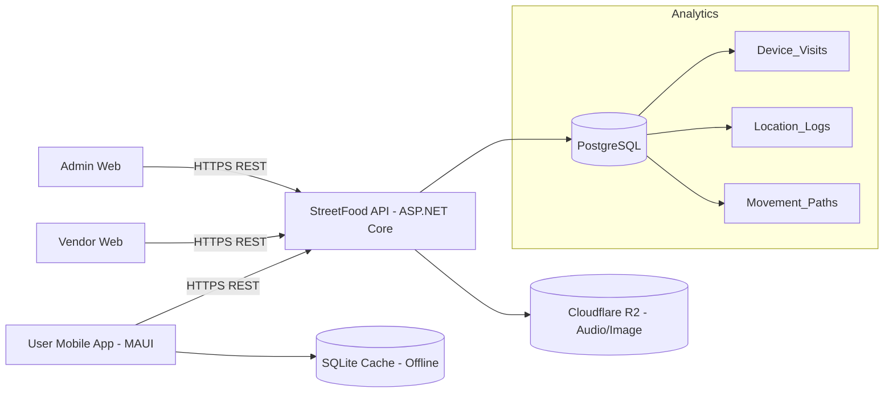
```mermaid
flowchart LR
    U[User Mobile App - MAUI] -->|HTTPS REST| API[StreetFood API - ASP.NET Core]
    V[Vendor Web] -->|HTTPS REST| API
    A[Admin Web] -->|HTTPS REST| API

    API --> DB[(PostgreSQL)]
    API --> R2[(Cloudflare R2 - Audio/Image)]
    U --> SQ[(SQLite Cache - Offline)]

    subgraph Analytics
      DB --> D1[Device_Visits]
      DB --> D2[Location_Logs]
      DB --> D3[Movement_Paths]
    end
```


---

## 8. Tổng quan cơ sở dữ liệu (Database Overview)

## 8.1 Danh sách bảng chính

- `POIs`
- `POI_Translations`
- `Restaurant_Audio`
- `Restaurant_Details`
- `Foods`
- `Users`
- `Restaurant_Owners`
- `Script_Change_Requests`
- `Device_Visits`
- `Location_Logs`
- `Movement_Paths`
- `Languages`
- `poi_audio_listen_events` (thống kê thời lượng nghe từ app — xem `ListenAnalyticsController`)
- `schema_migrations` (lịch sử file SQL đã chạy — do `DbInitializer` tạo)

## 8.2 Sơ đồ ERD


```mermaid
erDiagram
    LANGUAGES {
        varchar code PK
        varchar name
    }

    USERS {
        int id PK
        varchar username UK
        text password
        varchar role
        timestamp createdat
        boolean ishidden
        varchar email
    }

    POIS {
        int id PK
        double latitude
        double longitude
        int radius
        text address
        text imageurl
        timestamp createdat
        varchar scriptsubmissionstate
    }

    POI_TRANSLATIONS {
        int id PK
        int poiid FK
        varchar languagecode FK
        varchar name
        text description
    }

    RESTAURANT_DETAILS {
        int id PK
        int poiid FK
        varchar openinghours
        varchar phone
    }

    RESTAURANT_OWNERS {
        int id PK
        int userid FK
        int poiid FK
    }

    FOODS {
        int id PK
        int poiid FK
        varchar name
        text description
        int price
        text imageurl
        boolean ishidden
    }

    RESTAURANT_AUDIO {
        int id PK
        int poiid FK
        varchar languagecode FK
        text audiourl
    }

    SCRIPT_CHANGE_REQUESTS {
        int id PK
        int poiid FK
        varchar languagecode
        text newscript
        varchar status
        int createdby FK
        timestamp createdat
    }

    DEVICE_VISITS {
        int id PK
        varchar deviceid
        int poiid FK
        timestamp entertime
        timestamp exittime
        int duration
    }

    LOCATION_LOGS {
        int id PK
        varchar deviceid
        double latitude
        double longitude
        timestamp createdat
    }

    MOVEMENT_PATHS {
        int id PK
        varchar deviceid
        int frompoiid
        int topoiid
        timestamp createdat
    }

    POI_AUDIO_LISTEN_EVENTS {
        bigint id PK
        int poi_id FK
        int duration_seconds
        varchar device_id
        timestamp created_at
    }

    POIS ||--o{ POI_TRANSLATIONS : "poiid"
    LANGUAGES ||--o{ POI_TRANSLATIONS : "languagecode"

    POIS ||--o| RESTAURANT_DETAILS : "poiid (UNIQUE)"
    POIS ||--o{ FOODS : "poiid"
    POIS ||--o{ RESTAURANT_AUDIO : "poiid"
    LANGUAGES ||--o{ RESTAURANT_AUDIO : "languagecode"

    USERS ||--o{ RESTAURANT_OWNERS : "userid"
    POIS ||--o{ RESTAURANT_OWNERS : "poiid"

    USERS ||--o{ SCRIPT_CHANGE_REQUESTS : "createdby"
    POIS ||--o{ SCRIPT_CHANGE_REQUESTS : "poiid"

    POIS ||--o{ DEVICE_VISITS : "poiid"
    POIS ||--o{ POI_AUDIO_LISTEN_EVENTS : "poi_id"

    POIS ||--o{ MOVEMENT_PATHS : "frompoiid (nghiệp vụ)"
    POIS ||--o{ MOVEMENT_PATHS : "topoiid (nghiệp vụ)"
```

---

## 9. Thiết kế analytics

### 9.1 Số liệu cần thu thập

- **Visit count theo POI:** từ `Device_Visits`.
- **Visit duration:** `ExitTime - EnterTime`.
- **Heatmap:** tổng hợp `Location_Logs` theo lưới tọa độ.
- **Popular routes:** chuỗi chuyển dịch `FromPoiId -> ToPoiId` từ `Movement_Paths`.

### 9.2 Metrics/dashboard

- Top N POI theo lượt ghé.
- Thời lượng ghé trung bình theo POI.
- Bản đồ nhiệt theo khung giờ.
- Top tuyến di chuyển (cặp POI) theo tần suất.

### 9.3 Chu kỳ cập nhật

- Near real-time (1-5 phút) cho dashboard vận hành.
- Daily aggregation cho báo cáo xu hướng.

---

## 10. Yêu cầu phi chức năng (NFR)

- **Hiệu năng:** API đọc dữ liệu P95 < 300ms.
- **Khả năng mở rộng:** hỗ trợ tăng số lượng POI và người dùng đồng thời.
- **Bảo mật:** JWT authentication, RBAC (admin/vendor), mã hóa kết nối HTTPS.
- **Độ tin cậy:** hệ thống hoạt động ổn định khi mạng chập chờn.
- **Offline:** mobile có SQLite cache cho dữ liệu đọc.
- **Khả dụng:** UX đơn giản, ít thao tác, phản hồi rõ khi lỗi mạng/quyền vị trí.

---

## 11. Sơ đồ Use Case

## 11.1 User

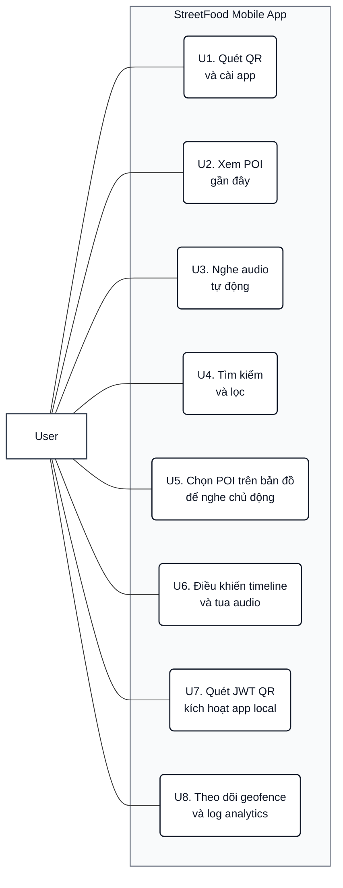
```mermaid
%%{init: {'themeVariables': {'fontSize': '14px'}, 'flowchart': {'nodeSpacing': 55, 'rankSpacing': 55, 'padding': 18, 'htmlLabels': true}}}%%
flowchart LR
    User["User"]

    subgraph U_SYS["StreetFood Mobile App"]
      direction TB
      UC1(U1. Quét QR<br/>và cài app)
      UC2(U2. Xem POI<br/>gần đây)
      UC3(U3. Nghe audio<br/>tự động)
      UC4(U4. Tìm kiếm<br/>và lọc)
      UC4b(U5. Chọn POI trên bản đồ<br/>để nghe chủ động)
      UC4c(U6. Điều khiển timeline<br/>và tua audio)
      UC18(U7. Quét JWT QR<br/>kích hoạt app local)
      UC19(U8. Theo dõi geofence<br/>và log analytics)
    end

    User --- UC1
    User --- UC2
    User --- UC3
    User --- UC4
    User --- UC4b
    User --- UC4c
    User --- UC18
    User --- UC19

    classDef actor fill:#ffffff,stroke:#374151,stroke-width:1.6px,color:#111827;
    classDef usecase fill:#ffffff,stroke:#111827,stroke-width:1.4px,color:#111827;
    classDef boundary fill:#f9fafb,stroke:#6b7280,stroke-width:1.2px,color:#111827;
    class User actor;
    class UC1,UC2,UC3,UC4,UC4b,UC4c,UC18,UC19 usecase;
    class U_SYS boundary;
```

## 11.2 Vendor

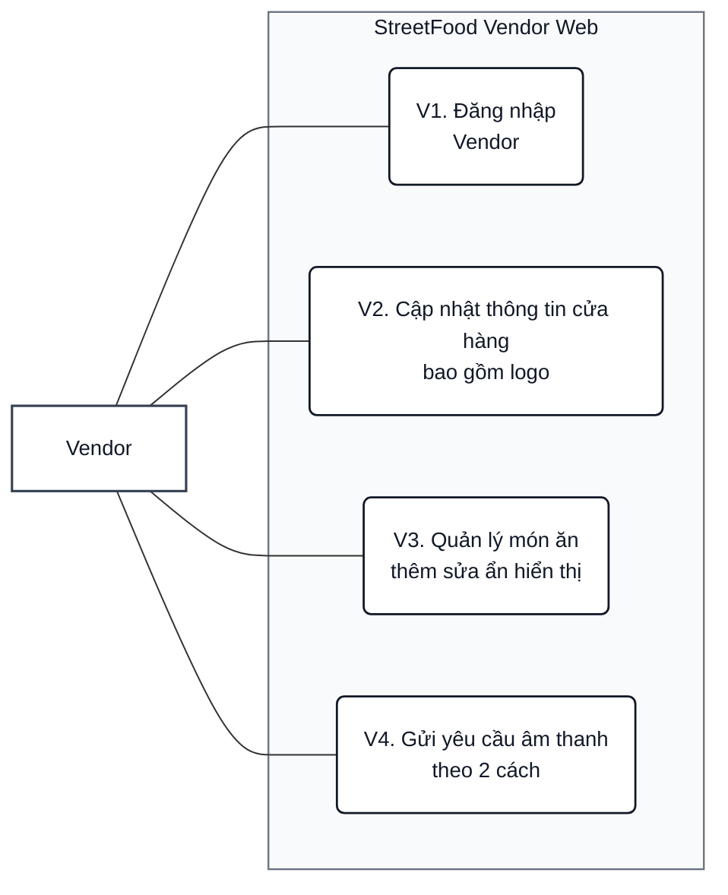
```mermaid
%%{init: {'themeVariables': {'fontSize': '14px'}, 'flowchart': {'nodeSpacing': 55, 'rankSpacing': 55, 'padding': 18, 'htmlLabels': true}}}%%
flowchart LR
    Vendor["Vendor"]

    subgraph V_SYS["StreetFood Vendor Web"]
      direction TB
      UC15(V1. Đăng nhập<br/>Vendor)
      UC6(V2. Cập nhật thông tin cửa hàng<br/>bao gồm logo)
      UC16(V3. Quản lý món ăn<br/>thêm sửa ẩn hiển thị)
      UC17(V4. Gửi yêu cầu âm thanh<br/>theo 2 cách)
    end

    Vendor --- UC15
    Vendor --- UC6
    Vendor --- UC16
    Vendor --- UC17

    classDef actor fill:#ffffff,stroke:#374151,stroke-width:1.6px,color:#111827;
    classDef usecase fill:#ffffff,stroke:#111827,stroke-width:1.4px,color:#111827;
    classDef boundary fill:#f9fafb,stroke:#6b7280,stroke-width:1.2px,color:#111827;
    class Vendor actor;
    class UC15,UC6,UC16,UC17 usecase;
    class V_SYS boundary;
```

## 11.3 Admin

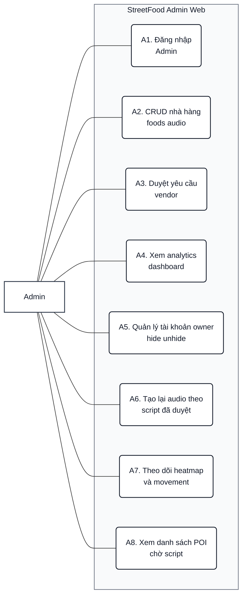
```mermaid
%%{init: {'themeVariables': {'fontSize': '14px'}, 'flowchart': {'nodeSpacing': 55, 'rankSpacing': 55, 'padding': 18, 'htmlLabels': true}}}%%
flowchart LR
    Admin["Admin"]

    subgraph A_SYS["StreetFood Admin Web"]
      direction TB
      UC8(A1. Đăng nhập<br/>Admin)
      UC9(A2. CRUD nhà hàng<br/>foods audio)
      UC10(A3. Duyệt yêu cầu<br/>vendor)
      UC11(A4. Xem analytics<br/>dashboard)
      UC12(A5. Quản lý tài khoản owner<br/>hide unhide)
      UC13(A6. Tạo lại audio theo<br/>script đã duyệt)
      UC14(A7. Theo dõi heatmap<br/>và movement)
      UC21(A8. Xem danh sách POI<br/>chờ script)
    end

    Admin --- UC8
    Admin --- UC9
    Admin --- UC10
    Admin --- UC11
    Admin --- UC12
    Admin --- UC13
    Admin --- UC14
    Admin --- UC21

    classDef actor fill:#ffffff,stroke:#374151,stroke-width:1.6px,color:#111827;
    classDef usecase fill:#ffffff,stroke:#111827,stroke-width:1.4px,color:#111827;
    classDef boundary fill:#f9fafb,stroke:#6b7280,stroke-width:1.2px,color:#111827;
    class Admin actor;
    class UC8,UC9,UC10,UC11,UC12,UC13,UC14,UC21 usecase;
    class A_SYS boundary;
```

### 11.4 Ma trận mapping Use Case -> Sequence/Activity

| Nhóm | Use Case | Sequence liên quan | Activity liên quan |
| --- | --- | --- | --- |
| User | `U7 (UC18)` | 12.5 | 13.1 |
| User | `U2,U3,U5,U6,U8 (UC2,UC3,UC4b,UC4c,UC19)` | 12, 12.1, 12.3, 12.11 | 13.1, 13.9 |
| Vendor + Admin | `V4,A3,A6,A8 (UC17,UC10,UC13,UC21)` | 12.2, 12.10 | 13, 13.2, 13.7 |
| Vendor | `V2,V3 (UC6,UC16)` | 12.4, 12.7, 12.8 | 13.3, 13.6 |
| Web Login | `A1,V1 (UC8,UC15)` | 12.6 | 13.5 |
| Admin | `A5 (UC12)` | 12.9 | 13.4, 13.8 |
| Admin | `A2,A4,A7 (UC9,UC11,UC14)` | 12.3, 12.4 | 13.2, 13.4 |


---

## 12. Sequence diagram theo chức năng (1 FR = 1 sequence)

### 12.0 Ma trận mapping FR -> Sequence -> Activity

| FR | Chức năng | Sequence | Activity |
| --- | --- | --- | --- |
| FR-M01 | Cài đặt qua QR | 12.1 | 13.1 |
| FR-M02 | Định vị GPS | 12.2 | 13.2 |
| FR-M03 | Hiển thị POI trên bản đồ | 12.3 | 13.3 |
| FR-M04 | Auto trigger audio theo geofence | 12.4 | 13.4 |
| FR-M05 | Đa ngôn ngữ | 12.5 | 13.5 |
| FR-M06 | Offline support (SQLite cache) | 12.6 | 13.6 |
| FR-M07 | Tìm kiếm và lọc | 12.7 | 13.7 |
| FR-M08 | On-demand nghe ngoài bán kính | 12.8 | 13.8 |
| FR-M09 | Timeline + seek player | 12.9 | 13.9 |
| FR-B01 | Quản lý POI | 12.10 | 13.10 |
| FR-B02 | Quản lý foods/images | 12.11 | 13.11 |
| FR-B03 | Quản lý audio đa ngôn ngữ | 12.12 | 13.12 |
| FR-B04 | Quản lý nội dung đa ngôn ngữ | 12.13 | 13.13 |
| FR-B05 | API cho mobile | 12.14 | 13.14 |
| FR-A01 | Quản lý nhà hàng | 12.15 | 13.15 |
| FR-A02 | Quản lý audio | 12.16 | 13.16 |
| FR-A03 | Dashboard analytics | 12.17 | 13.17 |
| FR-A04 | Duyệt yêu cầu vendor | 12.18 | 13.18 |
| FR-V01 | Chỉnh sửa thông tin nhà hàng | 12.19 | 13.19 |
| FR-V02 | Request thay đổi audio script | 12.20 | 13.20 |

### 12.1 FR-M01 - Cài đặt qua QR

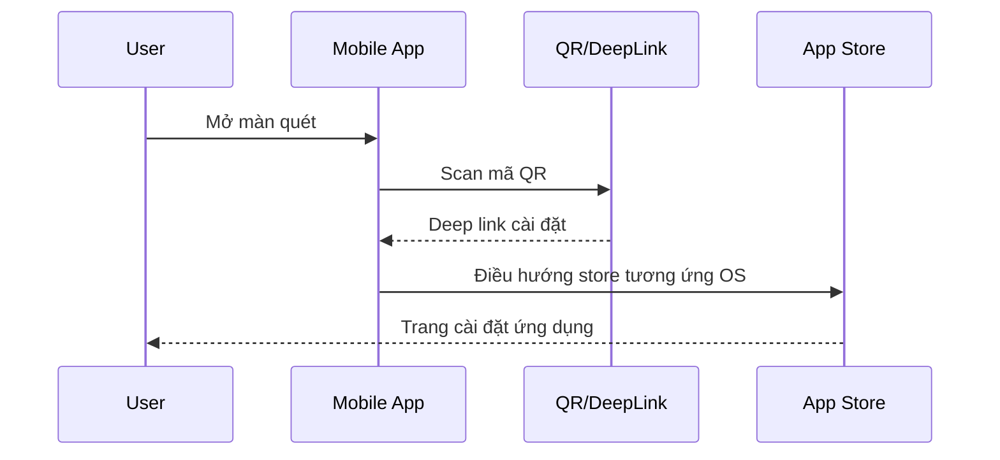
```mermaid
sequenceDiagram
    participant U as User
    participant M as Mobile App
    participant QR as QR/DeepLink
    participant S as App Store
    U->>M: Mở màn quét
    M->>QR: Scan mã QR
    QR-->>M: Deep link cài đặt
    M->>S: Điều hướng store tương ứng OS
    S-->>U: Trang cài đặt ứng dụng
```

### 12.2 FR-M02 - Định vị GPS

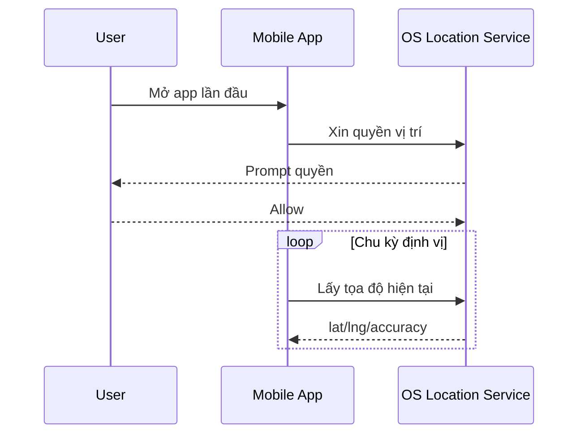
```mermaid
sequenceDiagram
    participant U as User
    participant M as Mobile App
    participant OS as OS Location Service
    U->>M: Mở app lần đầu
    M->>OS: Xin quyền vị trí
    OS-->>U: Prompt quyền
    U-->>OS: Allow
    loop Chu kỳ định vị
        M->>OS: Lấy tọa độ hiện tại
        OS-->>M: lat/lng/accuracy
    end
```

### 12.3 FR-M03 - Hiển thị POI trên bản đồ

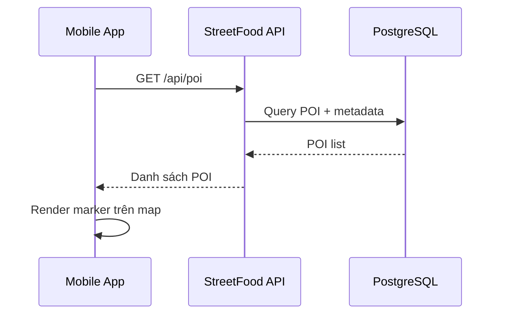
```mermaid
sequenceDiagram
    participant M as Mobile App
    participant API as StreetFood API
    participant DB as PostgreSQL
    M->>API: GET /api/poi
    API->>DB: Query POI + metadata
    DB-->>API: POI list
    API-->>M: Danh sách POI
    M->>M: Render marker trên map
```

### 12.4 FR-M04 - Auto trigger audio theo geofence

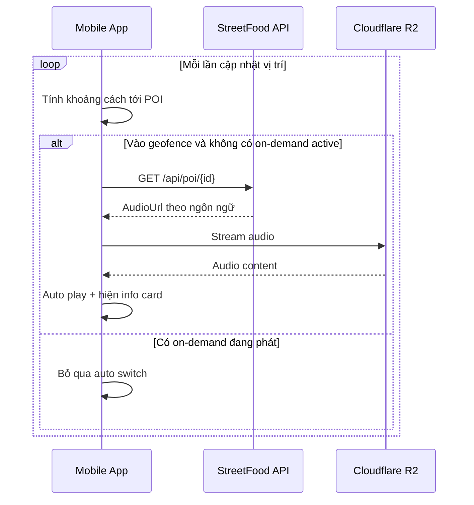
```mermaid
sequenceDiagram
    participant M as Mobile App
    participant API as StreetFood API
    participant R2 as Cloudflare R2
    loop Mỗi lần cập nhật vị trí
        M->>M: Tính khoảng cách tới POI
        alt Vào geofence và không có on-demand active
            M->>API: GET /api/poi/{id}
            API-->>M: AudioUrl theo ngôn ngữ
            M->>R2: Stream audio
            R2-->>M: Audio content
            M->>M: Auto play + hiện info card
        else Có on-demand đang phát
            M->>M: Bỏ qua auto switch
        end
    end
```

### 12.5 FR-M05 - Đa ngôn ngữ

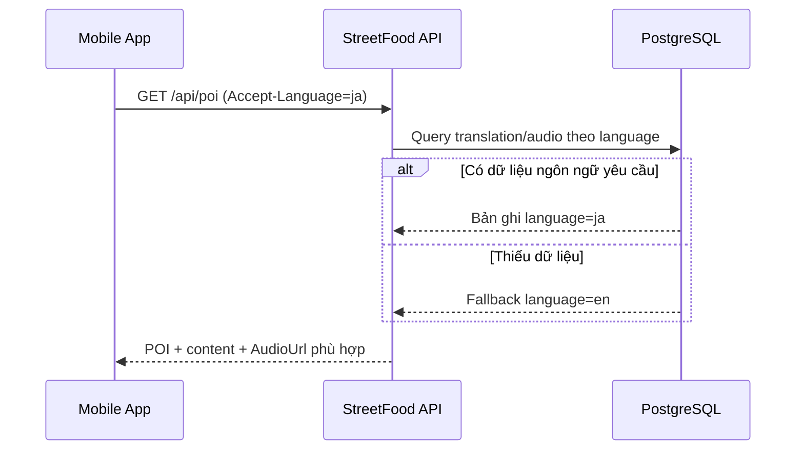
```mermaid
sequenceDiagram
    participant M as Mobile App
    participant API as StreetFood API
    participant DB as PostgreSQL
    M->>API: GET /api/poi (Accept-Language=ja)
    API->>DB: Query translation/audio theo language
    alt Có dữ liệu ngôn ngữ yêu cầu
        DB-->>API: Bản ghi language=ja
    else Thiếu dữ liệu
        DB-->>API: Fallback language=en
    end
    API-->>M: POI + content + AudioUrl phù hợp
```

### 12.6 FR-M06 - Offline support (SQLite cache)

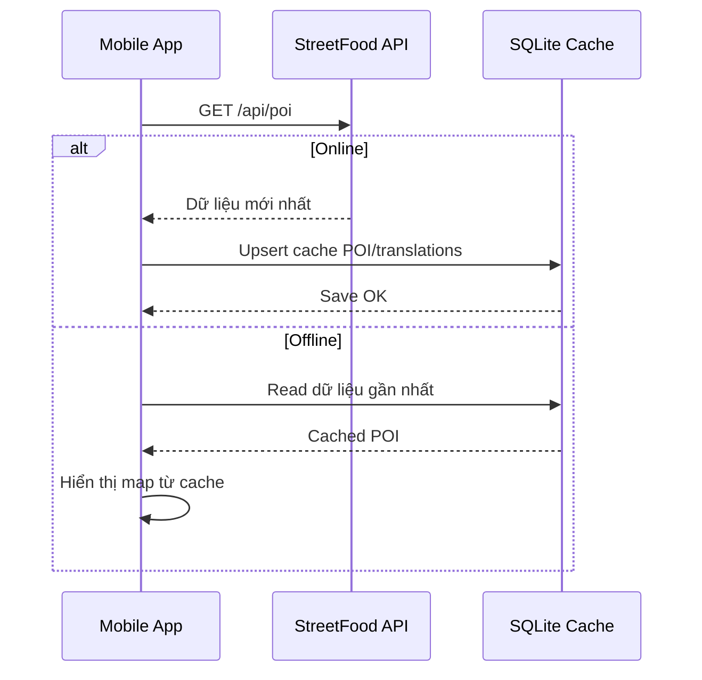
```mermaid
sequenceDiagram
    participant M as Mobile App
    participant API as StreetFood API
    participant C as SQLite Cache
    M->>API: GET /api/poi
    alt Online
        API-->>M: Dữ liệu mới nhất
        M->>C: Upsert cache POI/translations
        C-->>M: Save OK
    else Offline
        M->>C: Read dữ liệu gần nhất
        C-->>M: Cached POI
        M->>M: Hiển thị map từ cache
    end
```

### 12.7 FR-M07 - Tìm kiếm và lọc

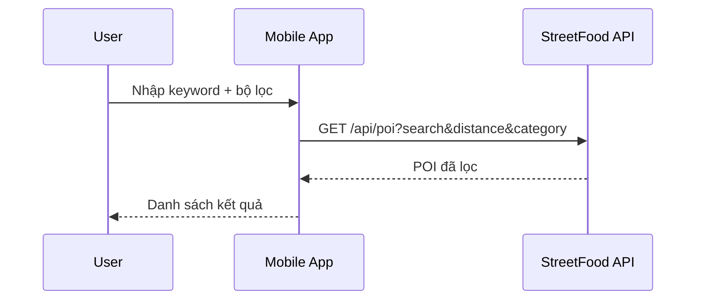
```mermaid
sequenceDiagram
    participant U as User
    participant M as Mobile App
    participant API as StreetFood API
    U->>M: Nhập keyword + bộ lọc
    M->>API: GET /api/poi?search&distance&category
    API-->>M: POI đã lọc
    M-->>U: Danh sách kết quả
```

### 12.8 FR-M08 - Chọn POI để nghe on-demand

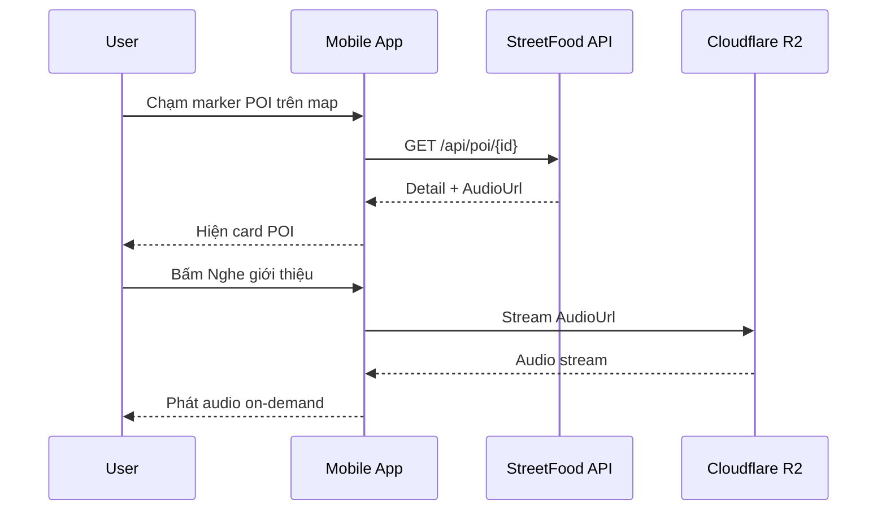
```mermaid
sequenceDiagram
    participant U as User
    participant M as Mobile App
    participant API as StreetFood API
    participant R2 as Cloudflare R2
    U->>M: Chạm marker POI trên map
    M->>API: GET /api/poi/{id}
    API-->>M: Detail + AudioUrl
    M-->>U: Hiện card POI
    U->>M: Bấm Nghe giới thiệu
    M->>R2: Stream AudioUrl
    R2-->>M: Audio stream
    M-->>U: Phát audio on-demand
```

### 12.9 FR-M09 - Timeline và seek audio

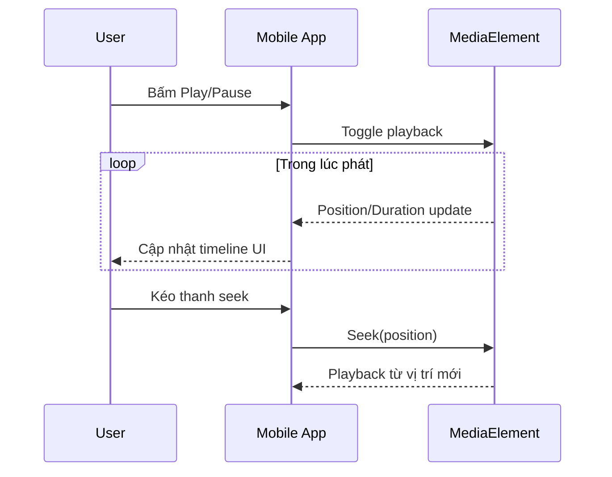
```mermaid
sequenceDiagram
    participant U as User
    participant M as Mobile App
    participant P as MediaElement
    U->>M: Bấm Play/Pause
    M->>P: Toggle playback
    loop Trong lúc phát
        P-->>M: Position/Duration update
        M-->>U: Cập nhật timeline UI
    end
    U->>M: Kéo thanh seek
    M->>P: Seek(position)
    P-->>M: Playback từ vị trí mới
```

### 12.10 FR-B01 - Quản lý POI

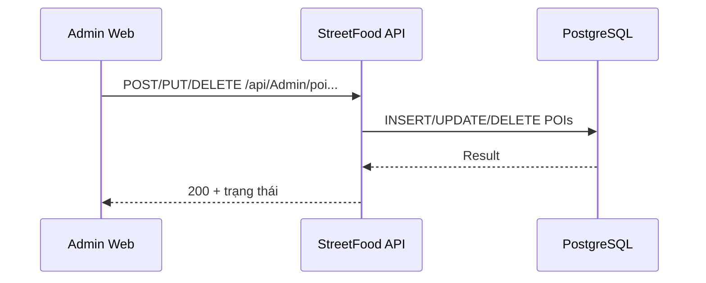
```mermaid
sequenceDiagram
    participant A as Admin Web
    participant API as StreetFood API
    participant DB as PostgreSQL
    A->>API: POST/PUT/DELETE /api/Admin/poi...
    API->>DB: INSERT/UPDATE/DELETE POIs
    DB-->>API: Result
    API-->>A: 200 + trạng thái
```

### 12.11 FR-B02 - Quản lý foods và images

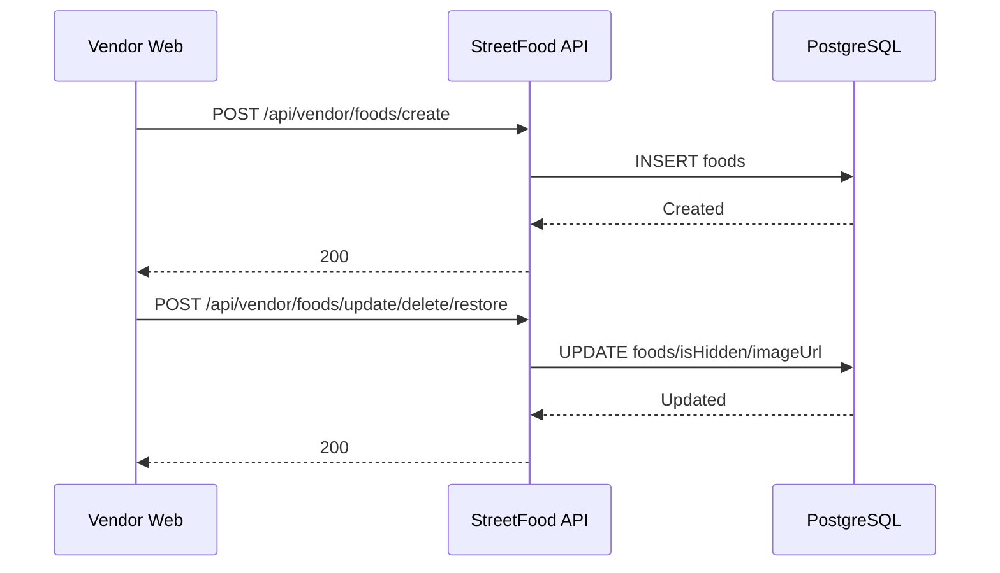
```mermaid
sequenceDiagram
    participant V as Vendor Web
    participant API as StreetFood API
    participant DB as PostgreSQL
    V->>API: POST /api/vendor/foods/create
    API->>DB: INSERT foods
    DB-->>API: Created
    API-->>V: 200
    V->>API: POST /api/vendor/foods/update/delete/restore
    API->>DB: UPDATE foods/isHidden/imageUrl
    DB-->>API: Updated
    API-->>V: 200
```

### 12.12 FR-B03 - Quản lý audio đa ngôn ngữ

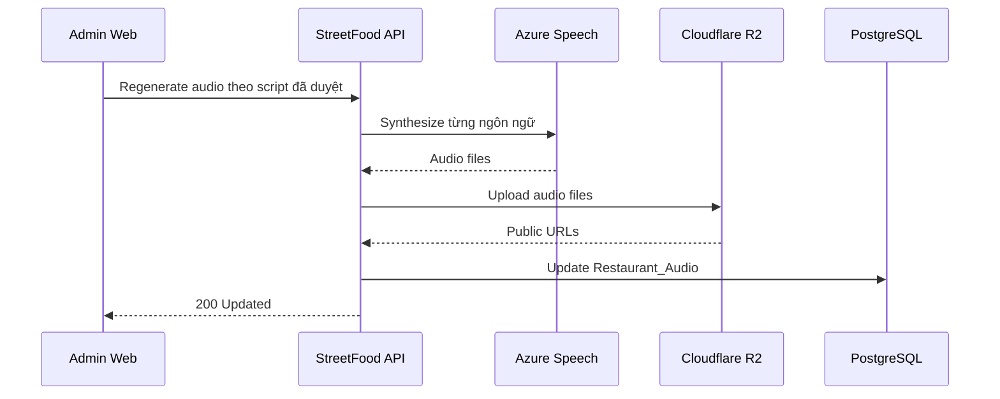
```mermaid
sequenceDiagram
    participant A as Admin Web
    participant API as StreetFood API
    participant TTS as Azure Speech
    participant R2 as Cloudflare R2
    participant DB as PostgreSQL
    A->>API: Regenerate audio theo script đã duyệt
    API->>TTS: Synthesize từng ngôn ngữ
    TTS-->>API: Audio files
    API->>R2: Upload audio files
    R2-->>API: Public URLs
    API->>DB: Update Restaurant_Audio
    API-->>A: 200 Updated
```

### 12.13 FR-B04 - Quản lý nội dung đa ngôn ngữ

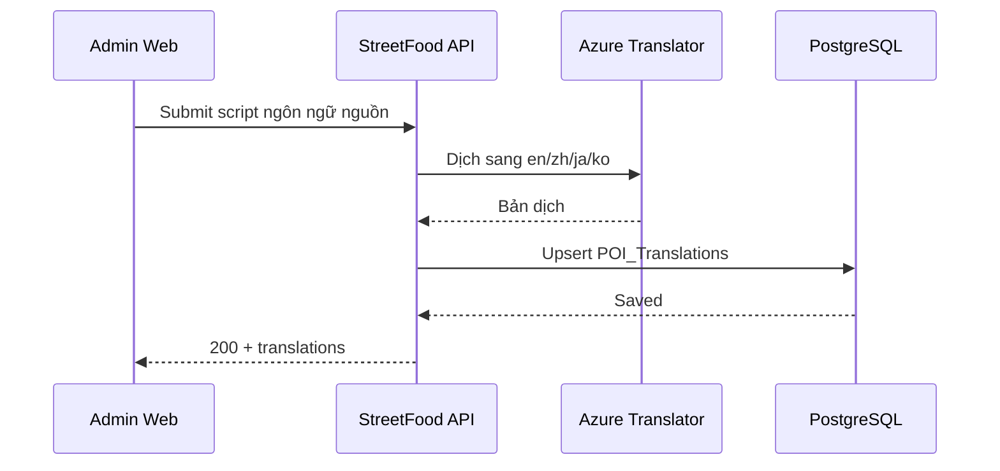
```mermaid
sequenceDiagram
    participant A as Admin Web
    participant API as StreetFood API
    participant T as Azure Translator
    participant DB as PostgreSQL
    A->>API: Submit script ngôn ngữ nguồn
    API->>T: Dịch sang en/zh/ja/ko
    T-->>API: Bản dịch
    API->>DB: Upsert POI_Translations
    DB-->>API: Saved
    API-->>A: 200 + translations
```

### 12.14 FR-B05 - API cho mobile

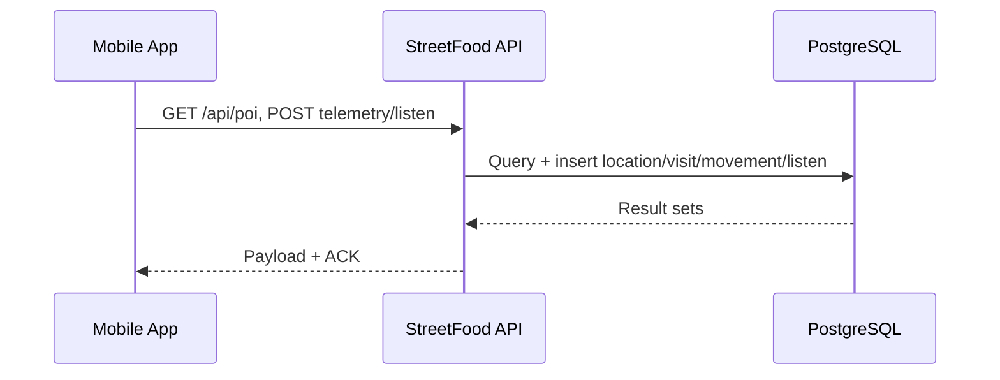
```mermaid
sequenceDiagram
    participant M as Mobile App
    participant API as StreetFood API
    participant DB as PostgreSQL
    M->>API: GET /api/poi, POST telemetry/listen
    API->>DB: Query + insert location/visit/movement/listen
    DB-->>API: Result sets
    API-->>M: Payload + ACK
```

### 12.15 FR-A01 - Quản lý nhà hàng

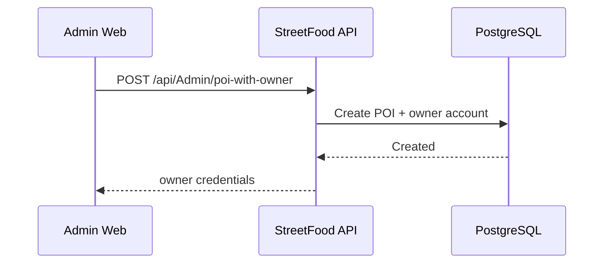
```mermaid
sequenceDiagram
    participant A as Admin Web
    participant API as StreetFood API
    participant DB as PostgreSQL
    A->>API: POST /api/Admin/poi-with-owner
    API->>DB: Create POI + owner account
    DB-->>API: Created
    API-->>A: owner credentials
```

### 12.16 FR-A02 - Quản lý audio

```mermaid
sequenceDiagram
    participant A as Admin Web
    participant API as StreetFood API
    participant TTS as Azure Speech
    participant R2 as Cloudflare R2
    participant DB as PostgreSQL
    A->>API: POST /api/Admin/poi/{id}/regenerate-audio
    API->>TTS: Generate audio
    TTS-->>API: Audio file
    API->>R2: Upload audio
    R2-->>API: Public URL
    API->>DB: Update restaurant_audio
    API-->>A: 200 Updated
```

### 12.17 FR-A03 - Dashboard analytics

```mermaid
sequenceDiagram
    participant A as Admin Web
    participant API as StreetFood API
    participant DB as PostgreSQL
    A->>API: GET /api/Admin/analytics/heatmap
    A->>API: GET /api/Admin/analytics/paths
    A->>API: GET /api/Admin/analytics/poi-audio-listen
    API->>DB: Aggregate analytics datasets
    DB-->>API: Results
    API-->>A: Dashboard payload
```

### 12.18 FR-A04 - Duyệt yêu cầu vendor

```mermaid
sequenceDiagram
    participant A as Admin Web
    participant API as StreetFood API
    participant DB as PostgreSQL
    A->>API: GET /api/Admin/script-requests/pending
    API->>DB: Query pending requests
    DB-->>API: Pending list
    API-->>A: Danh sách chờ duyệt
    A->>API: POST approve/reject
    API->>DB: Update request status
    API-->>A: 200 Updated
```

### 12.19 FR-V01 - Chỉnh sửa thông tin nhà hàng

```mermaid
sequenceDiagram
    participant V as Vendor Web
    participant API as StreetFood API
    participant R2 as Cloudflare R2
    participant DB as PostgreSQL
    opt Có đổi logo
        V->>API: POST /api/vendor/media/upload
        API->>R2: Upload logo
        R2-->>API: logoUrl
        API-->>V: logoUrl
    end
    V->>API: POST /api/vendor/shop/update-details
    API->>DB: Update restaurant details
    DB-->>API: Updated
    API-->>V: 200
```

### 12.20 FR-V02 - Request thay đổi audio script

```mermaid
sequenceDiagram
    participant V as Vendor Web
    participant API as StreetFood API
    participant DB as PostgreSQL
    alt Vendor gửi script nguồn
        V->>API: POST /api/vendor/submit-script
    else Vendor gửi audio bundle
        V->>API: POST /api/vendor/submit-audio-bundle
    end
    API->>DB: Insert Script_Change_Request = pending
    API-->>V: 200 Pending
```

---

## 13. Activity diagram theo chức năng (1 FR = 1 activity)

### 13.1 FR-M01 - Cài đặt qua QR

```mermaid
flowchart TD
    A[Mở màn quét QR] --> B[Quét mã]
    B --> C{Hợp lệ}
    C -- Có --> D[Đi tới deep link cài app]
    C -- Không --> E[Báo lỗi và quét lại]
```

### 13.2 FR-M02 - Định vị GPS

```mermaid
flowchart TD
    A[Mở app] --> B[Xin quyền vị trí]
    B --> C{Được cấp quyền}
    C -- Có --> D[Lấy GPS theo chu kỳ]
    C -- Không --> E[Hiện hướng dẫn bật quyền]
```

### 13.3 FR-M03 - Hiển thị POI trên bản đồ

```mermaid
flowchart TD
    A[Fetch danh sách POI] --> B[Nhận dữ liệu]
    B --> C[Render marker lên bản đồ]
    C --> D[User xem/nhấn marker]
```

### 13.4 FR-M04 - Auto trigger audio theo geofence

```mermaid
flowchart TD
    A[Nhận vị trí mới] --> B[Tính khoảng cách tới POI]
    B --> C{Vào geofence}
    C -- Không --> A
    C -- Có --> D{Đang phát on-demand}
    D -- Có --> A
    D -- Không --> E[Auto mở card + phát audio]
```

### 13.5 FR-M05 - Đa ngôn ngữ

```mermaid
flowchart TD
    A[Gửi Accept-Language] --> B[API tìm bản dịch]
    B --> C{Có bản dịch theo ngôn ngữ yêu cầu}
    C -- Có --> D[Trả dữ liệu cùng ngôn ngữ đó]
    C -- Không --> E[Fallback về en]
```

### 13.6 FR-M06 - Offline support (SQLite cache)

```mermaid
flowchart TD
    A[App cần dữ liệu POI] --> B{Có mạng}
    B -- Có --> C[Lấy API và cập nhật cache]
    B -- Không --> D[Đọc cache SQLite]
    C --> E[Hiển thị dữ liệu]
    D --> E
```

### 13.7 FR-M07 - Tìm kiếm và lọc

```mermaid
flowchart TD
    A[Nhập từ khóa/bộ lọc] --> B[Gọi API tìm kiếm]
    B --> C[Nhận danh sách đã lọc]
    C --> D[Hiển thị kết quả]
```

### 13.8 FR-M08 - Chọn POI để nghe on-demand

```mermaid
flowchart TD
    A[Chạm marker POI] --> B[Hiện card chi tiết]
    B --> C[Nhấn Nghe giới thiệu]
    C --> D[Phát audio on-demand]
```

### 13.9 FR-M09 - Timeline và seek audio

```mermaid
flowchart TD
    A[Play audio] --> B[Cập nhật current/total]
    B --> C{User thao tác}
    C -- Pause/Resume --> A
    C -- Seek --> D[Nhảy tới mốc mới]
    D --> A
```

### 13.10 FR-B01 - Quản lý POI

```mermaid
flowchart TD
    A[Admin thao tác CRUD POI] --> B[API validate dữ liệu]
    B --> C[Ghi DB]
    C --> D[Trả kết quả thành công/thất bại]
```

### 13.11 FR-B02 - Quản lý foods/images

```mermaid
flowchart TD
    A[Vendor thêm/sửa/ẩn/hiện món] --> B[API xử lý request]
    B --> C[Cập nhật bảng foods]
    C --> D[Reload danh sách món]
```

### 13.12 FR-B03 - Quản lý audio đa ngôn ngữ

```mermaid
flowchart TD
    A[Admin yêu cầu regenerate audio] --> B[Synthesize audio theo ngôn ngữ]
    B --> C[Upload lên storage]
    C --> D[Cập nhật URL audio trong DB]
```

### 13.13 FR-B04 - Quản lý nội dung đa ngôn ngữ

```mermaid
flowchart TD
    A[Submit script nguồn] --> B[Dịch đa ngôn ngữ]
    B --> C[Lưu translation]
    C --> D[Sẵn sàng phục vụ mobile]
```

### 13.14 FR-B05 - API cho mobile

```mermaid
flowchart TD
    A[Mobile gọi API POI/detail] --> B[API validate request]
    B --> C[Query hoặc ghi dữ liệu cần thiết]
    C --> D[Trả response cho app]
```

### 13.15 FR-A01 - Quản lý nhà hàng

```mermaid
flowchart TD
    A[Admin nhập thông tin POI + owner] --> B[API tạo tài khoản vendor]
    B --> C[API tạo POI và liên kết owner]
    C --> D[Trả thông tin tài khoản vừa tạo]
```

### 13.16 FR-A02 - Quản lý audio

```mermaid
flowchart TD
    A[Admin chọn POI cần cập nhật audio] --> B[Nhấn regenerate audio]
    B --> C[Hệ thống tạo file audio mới]
    C --> D[Upload và cập nhật URL audio]
```

### 13.17 FR-A03 - Dashboard analytics

```mermaid
flowchart TD
    A[Admin mở dashboard] --> B[Load heatmap, routes, listen stats]
    B --> C[Tổng hợp KPI theo thời gian]
    C --> D[Hiển thị biểu đồ và bảng số liệu]
```

### 13.18 FR-A04 - Duyệt yêu cầu vendor

```mermaid
flowchart TD
    A[Admin mở danh sách pending] --> B[Chọn một request]
    B --> C{Duyệt hay từ chối}
    C -- Duyệt --> D[Set status approved]
    C -- Từ chối --> E[Set status rejected]
```

### 13.19 FR-V01 - Chỉnh sửa thông tin nhà hàng

```mermaid
flowchart TD
    A[Vendor chọn cửa hàng] --> B{Có đổi logo}
    B -- Có --> C[Upload logo]
    B -- Không --> D[Giữ logo cũ]
    C --> E[Submit update details]
    D --> E
```

### 13.20 FR-V02 - Request thay đổi audio script

```mermaid
flowchart TD
    A[Vendor gửi request audio] --> B[Lưu trạng thái pending]
    B --> C[Thông báo đã ghi nhận request]
    C --> D[Vendor theo dõi trạng thái]
```

---

## 14. Data Flow Diagram (DFD Level 1)

```mermaid
flowchart LR
    U[User App]
    V[Vendor Web]
    A[Admin Web]

    P1((P1: Quản lý POI/Nội dung))
    P2((P2: Xử lý audio đa ngôn ngữ))
    P3((P3: Tracking & Analytics))

    D1[(POI + Foods + Translations)]
    D2[(Audio Metadata)]
    D3[(Tracking Logs)]
    R2[(Cloudflare R2)]

    U -->|Yeu cau POI + gui GPS| P1
    U -->|Audio playback request| P2
    U -->|Telemetry| P3

    V -->|Cap nhat thong tin + request script| P1
    A -->|CRUD + Duyet request| P1
    A -->|Dashboard query| P3

    P1 <--> D1
    P1 <--> D2
    P2 <--> D2
    P2 <--> R2
    P3 <--> D3
```


---

## 15. UI wireframe (MVP)

## 15.1 Mobile - Home map

```text
+--------------------------------------------------+
| StreetFood                                       |
| [Search.................] [Filter]               |
|                                                  |
|                (MAP VIEW)                        |
|          o User                                  |
|      [POI1]   [POI2]   [POI3]                    |
|                                                  |
|----------------------------------------------    |
| [Restaurant Card]  (mo khi: gan POI HOAC cham POI) |
| Name: Highlands Coffee                           |
| Address: 98 Nguyen Tri Phuong                    |
| Open: 07:00 - 22:00   | ~1.2 km (neu co GPS)     |
| [Nghe gioi thieu]  [Play] [Pause]                |
| |------o-----------------------|  0:42 / 2:15     |
|  ^-------- slider timeline (tua duoc) ----------- |
+--------------------------------------------------+
```

*Ghi chú:* Dòng timeline hiển thị khi có audio; user kéo “o” để tua. Có thể gom “Nghe giới thiệu” với Play nếu UI tối giản.

## 15.2 Admin - Dashboard

```text
+---------------------------------------------------------------+
| Admin Dashboard                                               |
| [POIs] [Foods] [Audio] [Requests] [Analytics]                |
|---------------------------------------------------------------|
| KPI: Visits Today | Avg Duration | Active POIs               |
|---------------------------------------------------------------|
| Heatmap Panel                 | Popular Routes                |
|                               | POI A -> POI B (120)         |
|                               | POI B -> POI C (95)          |
|---------------------------------------------------------------|
| Most Visited Restaurants Table                                |
+---------------------------------------------------------------+
```

## 15.3 Vendor - Request audio script

```text
+--------------------------------------------------+
| Vendor Portal                                    |
| [Restaurant Info] [Menu] [Audio Requests]        |
|--------------------------------------------------|
| Restaurant: Co Chi Thi Nen                       |
| Language: [vi v]                                 |
| New Script:                                      |
| [............................................]   |
| [............................................]   |
| Status: Pending                                  |
| [Submit Request]                                 |
+--------------------------------------------------+
```

---

## 16. API overview (đã triển khai trong repo)

Base URL ví dụ: `https://localhost:7236`. Route gốc của controller nằm trong cột **Prefix** (ASP.NET Core `[Route]`).

### 16.1 Mobile & POI công khai (`PoiController` → `/api/Poi`)


| Phương thức | Đường dẫn       | Mô tả                                                |
| ----------- | --------------- | ---------------------------------------------------- |
| GET         | `/api/Poi`      | Danh sách POI + audio theo `Accept-Language`.        |
| GET         | `/api/Poi/{id}` | Chi tiết POI + foods (ẩn món `IsHidden` nếu có cột). |


### 16.2 Telemetry nghe audio (`ListenAnalyticsController` → `/api/analytics`)


| Phương thức | Đường dẫn                         | Mô tả                                                                           |
| ----------- | --------------------------------- | ------------------------------------------------------------------------------- |
| POST        | `/api/analytics/poi-audio-listen` | App gửi `poiId`, `durationSeconds`, `deviceId` (lưu `poi_audio_listen_events`). |


### 16.3 Xác thực (`AuthController` → `/api/Auth`)


| Phương thức | Đường dẫn         | Mô tả                                                                                                                          |
| ----------- | ----------------- | ------------------------------------------------------------------------------------------------------------------------------ |
| POST        | `/api/Auth/login` | Đăng nhập admin/vendor (bảng `users`).                                                                                         |
| POST        | `/api/Auth/...`   | Các endpoint app/device cũ còn trong controller (khuyến nghị cleanup để đồng bộ 100% với mô hình kích hoạt JWT local của app). |


### 16.4 Quản trị (`AdminController` → `/api/Admin`) — cần `X-Admin-Key` nếu cấu hình `Admin:ApiKey`


| Phương thức | Đường dẫn                                     | Mô tả                                                                    |
| ----------- | --------------------------------------------- | ------------------------------------------------------------------------ |
| GET         | `/api/Admin/dashboard/summary`                | KPI: số POI, vendor, pending script, audio tracks, mẫu location 30 ngày. |
| GET         | `/api/Admin/analytics/heatmap`                | Điểm nhiệt từ `location_logs`.                                           |
| GET         | `/api/Admin/analytics/poi-audio-listen?days=` | Thống kê **thời lượng nghe** trung bình theo POI.                        |
| GET         | `/api/Admin/analytics/paths`                  | Chuỗi di chuyển gần đây.                                                 |
| GET         | `/api/Admin/analytics/popular-paths`          | Cặp POI A→B phổ biến.                                                    |
| GET         | `/api/Admin/analytics/popular-route-chains`   | Chuỗi tối đa N POI.                                                      |
| POST        | `/api/Admin/poi-with-owner`                   | Tạo user vendor + POI + script khởi tạo (admin).                         |
| GET         | `/api/Admin/pois/awaiting-script`             | POI chờ script/vendor.                                                   |
| GET         | `/api/Admin/script-requests/pending`          | Yêu cầu script chờ duyệt.                                                |
| POST        | `/api/Admin/script-requests/{id}/approve`     | Duyệt + pipeline dịch/TTS (theo cấu hình).                               |
| POST        | `/api/Admin/poi/{poiId}/regenerate-audio`     | Tạo lại MP3 (Azure Speech).                                              |
| GET         | `/api/Admin/owners`                           | Danh sách chủ quán.                                                      |
| POST        | `/api/Admin/owners/{userId}/hide`             | Ẩn tài khoản vendor.                                                     |


### 16.5 Vendor (các controller dùng chung prefix `**/api/vendor`**)


| Endpoint (POST)                   | Mô tả                                            |
| --------------------------------- | ------------------------------------------------ |
| `/api/vendor/pois/list`           | Danh sách POI của vendor.                        |
| `/api/vendor/shop/update-details` | Cập nhật chi tiết cửa hàng.                      |
| `/api/vendor/foods/list`          | Danh sách món.                                   |
| `/api/vendor/foods/create`        | Tạo món.                                         |
| `/api/vendor/foods/update`        | Cập nhật món.                                    |
| `/api/vendor/foods/delete`        | Xóa/ẩn món.                                      |
| `/api/vendor/submit-script`       | Gửi script chờ duyệt (`VendorScriptController`). |
| `/api/vendor/submit-audio-bundle` | Gửi gói 5 URL audio (5 ngôn ngữ).                |
| `/api/vendor/media/upload`        | Upload ảnh (multipart).                          |


> **Ghi chú:** Danh sách trên lấy từ attribute `[HttpGet]`/`[HttpPost]` trong `StreetFoodAPI/Controllers/`. Một số đường dẫn REST “chuẩn CRUD” trong PRD 1.x (ví dụ `GET /api/poi/search`) **chưa** thấy triển khai riêng — tìm kiếm/lọc được đảm nhiệm phía app (`SuggestPage`) trên dữ liệu đã tải hoặc API hiện có.

---

## 17. Bảo mật và phân quyền

### 17.1 Mục tiêu dài hạn (PRD gốc)

- JWT / token cho phiên API; RBAC rõ `admin` / `vendor` / `user`.
- Audit log; rate limit.

### 17.2 Triển khai hiện tại (đối chiếu code)

- **Đăng nhập web:** `POST /api/Auth/login` kiểm tra `users` (role `admin` | `vendor`), không JWT trong repo tại thời điểm cập nhật PRD 2.0.
- **Admin API:** khóa tùy chọn qua `Admin:ApiKey` + header `**X-Admin-Key`** (`AdminController.IsAdmin`).
- **Khuyến nghị môi trường thật:** HTTPS, đổi khóa admin mặc định trong `config.js` / `appsettings`, bật CORS chặt theo origin.

---

## 18. Kế hoạch triển khai (Roadmap) và trạng thái


| Giai đoạn               | Nội dung                                                                           | Trạng thái (2026-04)                                                                         |
| ----------------------- | ---------------------------------------------------------------------------------- | -------------------------------------------------------------------------------------------- |
| **Phase 1 – MVP core**  | App: bản đồ, POI, geofence, on-demand, player, đa ngôn ngữ; API đọc POI/detail; DB | **Đã đạt** cốt lõi trong repo.                                                               |
| **Phase 2 – Vận hành**  | Admin tạo POI+owner, vendor cập nhật shop/foods, workflow script/audio, TTS/Azure  | **Đã đạt** theo luồng hiện có; CRUD admin “full UI” như wireframe cổ điển **chưa** bắt buộc. |
| **Phase 3 – Analytics** | Heatmap, paths, popular routes/chains, **thời lượng nghe theo POI**                | **Đã đạt** trên dashboard + các trang admin tương ứng.                                       |
| **Phase 4 – Tối ưu**    | Offline sâu, geofence tiết kiệm pin, gợi ý cá nhân hóa                             | **Kế tiếp** / ngoài phạm vi MVP hiện tại.                                                    |


---

## 19. Tiêu chí nghiệm thu MVP

- User cài app qua QR và mở thành công.
- App hiển thị đúng POI gần vị trí hiện tại.
- Vào bán kính POI thì audio tự phát đúng ngôn ngữ.
- User **chạm POI trên bản đồ** khi **ngoài bán kính** vẫn mở được thông tin và **phát được audio** sau khi bấm nghe.
- Khi đang phát audio, UI có **thời gian đã phát / tổng thời lượng** và **thanh tua**; kéo seek cập nhật đúng vị trí phát (trong giới hạn hỗ trợ của nguồn stream).
- Quy tắc **không cắt ngang** bài on-demand bởi auto geofence được áp dụng như mô tả FR-M04.
- Admin **tạo được POI kèm chủ quán** và **theo dõi được** dashboard/heatmap/paths/thời lượng nghe; vendor **bổ sung** foods qua cổng vendor (đúng mô hình phân tách hiện tại).
- Vendor gửi được request script / gói audio, admin duyệt được.
- Dashboard hiển thị được các chỉ số tổng hợp (POI, vendor, pending script, audio tracks, mẫu location, v.v.).

---

## 20. Future improvements

- Hoàn thiện JWT/session đồng nhất cho API thay vì chỉ login trả payload (nếu cần scale bảo mật).
- CRUD POI/foods **thuần admin UI** nếu yêu cầu nghiệp vụ thay vì chủ yếu qua vendor + `poi-with-owner`.
- AI voice generation/TTS ngoài Azure (tùy chi phí).
- Recommendation engine theo hành vi di chuyển.
- A/B test nội dung audio để tối ưu chuyển đổi ghé quán.
- Tích hợp chiến dịch theo khung giờ và sự kiện địa phương.
- Mở rộng đa thành phố / multi-tenant.

---

## 21. Danh mục tài liệu và tham chiếu mã nguồn


| Loại                     | Đường dẫn / ghi chú                                                                                                                                                                                                                                                                                              |
| ------------------------ | ---------------------------------------------------------------------------------------------------------------------------------------------------------------------------------------------------------------------------------------------------------------------------------------------------------------- |
| **PRD (tài liệu này)**   | `prd.md` (root repo)                                                                                                                                                                                                                                                                                             |
| **Cấu hình API cho web** | `Web Admin/wwwroot/config.js`, `Web Vendor/wwwroot/config.js`                                                                                                                                                                                                                                                    |
| **Client gọi API admin** | `Web Admin/wwwroot/js/admin-api.js` (gồm inject sidebar StreetFood)                                                                                                                                                                                                                                              |
| **API**                  | `StreetFoodAPI/Controllers/*.cs`, `StreetFoodAPI/Program.cs`, `StreetFoodAPI/appsettings.json`                                                                                                                                                                                                                   |
| **Migration / SQL**      | `StreetFood.Infrastructure/Migrations/` — `**V1__Initial_schema.sql`** (DDL đầy đủ), `**V2__Seed_core_data.sql**` (dữ liệu nền), `**V3__Seed_demo_analytics.sql**` (heatmap/tuyến/thống kê nghe). DB mới: tạo database trống rồi chạy lần lượt hoặc bật `DbInitializer` (nếu được kích hoạt trong `Program.cs`). |
| **App MAUI**             | `App/Views/*.xaml`, `App/AppShell.xaml`                                                                                                                                                                                                                                                                          |
| **Trang HTML admin**     | `Web Admin/wwwroot/html/` — `loginPage.html`, `dashboardPage.html`, `routeHeatmapPage.html`, `poiListenStatsPage.html`, `createPoiOwnerPage.html`, `pendingScriptsPage.html`, `restaurantOwnersPage.html`                                                                                                        |
| **Trang HTML vendor**    | `Web Vendor/wwwroot/html/` — `dashboardShopPage.html`, `manageProductsPage.html`, `requestScriptPage.html`, …                                                                                                                                                                                                    |
| **Sơ đồ ERD**            | Mermaid ERD duy nhất tại [mục 8.2](#82-sơ-đồ-erd-mermaid).                                                                                                                                                                                                                                                       |


---

## 22. Lịch sử phiên bản PRD


| Phiên bản | Ngày            | Nội dung thay đổi chính                                                                                                                                                                                                                                                                                    |
| --------- | --------------- | ---------------------------------------------------------------------------------------------------------------------------------------------------------------------------------------------------------------------------------------------------------------------------------------------------------- |
| **1.0**   | (trước 2026-04) | PRD MVP: personas, FR mobile/backend/admin/vendor, diagram, API đề xuất, roadmap.                                                                                                                                                                                                                          |
| **2.0**   | **2026-04-06**  | Bổ sung: phiên bản stack & cổng dev; **bảng tiến độ thực tế**; **API đã triển khai**; chỉnh roadmap trạng thái; bảo mật đối chiếu code; **danh mục tài liệu / file tham chiếu**; lịch sử phiên bản.                                                                                                        |
| **2.1**   | **2026-04-06**  | Mục **8.2**: nhúng ảnh **ERD** (`Public/Resouces/ERD.png`); cập nhật **8.1** (thêm `device_activations`, `schema_migrations`); chỉnh tiêu đề và ghi chú ERD. Metadata PRD **2.1**.                                                                                                                         |
| **2.2**   | **2026-04-08**  | Đồng bộ codebase hiện tại: bỏ `StreetFood.Application`; đồng bộ migration mới (loại `app_activation_expires_at` và `device_activations`); mở rộng dữ liệu demo analytics; bổ sung bộ **Use Case + Sequence + Activity** đầy đủ cho App, API, Web Admin, Web Vendor; thêm **ERD dạng Mermaid** tại mục 8.2. |


